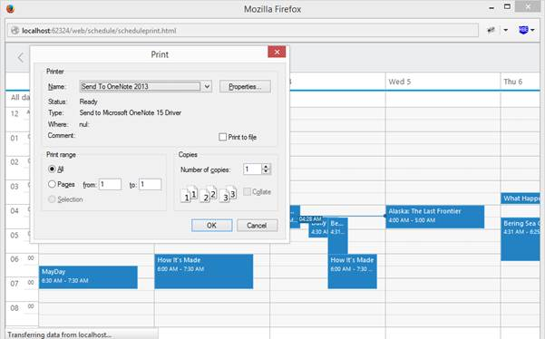
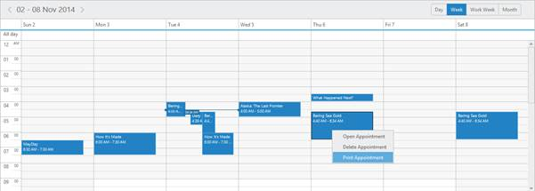

## Print

Schedule control is provided with the Print feature. You can print the entire Schedule control or separately print the appointment based on your requirement.

Schedule Print

You can print the Schedule control by using print() method. Use the following code example to print the Schedule control.

[ASPX]

&lt;div&gt;

&lt;input class="print" type="button" value="Print" /&gt;

&lt;ej:Schedule runat="server" ID="Schedule1" DataSourceID="SqlData"&gt;

&lt;%--Add the Necessary properties here -- %&gt;

&lt;/ej:Schedule&gt;

&lt;/div&gt;

&lt;asp: SqlDataSource ID="SqlData" runat="server" ConnectionString="&lt;%$ ConnectionStrings: ScheduleConnectionString %&gt;"

SelectCommand="SELECT * FROM [DefaultSchedule]">&lt;/asp:SqlDataSource&gt;

&lt;script type="text/javascript"&gt;

$(document).ready(function () {

// function to bind the click event to the button

$('.print').bind("click", function () {

var obj = $("#Schedule1").data("ejSchedule");

// Public method to print the schedule

obj.print();

});

});

&lt;/script&gt;

Execute the above code to render the following output.

{  | markdownify }
{:.image }

_Figure_ _121__: Schedule with print button_

Click the print button to render the following output.

{  | markdownify }
{:.image }

_Figure_ _122__: Schedule with Print window_

Appointment Print

* In Schedule control, you can print the appointment alone by using context menu. Add print as menu item in the context menu settings as in the following code example. 

[ASPX]

&lt;ej:Schedule runat="server" ID="Schedule1" DataSourceID="SqlData"&gt;

&lt;%--To Add the Context menu setting-- %&gt;

&lt;ContextMenuSettings Enable="true"&gt;

&lt;%--To Add the Context menu setting-- %&gt;

&lt;MenuItems&gt;

&lt;AppointmentCollection&gt;

&lt;ej:Appointment Id="open" Text="Open Appointment" /&gt;

&lt;ej:Appointment Id="delete" Text="Delete Appointment" /&gt;

&lt;%--To Add the print item in that collection-- %&gt;

&lt;ej:Appointment Id="print" Text="Print Appointment" /&gt;

&lt;/AppointmentCollection&gt;

&lt;/MenuItems&gt;

&lt;/ContextMenuSettings&gt;

&lt;%--Add the necessary schedule properties here-- %&gt;

&lt;/ej:Schedule&gt;

&lt;div id="reminder"&gt;

&lt;a class="pull-left" href="#" style="margin-top: 9px; outline: medium none;"&gt;

&lt;div class="reminder-icon e-btn e-select /"&gt;

&lt;/a&gt;

&lt;/div&gt;

&lt;style type="text/css"&gt;

#reminder

{

width: 50px;

height: 40px;

margin-top: 1px;

float: right;

}

.reminder-icon

{

background-image: url("../Content/images/Schedule/print.png") !important;

background-repeat:no-repeat !important;

background-position: 3px 3px !important;

border: 1px solid #BBBCBB !important;

height: 28px;

width: 28px;

}

&lt;/style&gt;

&lt;script type="text/javascript"&gt;

$(function () {

$("#Schedule1").find("tr.e-scheduleheader td").first().append($("#reminder"));

$('.reminder-icon').bind("click", function () {

var obj = $("#Schedule1").data("ejSchedule");

obj.print();

});

});

&lt;/script&gt;

* Right click on the appointment and select print appointment in the context menu as follows.

{  | markdownify }
{:.image }

_Figure_ _123__: Schedule with Print option in Context Menu_

* Now, the widow is promoted to new document with appointment details and print window opens.

{  | markdownify }
{:.image }

_Figure_ _124__: Schedule with Appointment Print_

