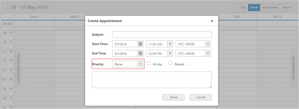
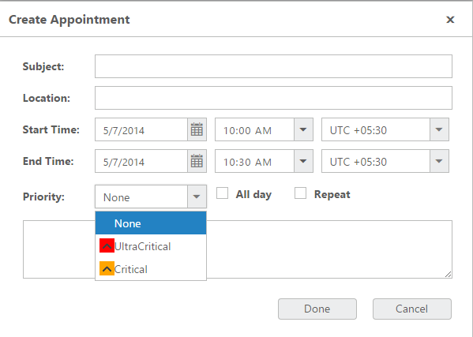
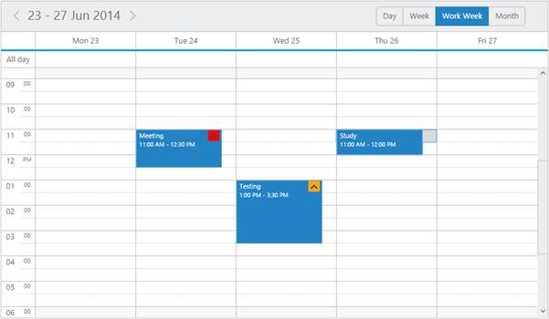

# Priority

* This feature allows you to prioritize the appointments with various priority options each differentiated with its individual icons/images. 
* You can also denote the priority of the appointments using this priority option and can specify your own user-defined priority collection.
## Priority settings

* The prioritySettings is an object collection that holds the priority related information. 
* For example enable property enables/disables the priority value to be displayed.

The following are the sub-properties used within the prioritySettings.

####enable

* This option accepts either true or false, denoting whether to enable/disable the priority option.

####datasource 

* It either accepts the local JSON data or remote data for binding the priority related information.

####text

* It holdsthe binding name for text field in the priority dataSource.

####id

* It holds the binding name for id field in the priority dataSource.

####value

* It holds the binding name for value field in the priority dataSource.

The following code example illustrates on how to render priority feature in the Schedule control.



<ej:Schedule ID="Schedule1" Width="100%" runat="server" DataSourceID="ScheduleData">

<PrioritySettings Enable="true" Id="id" Value="value" Text="text">

</PrioritySettings>   // To display the Priority field in the appointment Window need to enable this property

</ej:Schedule>

<asp: SqlDataSource ID="SqlData" runat="server" ConnectionString="<%$ ConnectionStrings: ScheduleConnectionString %>"

SelectCommand="SELECT * FROM [DefaultSchedule]"></asp:SqlDataSource>



  On executing the above specified code the Priority field will be added in the create appointment window as follows:

##template

* The Priority option can be customized based on the user- defined datasource. 
* You need to mention the “template” value also while passing the user-defined datasource. 

The following code example illustrates on how to render priority feature with user- defined datasource in the Schedule control. 



<ej:Schedule ID="Schedule1" Width="100%" runat="server" DataSourceID="ScheduleData" ShowLocationField="true">

<PrioritySettings Enable="true" Id="id" Value="value" Text="text" Template="

">  // To display the Priority option in the appointment window while passing custom datasource we need to mention the Template and DataSource like this

</PrioritySettings>

<AppointmentSettings Id="Id" Subject="Subject" AllDay="AllDay" StartTime="StartTime" EndTime="EndTime" Description="Description" Recurrence="Recurrence" Categorize="Categorize" Priority="Priority"/>

</ej:Schedule>

<asp: SqlDataSource ID="SqlData" runat="server" ConnectionString="<%$ ConnectionStrings: ScheduleConnectionString %>"

SelectCommand="SELECT * FROM [DefaultSchedule]"></asp:SqlDataSource>





List<Priority> PriorityValue = new List<Priority>();

protected void Page_Load(object sender, EventArgs e)

{

if (!IsPostBack)

{

PriorityValue.Add(new Priority { text = "None", id = 1, value = "none" });

PriorityValue.Add(new Priority { text = "Critical", id = 2, value = "critical" });

PriorityValue.Add(new Priority { text = "Ultra critical", id = 3, value = "ultracritical" });

Schedule1.PrioritySettings.DataSource = PriorityValue;  // We can pass the custom datasource (priority option) for the schedule control like this

}

}

public class Priority

{

public string text { set; get; }

public int id { set; get; }

public string value { set; get; }

}



* And then need to define the styles to display the “priority icon/images (you can use your desired images)” with the priority options. 
* The class name (while defining styles) should be the field name in template. For example if you define the template (ex: Template ("

")) then you need to define class with “value field and its value should be a class name (ex: critical)”. 

The following code example illustrates how to define the css style while using the template.

// Her we are defining the style of the “custom priority icon”





* Similarly you can use the image tag directly in the template. Following code snippets illustrates the image tag usage in the template.



<ej:Schedule ID="Schedule1" Width="100%" runat="server" DataSourceID="ScheduleData" ShowLocationField="true">

<PrioritySettings Enable="true" Id="id" Value="value" Text="text" Template=""> // We can use the image tag directly to display the priority icon/image

</PrioritySettings>

<AppointmentSettings Id="Id" Subject="Subject" AllDay="AllDay" StartTime="StartTime" EndTime="EndTime" Description="Description" Recurrence="Recurrence" Categorize="Categorize" Priority="Priority"/>

</ej:Schedule>

<asp: SqlDataSource ID="SqlData" runat="server" ConnectionString="<%$ ConnectionStrings: ScheduleConnectionString %>"

SelectCommand="SELECT * FROM [DefaultSchedule]"></asp:SqlDataSource>



On excuting the above mentioned codes will render the same output as follows.

