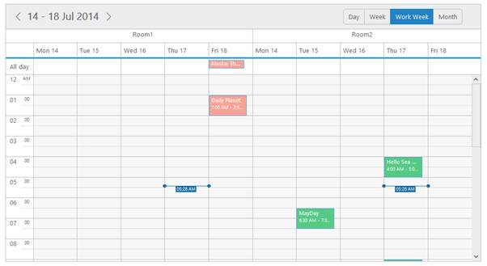
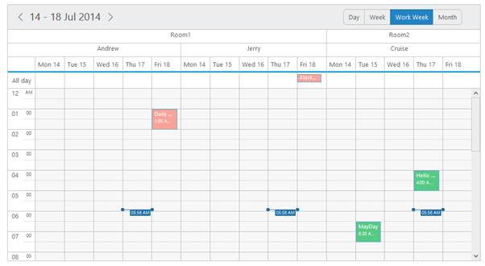
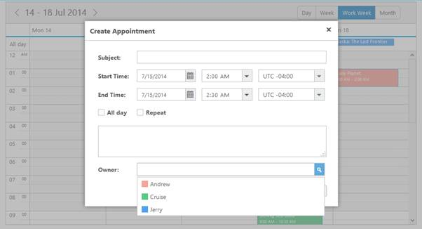
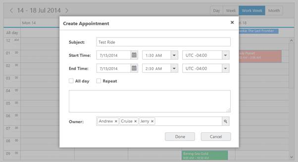
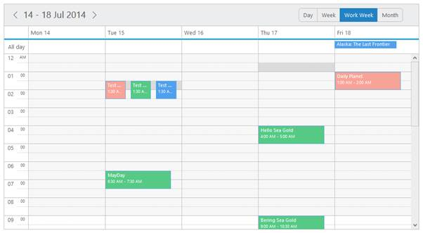

## Resources

Multiple Resources

* Multiple Resource feature provides support for rendering multiple resources on the Schedule control. You can group multiple resources under certain categories. 
* You can also save the appointments simultaneously on multiple resources or within the multiple categories using allowMultiple property enabled for different levels of resources.
* The two important properties to be defined for grouping the multiple resources are as follows:

Resources

* It accepts the resource data as an array collection. Here, you can define the field name with resourceFields to each of the resource level. The order of resource data objects that you provide within the resource collection defines the rendering order of the resources in the Schedule. 
* The first resource data object provided within the collection is always rendered as the top level order in the Schedule. The important sub-options available are as follows:

_field_

* This option holds the field name to be bound to each level of the resources.

_title_

* This option accepts a title string from the user that is displayed as the appropriate title for the resource field on the appointment window.

_name_

* It uniquely identifies each resource level while grouping.

_resourceSettings_

* It accepts the dataSource and bind field names related to the resources data. The sub-options present within it are as follows,

_dataSource_

* It either accepts the local JSON data or remote data for the resource related information. The field names it accepts are 

_text_

* It holds the binding name for text field in the resource dataSource.

_id_

* It holds the binding name for id field in the resource dataSource.

_groupId_

* It holds the binding name for group id field in the resource dataSource.

_color_

* It holds the binding name for color field in the resource dataSource.

_appointmentClass_

* It specifies the custom css class name to be applied for the appointments that belongs to each resource.

_allowMultiple_

* This property enables or disables the multiple selections of each resource in the appointment window. 

The following code example explains how to render the multiple resources on the Schedule control,

<table>
<tr>
<td>
[ASP]&lt;ej:Schedule runat="server" ID="Schedule1" DataSourceID="SqlData" Width="100%" Height="525px" CurrentDate="5/2/2014"&gt;&lt;Group Resources="Owners"/&gt;&lt;%--Resource data collection-- %&gt;&lt;Resources&gt;&lt;%--Enable the multiple selection of resources in the appointment window-- %&gt;&lt;ej:Resources Field="OwnerId" Name="Owners" Title="Owner" AllowMultiple="true"&gt;&lt;ResourceSettings Color="color" Id="id" Text="text"&gt;&lt;/ResourceSettings&gt;&lt;/ej:Resources&gt;&lt;/Resources&gt;&lt;AppointmentSettings Id="Id" Subject="Subject" AllDay="AllDay" StartTime="StartTime" EndTime="EndTime" Recurrence="Recurrence" RecurrenceRule="RecurrenceRule" Description="Description" ResourceFields="OwnerId"/&gt;&lt;/ej:Schedule&gt;&lt;asp: SqlDataSource ID="SqlData" runat="server" ConnectionString="&lt;%$ ConnectionStrings: ScheduleConnectionString %&gt;"SelectCommand="SELECT * FROM [MultipleResource]">&lt;/asp:SqlDataSource&gt;</td></tr>
<tr>
<td>
[ASPX.CS]namespace WebSampleBrowser.Schedule{public partial class multipleresource : System.Web.UI.Page{protected void Page_Load(object sender, EventArgs e){List<Rooms> owners = new List<Rooms>();owners.Add(new Rooms { text = "Andrew", id = "1", color = "#f8a398" });owners.Add(new Rooms { text = "Cruise", id = "3", color = "#56ca85" });owners.Add(new Rooms { text = "Jerry", id = "5", color = "#51a0ed" });Schedule1.Resources[0].ResourceSettings.DataSource = owners;}public class Rooms{public string text { set; get; }public string id { set; get; }public string color { set; get; }}}}</td></tr>
</table>

The output of the above code looks as follows.

{  | markdownify }
{:.image }

   _Figure_ _87__:  schedule with multiple resource._

Resource Grouping

* The Schedule control supports another important property group related to the multiple resources. It accepts the unique name assigned to each resources in the resource collection. The names that are all listed in this option is grouped in the Schedule control.

The following steps defines the way to start with rendering multiple resources on the Schedule control.

* Define the appointment data with required resource-related information fields as follows.

[ASPX.CS]

namespace WebSampleBrowser.Schedule

{

public partial class Default : System.Web.UI.Page

{

protected void Page_Load(object sender, EventArgs e)

{

List<WebSampleBrowser.Schedule.multipleresource.Rooms> owner = new List<WebSampleBrowser.Schedule.multipleresource.Rooms>();

List<WebSampleBrowser.Schedule.multipleresource.Rooms> rooms = new List<WebSampleBrowser.Schedule.multipleresource.Rooms>();

rooms.Add(new WebSampleBrowser.Schedule.multipleresource.Rooms { text = "Room1", id = "1", color = "#f8a398" });

rooms.Add(new WebSampleBrowser.Schedule.multipleresource.Rooms { text = "Room2", id = "2", color = "#56ca85" });

owner.Add(new WebSampleBrowser.Schedule.multipleresource.Rooms { text = "Andrew", id = "1", groupId = "1", color = "#f8a398" });

owner.Add(new WebSampleBrowser.Schedule.multipleresource.Rooms { text = "Cruise", id = "3", groupId = "2", color = "#56ca85" });

owner.Add(new WebSampleBrowser.Schedule.multipleresource.Rooms { text = "Jerry", id = "5", groupId = "1", color = "#51a0ed" });

Schedule1.Resources[0].ResourceSettings.DataSource = rooms;

Schedule1.Resources[1].ResourceSettings.DataSource = owner;

}

}

}

* The above specified resource related fields are require to  bound to the resource dataSource and the following code defines the way to provide data to the resources and group collection. This step helps you to render multiple resources on the Schedule control,

[ASP]

&lt;ej:Schedule runat="server" ID="Schedule1" DataSourceID="SqlData" Width="100%" Height="525px" CurrentDate="5/2/2014" CurrentView="Month"&gt;

&lt;Resources&gt;

&lt;%--Resource data collection-- %&gt;

&lt;ej:Resources Field="RoomId" Name="Rooms" Title="Room" AllowMultiple="true"&gt;

&lt;ResourceSettings Color="color" Id="id" Text="text"&gt;

&lt;/ResourceSettings&gt;

&lt;/ej:Resources&gt;

&lt;ej:Resources Field="OwnerId" Name="Owners" Title="Owner" AllowMultiple="true"&gt;

&lt;ResourceSettings Color="color" Id="id" Text="text" GroupId="groupId"&gt;

&lt;/ResourceSettings&gt;

&lt;/ej:Resources&gt;

&lt;/Resources&gt;

&lt;%--Groups the resources listed out in the below collection-- %&gt;

&lt;Group Resources="Rooms,Owners"/&gt;

&lt;AppointmentSettings Id="Id" Subject="Subject" AllDay="AllDay" StartTime="StartTime" EndTime="EndTime" Recurrence="Recurrence" RecurrenceRule="RecurrenceRule" Description="Description" ResourceFields="RoomId,OwnerId"/&gt;

&lt;/ej:Schedule&gt;

&lt;asp: SqlDataSource ID="SqlData" runat="server" ConnectionString="&lt;%$ ConnectionStrings: ScheduleConnectionString %&gt;"

SelectCommand="SELECT * FROM [MultipleResource]">

&lt;/asp:SqlDataSource&gt;

* Execute the above code to render the output as follows.

{  | markdownify }
{:.image }

  _Figure_ _88__:  schedule with resource grouping._

Multiple Appointment Creation

* The “allowMultiple” option available for each resource object within the resource collection enables/disables the functionality of saving same appointment for multiple resources. 
* When this property is set to true, the resource related fields in the appointment window allows you to select multiple resources. Refer the following code example.

<table>
<tr>
<td>
[ASPX.CS]namespace WebSampleBrowser.Schedule{public partial class multipleresource : System.Web.UI.Page{protected void Page_Load(object sender, EventArgs e){List<Rooms> owners = new List<Rooms>();owners.Add(new Rooms { text = "Andrew", id = "1", color = "#f8a398" });owners.Add(new Rooms { text = "Cruise", id = "3", color = "#56ca85" });owners.Add(new Rooms { text = "Jerry", id = "5", color = "#51a0ed" });Schedule1.Resources[0].ResourceSettings.DataSource = owners;}public class Rooms{public string text { set; get; }public string id { set; get; }public string groupId { set; get; }public string color { set; get; }}}}</td></tr>
<tr>
<td>
[ASP]&lt;ej:Schedule runat="server" ID="Schedule1" DataSourceID="SqlData" Width="100%" Height="525px" CurrentDate="5/2/2014" CurrentView="Month"&gt;&lt;%--Resource data collection-- %&gt;&lt;Resources&gt;&lt;%--Enable the multiple selection of resources in the appointment window-- %&gt;&lt;ej:Resources Field="OwnerId" Name="Owners" Title="Owner" AllowMultiple="true"&gt;&lt;ResourceSettings Color="color" Id="id" Text="text"&gt;&lt;/ResourceSettings&gt;&lt;/ej:Resources&gt;&lt;/Resources&gt;&lt;AppointmentSettings Id="Id" Subject="Subject" AllDay="AllDay" StartTime="StartTime" EndTime="EndTime" Recurrence="Recurrence" RecurrenceRule="RecurrenceRule" Description="Description" ResourceFields="OwnerId"/&gt;&lt;/ej:Schedule&gt;&lt;asp: SqlDataSource ID="SqlData" runat="server" ConnectionString="&lt;%$ ConnectionStrings: ScheduleConnectionString %&gt;"SelectCommand="SELECT * FROM [MultipleResource]">&lt;/asp:SqlDataSource&gt;</td></tr>
</table>

* Execute the above code to display the Schedule control with appointments saved for multiple resources differentiated with its specific colors.

{  | markdownify }
{:.image }

 _Figure_ _89__:  schedule with multiple resource creation._

* To save the same appointment for multiple resources, refer the following steps,
1. Double-click on the required work cell, the appointment window pops up as shown in the following image with an individual autocomplete field for selecting the available resources.

{  | markdownify }
{:.image }

_Figure_ _90__:  schedule with multiple appointment window._

2. Since the allowMultiple property is set to ‘true’ for this resource object, so you can select any number of available resources in it as follows.

{  | markdownify }
{:.image }

_Figure_ _91__:  schedule with multiple appointment window with different type owner._

3. The same appointment with the subject Test Ride is created for each resource individually as follows when you click the Done button.

{  | markdownify }
{:.image }

_Figure_ _92__:  schedule with saved multiple appointments with different type owner_

