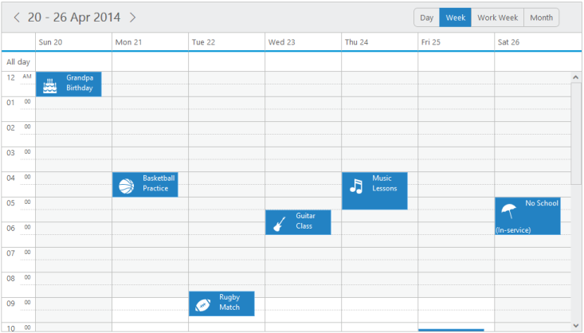

# Template

## Appointment Template

* The appointments are provided with rich template support, so that the customizations are done easily. You can add the appointment template to the Schedule control as follows.



<asp:Content ID="Content1" ContentPlaceHolderID="SampleHeading" runat="server">

Schedule / Template

</asp:Content>

<asp:Content ID="ControlContent" runat="server" ContentPlaceHolderID="ControlsSection">

<ej:Schedule runat="server" ID="Schedule1" DataSourceID="SqlData" CurrentView="Month" Width="100%" Height="525px" AppointmentTemplateId="#MyTemplate"

CurrentDate="5/2/2014">

<AppointmentSettings Id="Id" Subject="Subject" AllDay="AllDay" StartTime="StartTime" EndTime="EndTime" Recurrence="Recurrence" RecurrenceRule="RecurrenceRule" Description="Description"/>

</ej:Schedule>

<asp: SqlDataSource ID="SqlData" runat="server" ConnectionString="<%$ ConnectionStrings: ScheduleConnectionString %>"

SelectCommand="SELECT * FROM [Template]"></asp:SqlDataSource>

</asp:Content>

<asp:Content ID="styleContent" runat="server" ContentPlaceHolderID="StyleSection">

</asp:Content>

<asp:Content ID="ScriptContent" runat="server" ContentPlaceHolderID="ScriptSection">

<%--appointment template definition-- %>

</asp:Content>



* The output for the above code is as follows that displays the appointment with the template defined for it.

schedule with template.
{:.caption} 

## ResourceHeader Template

* The resources are provided with rich template support, so that the customizations are done easily. You can add the resource header template to the Schedule control as follows.





<ej:Schedule runat="server" ID="Schedule1" DataSourceID="SqlData" Width="100%" Height="525px" CurrentDate="5/2/2014" ResourceHeaderTemplateId="#resourceHeaderTemplateId">

	<Group Resources="Owners"/><%--Resource data collection-- %>

	<Resources>

		<%--Enable the multiple selection of resources in the appointment window-- %>

		<ej:Resources Field="OwnerId" Name="Owners" Title="Owner" AllowMultiple="true">

			<ResourceSettings Color="color" Id="id" Text="text"> </ResourceSettings>
			
		</ej:Resources></Resources>

		<AppointmentSettings Id="Id" Subject="Subject" AllDay="AllDay" StartTime="StartTime" EndTime="EndTime" Recurrence="Recurrence" RecurrenceRule="RecurrenceRule" Description="Description" ResourceFields="OwnerId"/>

		</ej:Schedule><asp: SqlDataSource ID="SqlData" runat="server" ConnectionString="<%$ ConnectionStrings: ScheduleConnectionString %>"SelectCommand="SELECT * FROM [MultipleResource]">

		</asp:SqlDataSource>

		// resourceHeader template definition





namespace WebSampleBrowser.Schedule
{
public partial class multipleresource : System.Web.UI.Page
{
protected void Page_Load(object sender, EventArgs e)
{
List<Rooms> owners = new List<Rooms>();
owners.Add(new Rooms { text = "Andrew", id = "1", color = "#f8a398" });
owners.Add(new Rooms { text = "Cruise", id = "3", color = "#56ca85" });
owners.Add(new Rooms { text = "Jerry", id = "5", color = "#51a0ed" });
Schedule1.Resources[0].ResourceSettings.DataSource = owners;
}
public class Rooms
{
public string text { set; get; }
public string id { set; get; }
public string color { set; get; }
}
}







Important: The above used images should be present in a separate images folder, so that it will be referred properly.The images name should be saved with id as same as given in the resourceSettings inorder to set unqiue images to all resources.



The output of the above code looks as follows.

