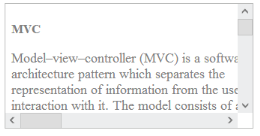

# Getting Started

## Create your first Scroller in ASP.NET

**ASP.NET Scroller** control can be rendered based on the target panel height and width, and includes more customization options.

### Add Scroller Control to your ASP.NET Web Application

You can create an ASP.NET Project and add necessary Dll and script with the help of the given [ASP-Getting Started](https://help.syncfusion.com/aspnet/getting-started) Documentation.

You can add the following code example to the corresponding ASPX page to render Scroller.



    <ej:Scroller ID="scrollcontent" runat="server" Height="170" Width="350" ScrollTop="10" ScrollLeft="20" ButtonSize="20">
        <ScrollerContent>
            

                

                    <h3 style="font-size: 20px;">MVC</h3>
                    

                        

                            Model–view–controller (MVC) is a software architecture pattern which separates the
                            representation of information from the user's interaction with it.
                            The model consists of application data, business rules, logic, and functions. A view can be any
                            output representation of data, such as a chart or a diagram. Multiple views of the same data
                            are possible, such as a bar chart for management and a tabular view for accountants.
                            The controller mediates input, converting it to commands for the model or view.The central
                            ideas behind MVC are code reusable and n addition to dividing the application into three
                            kinds of components, the MVC design defines the interactions between them.
                        

                        <ul>
                            <li>
                                <b>A controller </b>can send commands to its associated view to change the view's presentation of the model (e.g., by scrolling through a document).
                                It can also send commands to the model to update the model's state (e.g., editing a document).
                            </li>
                            <li>
                                <b>A model</b> notifies its associated views and controllers when there has been a change in its state. This notification allows the views to produce updated output, and the controllers to change the available set of commands.
                                A passive implementation of MVC omits these notifications, because the application does not require them or the software platform does not support them.
                            </li>
                            <li>
                                <b>A view</b> requests from the model the information that it needs to generate an output representation to the user.
                            </li>
                        </ul>
                    

                

            

        </ScrollerContent>
    </ej:Scroller>



Initialize Scroller with following styles.



.sampleContent {
		width: 700px;
		padding: 15px;
	}
		


Output of the above steps.

