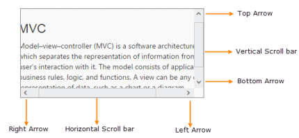

# Scroller Styles

The **Essential ASP.NET Scroller control** allows you to customize the look and function of scrollbars. You can vary it significantly by setting the scrollbar button size, scrollbar position, height and width of the Scroller control. This section describes you the custom styles to be used when creating Scroller.

## ButtonSize

In Scroller control, it allows you to customize the scroll arrows width and height. In horizontal scroller the ButtonSize customizes the top and down arrow and in vertical scroller the ButtonSize customizes the left and right arrow.

## ScrollerSize

The **ScrollerSize property** is used to customize the scrollbar width and height. It is applicable for both horizontal and vertical scroller.

## ScrollTop

The **ScrollerTop property** is used to move the Scroller content and scrollbars in top position with the specified value. It is used for only vertical scroller.

## ScrollLeft

The **ScrollerLeft property** is used to move the Scroller content and scrollbars in left position with the specified value. It is used for only horizontal scroller.

## Height

The **Height property** is used to set the height for Scroller outer wrapper.

## Width

The **Width property** is used to set the width for Scroller outer wrapper.

The following steps explains you on how to apply styles in Scroller control.

In an ASPX page add the following code to render Scroller.



    <ej:Scroller ID="scrollcontent" runat="server" Height="170" Width="350" ScrollTop="10" ScrollLeft="20" ButtonSize="20">
        <ScrollerContent>
            

                

                    <h3 style="font-size: 20px;">MVC</h3>
                    

                        

                            Model–view–controller (MVC) is a software architecture pattern which separates the
                            representation of information from the user's interaction with it.
                            The model consists of application data, business rules, logic, and functions. A view can be any
                            output representation of data, such as a chart or a diagram. Multiple views of the same data
                            are possible, such as a bar chart for management and a tabular view for accountants.
                            The controller mediates input, converting it to commands for the model or view.The central
                            ideas behind MVC are code reusable and n addition to dividing the application into three
                            kinds of components, the MVC design defines the interactions between them.
                        

                        <ul>
                            <li>
                                <b>A controller </b>can send commands to its associated view to change the view's presentation of the model (e.g., by scrolling through a document).
                                It can also send commands to the model to update the model's state (e.g., editing a document).
                            </li>
                            <li>
                                <b>A model</b> notifies its associated views and controllers when there has been a change in its state. This notification allows the views to produce updated output, and the controllers to change the available set of commands.
                                A passive implementation of MVC omits these notifications, because the application does not require them or the software platform does not support them.
                            </li>
                            <li>
                                <b>A view</b> requests from the model the information that it needs to generate an output representation to the user.
                            </li>
                        </ul>
                    

                

            

        </ScrollerContent>
    </ej:Scroller>



### Define the style for Scroller control



.sampleContent {
	width: 700px;
	padding: 15px;
}



The following screenshot displays the output of the above code example.

