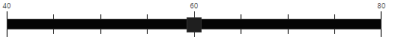
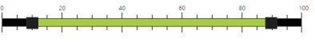
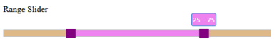

# Appearance and Styling

## Theme

Slider control looks sleek and enriched with good UI appearance. It is included with both metro (flat) theme and gradient theme support. Totally 13 in-built themes are provided including six flat themes and six gradient themes. The themes include three color variations such as Azure, Lime and Saffron. The themes supported by the Slider control are as follows,

* bootstrap-theme
* default-theme
* flat-azure-dark
* flat-lime
* flat-lime-dark
* flat-saffron
* flat-saffron-dark
* gradient-azure
* gradient-azure-dark
* gradient-lime
* gradient-lime-dark
* gradient-saffron
* gradient-saffron-dark

In order to apply different themes, you can refer to the ej.controls.all.min.css file from the corresponding theme folders. This file is a combination of two style sheets ej.controls.core.min.css and ej.theme.min.css. Instead of including ej.controls.all.min.css file, you can also refer to the ej.controls.core.min.css and ej.theme.min.css files separately.

The following steps explain you how to apply flat-lime-dark theme to the Slider control

In an ASPX page, specify the desired ej.controls.all.min.css file to load the corresponding theme.



<head>

    <title>Slider</title>

    <!--Flat-Lime theme-->

    <link href="http://cdn.syncfusion.com/{{site.releaseversion}}/js/web/flat-lime-dark/ ej.controls.all.min.css " rel="stylesheet" />

    <!--scripts-->

    

    

</head>



In an ASPX page, define the Slider control with “Default” and “Range”.



<ej:Slider ID="BasicSlider" runat="server" Width="500" Value="60" MinValue="40" MaxValue="80" ShowScale="true" SmallStep="5" LargeStep="20" ></ej:Slider>

<ej:Slider ID="RangeSlider" runat="server" Width="500" Values="10,90" ShowScale="true" SliderType="Range" SmallStep="5" LargeStep="20"></ej:Slider>



The following screenshot displays the output of the above code example.

#### Default Slider

 

#### Range Slider

 

## CSS Class

To display the Slider control in different styles based on the appearance of your application, use CssClass property that applies custom theme for the Slider. Specify a class name as the value for CssClass property. The specified class is added to the wrapper of the Slider control. Now, you can easily override the styles of the Slider control by accessing the styles from the root level by using the CssClass specified.

In an ASPX page, define the Slider control and configure the Slider with custom theme by using the CssClass property.



<ej:Slider ID="RangeSlider" runat="server" Width="500" Values="25,75" CssClass="purple" SliderType="Range"></ej:Slider>



### Define CSS class for customizing the Slider.



.purple.e-slider.e-control {

	background-color: burlywood;

	border-color: #bbbcbb;

}

.purple.e-tooltip {

	background: none repeat scroll 0 0 violet;

	/* Old browsers */

	border-color: #1b95cf;

	color: white;

}

.purple.e-slider .e-handle.e-select {

	background-color: purple;

	border-color: purple;

}

.purple.e-slider .e-handle.e-hover {

	background-color: purple;

	border-color: purple;

}

.purple.e-slider .e-handle.e-focus {

	box-shadow: 0 0 2px rgba(0, 0, 0, 0.2);

}

.purple.e-slider .e-range {

	background: none repeat scroll 0 0 violet;

	/* Old browsers */

}

.purple.e-scale .e-tick {

	background-image: url(images/dot.png);

}



The following screenshot displays the output of the above code example.

 

## Show Tooltip

Slider displays the tooltip to indicate the current value when you click on the Slider handle. By default, Slider displays the tooltip. By using the ShowTooltip option, you can enable or disable the Tooltip. Data type of this property is Boolean.

In an ASPX page, define the Slider control and set the ShowSmallTicks property to false to disable the tooltip in Slider. 



<ej:Slider ID="BasicSlider" runat="server" Width="500" Value="60" ShowTooltip="false"> </ej:Slider>



## Show Rounded Corner

This property is used to display the Slider and its handle with rounded corners. By default ShowRoundedCorner is in disabled state. Data type of this property is Boolean.

In an ASPX page, define the Slider control and set the ShowRoundedCorner property to true. 



<ej:Slider ID="BasicSlider" runat="server" Width="500" Value="60" ShowRoundedCorner="true"></ej:Slider>



The following screenshot displays the output of the above code example.

 