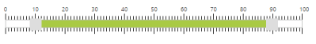
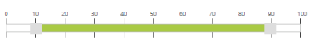
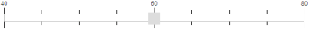
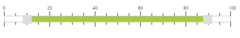

# Scale Settings

Slider control includes option to display the scale on the Slider. Scale in Slider supports you to easily identify the current value/values of the Slider. Scale contains small ticks and large ticks. Values of the Slider are displayed above each large ticks.

## Show Scale

This property enables the scale in the Slider. By default, its value is false. Data type of this property is Boolean.

In an ASPX page, define the Slider control with Default and Range Sliders and set the ShowScale property to true. 



<ej:Slider ID="BasicSlider" runat="server" Width="500" Value="60" MinValue="40" MaxValue="80" ShowScale="true"></ej:Slider>

<ej:Slider ID="RangeSlider" runat="server" Width="500" Values="10,90" ShowScale="true" SliderType="Range"></ej:Slider>



The following screenshot displays the output of the above code example.

#### Default Slider

 

#### Range Slider

 

## Enable Small Ticks

Slider control provides you an option to enable/disable the small ticks present in the scale. By default, when you enable showScale property, small ticks are displayed in the scale. Use the ShowSmallTicks property to disable the small ticks present in the scale. Data type of this property is Boolean. The [renderingTicks](https://help.syncfusion.com/api/js/ejslider#events:renderingticks) event will be triggered while creating each slider scale tick.

In an ASPX page, define the Slider control with Default and RangeSliders and set the ShowSmallTicks property to false to disable the small ticks in the Slider. 



<ej:Slider ID="BasicSlider" runat="server" Width="500" Value="60" MinValue="40" MaxValue="80" ShowScale="true" ShowSmallTicks="false"></ej:Slider>

<ej:Slider ID="RangeSlider" runat="server" Width="500" Values="10,90" ShowScale="true" SliderType="Range" ShowSmallTicks="false"></ej:Slider>



The following screenshot displays the output of the above code example.

#### Default Slider

#### Range Slider

## Small step

This property specifies the distance between two small ticks present in the scale and the position of the small ticks in the Slider scale. Data type of this property is number.

## Large step

This property specifies the distance between the two small ticks present in the scale and the position of the large ticks in the Slider scale. Data type of this property is number.

In an ASPX page, define the Slider control with Default and RangeSliders and configure the SmallStep and LargeStep properties as required. 



<ej:Slider ID="BasicSlider" runat="server" Width="500" Value="60" MinValue="40" MaxValue="80" ShowScale="true" SmallStep="5" LargeStep="20"></ej:Slider>

<ej:Slider ID="RangeSlider" runat="server" Width="500" Values="10,90" ShowScale="true" SliderType="Range" SmallStep="5" LargeStep="20"></ej:Slider>



The following screenshot displays the output of the above code example.

#### Default Slider

#### Range Slider

In the above example, for Default Slider, the SmallStep value is specified as 5, so for each 5 values from the starting value, small ticks are enabled. Also, LargeStep value is specified as 20, so for each 20 values from the starting value, large ticks are enabled.

Similarly for Range Slider, SmallStep value is specified as 5, so for each 5 values from the starting value, small ticks are enabled. Also, LargeStep value is specified as 25, so for each 25 values large ticks are enabled.

