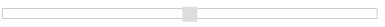
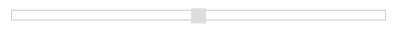
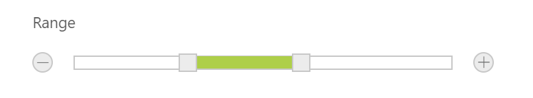

# Updating Slider Value

Slider control includes an option to specify/update its value. Also, you can specify the starting and ending value for the Slider by using the MinValue and MaxValue properties.

## Value

This property is used to set the value in the Default and Min-Range Sliders. By default, its value is null when no value is specified. Data type of this property is number.
You can get/set the value in the slider handle by using [getValue](https://help.syncfusion.com/api/js/ejslider#methods:getvalue) and [setValue](https://help.syncfusion.com/api/js/ejslider#methods:setValue) methods.
Also [change](https://help.syncfusion.com/api/js/ejslider#events:change) event will be triggered whenever **Slider** value is changed.

## Values

This property is used to set the value in Range Slider. By default, range values are from 0 to 100. The property is of Array data type.

In an ASPX page, define the Slider control and configure the Value and Values properties as required.



<ej:Slider ID="BasicSlider" runat="server" Width="500" Value="50" SliderType="Default"></ej:Slider> 

<ej:Slider ID="RangeSlider" runat="server" Width="500" Values="20,80" SliderType="Range"></ej:Slider>



The following screenshot displays the output of the above code example.

Default Slider

Range Slider

## MinValue

To set the minimum/starting value of the Slider, you can use the MinValue property. By default, its value is 0. Data type of this property is number.

## MaxValue

To set the maximum/ending value of the Slider, you can use the MaxValue property. By default, its value is 100. Data type of this property is number.

In an ASPX page, define the Slider control and configure the MinValue and MaxValue properties as required with Default and Range Slider.



<ej:Slider ID="BasicSlider" runat="server" Width="500" Value="60" MinValue="40" MaxValue="80"></ej:Slider>

<ej:Slider ID="RangeSlider" runat="server" Width="500" Values="10,90" MinValue="10"MaxValue="90" SliderType="Range"></ej:Slider>



The following screenshot displays the output of the above code example.

#### Default Slider

#### Range Slider

In the above example, for Default Slider, the slider value starts from 40 (min value) and ends at 80 (max value). So, the Slider handle is placed at the center of the Slider while specifying the value as 60.

For Range Slider, the value starts from 10 (min value) and ends at 90 (max value). The range shadow occupies the entire Slider, since the range (values) is specified as [10, 90].

## Buttons

Slider includes the button support for increment or decrement the values of the slider.

### Enabling Buttons

Use the ShowButtons property to enable the button support. By default this property is disabled. Data type of this property is “Boolean”.

The following steps explains you on how to enable button support in Slider.

In an ASPX page, define the Slider control and set the ShowButtons property to true.



  <ej:Slider ID="RangeSlider" runat="server" Width="500" Values="30,60" SliderType="Range" ShowButtons="true"></ej:Slider>



The following screenshot displays the output of the above code example.

