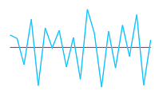

## Axis Customize 

The Sparkline axis can be collapsed using visible property in `AxisLineSettings` and this not applicable for win-loss. You can customize `Color`, `Width` and `DashArray` of axis line.


 
<ej:Sparkline ClientIDMode="Static" ID="Sparkline1" runat="server">    
    <AxisLineSettings Visible="true" Color="#ff14ae"></AxisLineSettings>
</ej:Sparkline>



