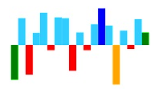

## Point Customization

You can customize points by initializing the point colors. The customization options allow you to differentiate the `First`, `Last`, `Highest`, `Lowest`, and `Negative` points. This customization only applicable for line, column and area type Sparkline.



<ej:Sparkline ClientIDMode="Static" ID="Sparkline1" runat="server"
    NegativePointColor="Red"
    HighPointColor="Blue"
    LowPointColor="Orange"
    StartPointColor="Green"
    EndPointColor="Green" >
 </ej:Sparkline>



