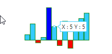
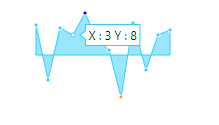
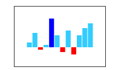

# Sparkline Customization

This section explains you the customization options available to make changes in the Sparkline for getting better appearance.

## Sparkline background

You can specify the background color for the Sparkline using `Background` property. When you don't specify the `Background`, it takes "transparent" as background color. 



<ej:Sparkline ClientIDMode="Static" ID="Container" runat="server" Background="gray">
</ej:Sparkline>

 

## Stroke color and width

You can customize the series border color and width using `Stroke` and `Width`. This is applicable for Sparkline types line and area.



<ej:Sparkline ClientIDMode="Static" ID="Container" runat="server" Stroke="green" Width="3">
</ej:Sparkline>

 

## Sparkline border

You can customize the `Border` color and width of the Sparkline using `Color` and `Height` properties. This is applicable for column, win-loss and pie series.



<ej:Sparkline ClientIDMode="Static" ID="Container" runat="server">
    <Border Color="green" Width="2"></Border>
</ej:Sparkline>

 

## Opacity

By default `Opacity` of the Sparkline is 1. You can specify the opacity value from 0 to 1. This is applicable for all types of series. 



<ej:Sparkline ClientIDMode="Static" ID="Container" runat="server" Opacity="0.5">
</ej:Sparkline>

 

## Padding for Sparkline

`Padding` is used to specify the padding value between the container and Sparkline. By default padding value of the Sparkline is 5. 



<ej:Sparkline ClientIDMode="Static" ID="Container" runat="server" Padding="20">
</ej:Sparkline>

 

## Canvas support

You can control whether Sparkline has to be rendered as SVG or Canvas. `EnableCanvasRendering` property supports all the functionalities supported in SVG rendering.



<ej:Sparkline ClientIDMode="Static" ID="Container" runat="server" EnableCanvasRendering="true">
</ej:Sparkline>

 

## Themes

You can specify different `Theme` for Sparkline control.



<ej:Sparkline ClientIDMode="Static" ID="Container" runat="server" Theme="FlatDark">
</ej:Sparkline>

 

