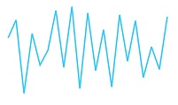
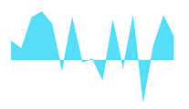
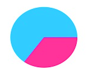

# Sparkline Types

## Line Type

To render a Line type Sparkline, set the `Type` as **line**. To change the color and width of the line, you can use the `Fill` and `Width` property.	



<ej:Sparkline ClientIDMode="Static" ID="Sparkline1" Width="3" Fill="#33ccff" runat="server">          
</ej:Sparkline>



## Column Type

To render a Column Sparkline, set the type as **column** To change the color of the column, you can use the `Fill` property.



<ej:Sparkline ClientIDMode="Static" ID="Sparkline1" Type="Line" Fill="#33ccff" runat="server">          
</ej:Sparkline>



## Area Type

To render an Area Sparkline, you can specify the type as **area**. To change the Area color, you can use the `Fill` property



<ej:Sparkline ClientIDMode="Static" ID="Sparkline1" Type="Area" Fill="#69D2E7" runat="server">          
</ej:Sparkline>



## WinLoss Type

WinLoss Sparkline render as a column segment and it show the positive, negative and neutral values. You can customize the positive and negative color of the win-loss type.



<ej:Sparkline ClientIDMode="Static" ID="Sparkline1" Type="WinLoss" Fill="#69D2E7" runat="server">          
</ej:Sparkline>



## Pie Type

You can create a pie type sparkline by setting the type as **pie**. Colors for the pie can be customize using `Palette` property.



<ej:Sparkline ClientIDMode="Static" ID="Sparkline1" Type="Pie" runat="server">
</ej:Sparkline>





this.Sparkline1.Palette = new List<string>() { "#ff3399", "#33ccff"};



