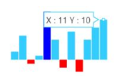
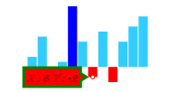
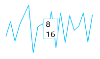

## Tooltip  

The `Tooltip` follows the pointer movement and is used to indicate the value of a point. This feature is applicable for line, column, pie, and area Sparkline. You can enable the tooltip by setting it’s `Visible` property as true. You can customize the tooltip `Fill`, `Border` and `Font`.



@(Html.EJ().Sparkline("container")

.Tooltip(tooltip => tooltip.Visible(true))
 
 )



## Tooltip Customization

You can customize the tooltip `Fill`, `Border` `Color`, `Width` and `Font` properties `Color`, `FontFamily`, `FontStyle`, `FontWeight`, `Opacity` and `Size`



<ej:Sparkline ClientIDMode="Static" ID="Sparkline1" runat="server">    
    <Tooltip Visible="true" Fill="#ff14ae" Width="4">
        <Border Color="Green" Width="3"></Border>
        
    </Tooltip>
</ej:Sparkline>



## Tooltip Template   

HTML elements can be displayed in the tooltip by using the `Template` option of the tooltip. The template option takes the value of the id attribute of the HTML element. You can use the **#point.x#** and **#point.y#** as place holders in the HTML element to display the x and y values of the corresponding point.



    

        
#point.x#

        
#point.y#

    

<ej:Sparkline ClientIDMode="Static" ID="Sparkline1" runat="server">    
    <Tooltip Visible="true" Template="item"></Tooltip>
</ej:Sparkline>



