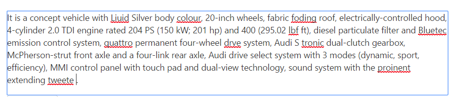

# Functionalities

## Check Spelling

The main functionality of the SpellCheck control is checking the spelling of a word and returns the suggestions for an error word.

For example, if you pass the sentence that contains misspell words as input, you can know the error words in this sentence and its suggestions (apt words to replace).

## Ignore Words

The SpellCheck control provides the support to ignore the words from an error word consideration and also to ignore an error words whenever needed. Please refer the following options to ignore the words.

### Ignore

The **ignore** method is used to ignore a specific word once from the given input string. 

The following code example describes the above method implementation.



    <ej:SpellCheck ID="SpellCheck" ClientIDMode="Static" runat="server" ControlsToValidate="#TextArea">
        <DictionarySettings DictionaryUrl="../api/SpellCheck/CheckWords" CustomDictionaryUrl="../api/SpellCheck/AddToDictionary" />
    </ej:SpellCheck>   



### Ignore All

The **ignoreAll** method is used to ignore all the error word occurrences from the given input string.

The following code example describes the way of using ignore all method.



    <ej:SpellCheck ID="SpellCheck" ClientIDMode="Static" runat="server" ControlsToValidate="#TextArea">
        <DictionarySettings DictionaryUrl="../api/SpellCheck/CheckWords" CustomDictionaryUrl="../api/SpellCheck/AddToDictionary" />
    </ej:SpellCheck>   



### Word Collection to Ignore

The **IgnoreWords** option is used to ignore the collection of words from an error word checking. You can pass the technical terms, brand names which is not present in the dictionary file to this property "IgnoreWords" as shown in the following code example and then while checking the spelling these passed words are considered as a correct word.



        Facebook is a social networking service headquartered in Menlo Park, California. Its website was launched on February 4, 2004, by Mark Zuckerberg with his Harvard College roommates and fellow students Eduardo, Andrew McCollum, Dustin and Chris Hughes. The fouders had initially limited the websites membrship to Harvard students, but later expanded it to collges in the Boston area, the Ivy League, and Stanford Univrsity. It graually added support for students at various other universities and later to high-school students.

    <ej:Button ID="CheckText" Type="Button" ClientSideOnClick="checkErrors" Text="Spell Check" runat="server"></ej:Button>

    <ej:SpellCheck ID="SpellCheck" ClientIDMode="Static" runat="server" ControlsToValidate="#TextArea">
        <DictionarySettings DictionaryUrl="../api/SpellCheck/CheckWords" CustomDictionaryUrl="../api/SpellCheck/AddToDictionary" />
    </ej:SpellCheck>    





        protected void Page_Load(object sender, EventArgs e)
        {
            SpellCheck.IgnoreWords = new string[] { "Facebook", "Zuckerberg" };
        }



## Ignore Settings

The **IgnoreSettings**  helps to ignore the uppercase, mixed case words, alphanumeric words, file path and email addresses from the error word checking. Ignore settings contains the following options to ignore the words based on their category.

* **IgnoreAlphaNumericWords** - ignoring the alpha numeric words from an error word consideration.
* **IgnoreUpperCase** - ignoring the upper case words from an error word consideration.
* **IgnoreMixedCaseWords** - ignoring the mixed case words from an error word consideration.
* **IgnoreFileNames** - ignoring the file address path from an error word consideration.
* **IgnoreUrl** - ignoring the url links from an error word consideration.
* **IgnoreEmailAddress** - ignoring the email address from an error word consideration.

The following code example uses to enable the checking of all the words formed with alphanumeric, uppercase, mixed case words and file paths and email addresses.  



    <ej:SpellCheck ID="SpellCheck" ClientIDMode="Static" runat="server" ControlsToValidate="#TextArea">
        <DictionarySettings DictionaryUrl="../api/SpellCheck/CheckWords" CustomDictionaryUrl="../api/SpellCheck/AddToDictionary" />
        <IgnoreSettings IgnoreAlphaNumericWords=false IgnoreMixedCaseWords=false IgnoreUpperCase=false
               IgnoreUrl=false IgnoreEmailAddress=false IgnoreFileNames=false/>
    </ej:SpellCheck>



## Change Words

The SpellCheck control provides the support to change an error words from its possible suggestions. Please refer the following options to change an error word.

### Change

The **change** method is used to replace an error word occurrences once from the given input string with the correct word.

The following code example describes the behavior of change method.



    <ej:SpellCheck ID="SpellCheck" ClientIDMode="Static" runat="server" ControlsToValidate="#TextArea">
        <DictionarySettings DictionaryUrl="../api/SpellCheck/CheckWords" CustomDictionaryUrl="../api/SpellCheck/AddToDictionary" />
    </ej:SpellCheck>   



### Change All

The **changeAll** method is used to replace all the occurrences of an error word with the correct word(selected from the suggestions list) from the given inputs string.

The following code example uses to change all the error word occurrences.



    <ej:SpellCheck ID="SpellCheck" ClientIDMode="Static" runat="server" ControlsToValidate="#TextArea">
        <DictionarySettings DictionaryUrl="../api/SpellCheck/CheckWords" CustomDictionaryUrl="../api/SpellCheck/AddToDictionary" />
    </ej:SpellCheck>   



## Custom Words

The SpellCheck control provides the support to add the custom words into the custom dictionary file.

The **addToDictionary** method is used to add the custom words into the custom dictionary file.

The following code example uses to add the custom word into the custom dictionary file.



    <ej:SpellCheck ID="SpellCheck" ClientIDMode="Static" runat="server" ControlsToValidate="#TextArea">
        <DictionarySettings DictionaryUrl="../api/SpellCheck/CheckWords" CustomDictionaryUrl="../api/SpellCheck/AddToDictionary" />
    </ej:SpellCheck>   



You can also add the custom words into the custom dictionary file through the dialog mode or context menu mode add to dictionary option.

* Dialog Mode - Add To Dictionary button is available in the dialog window, while highlighting the error word in the given input string and clicking this button then the word will be adding into the custom dictionary file.
* Context Menu Mode - Add To Dictionary option is available while right click on the error word and selecting this option, the word will be adding into the custom dictionary file.

## Checking content on typing

SpellCheck control supports for checking the content, while pressing the `Enter` and `Space` key. The cursor position also properly retained, while processing the spell check operations. If you set `true` to the **EnableValidateOnType** property, the spell check operation will be performed on typing the text. 

The following code example describes the above behavior.



        Facebook is a social networking service headquartered in Menlo Park, California. Its website was launched on February 4, 2004, by Mark Zuckerberg with his Harvard College roommates and fellow students Eduardo, Andrew McCollum, Dustin and Chris Hughes.
        The fouders had initially limited the websites membrship to Harvard students, but later expanded it to collges in the Boston area, the Ivy League, and Stanford Univrsity. It graually added support for students at various other universities and later to high-school students.

    <ej:SpellCheck ID="SpellCheck" ClientIDMode="Static" runat="server" ControlsToValidate="#TextArea" EnableValidateOnType="true">
        <DictionarySettings DictionaryUrl="../api/SpellCheck/CheckWords" CustomDictionaryUrl="../api/SpellCheck/AddToDictionary" />
    </ej:SpellCheck>    



The following screenshot displays the output for the above code

## Suggestion Words

The **getSuggestionWords** method is used to get the possible suggestion words to an error word to correct the spelling.

The following code example describes the above behavior.



    <ej:SpellCheck ID="SpellCheck" ClientIDMode="Static" runat="server">
        <DictionarySettings DictionaryUrl="../api/SpellCheck/CheckWords" CustomDictionaryUrl="../api/SpellCheck/AddToDictionary" />
    </ej:SpellCheck>   



N> You can get the suggestion words after some time interval once the method is called, since the AJAX request is processing in the background.

## Synchronous request

The **EnableAsync** option is used to send the Synchronous request to perform the SpellCheck operations.

The following code example describes the above behavior.



    <ej:SpellCheck ID="SpellCheck" ClientIDMode="Static" runat="server" EnableAsync="false" AjaxDataType="json">
        <DictionarySettings DictionaryUrl="../api/SpellCheck/CheckWords" CustomDictionaryUrl="../api/SpellCheck/AddToDictionary" />
    </ej:SpellCheck>   



N> You need to set the AjaxDataType value as json to get the Synchronous request result properly.