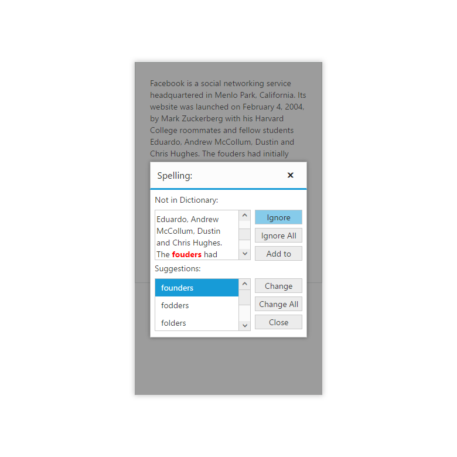

# Responsive

The SpellCheck control has support for responsive behavior based on client browser’s width and height. To enable responsive, **IsResponsive** property should be true.

The following code example describes the above behavior.



        Facebook is a social networking service headquartered in Menlo Park, California. Its website was launched on February 4, 2004, by Mark Zuckerberg with his Harvard College roommates and fellow students Eduardo, Andrew McCollum, Dustin and Chris Hughes. The fouders had initially limited the websites membrship to Harvard students, but later expanded it to collges in the Boston area, the Ivy League, and Stanford Univrsity. It graually added support for students at various other universities and later to high-school students.

<ej:SpellCheck ID="SpellCheck" ClientIDMode="Static" runat="server" ControlsToValidate="#TextArea" IsResponsive="true">
    <DictionarySettings DictionaryUrl="../api/SpellCheck/CheckWords" CustomDictionaryUrl="../api/SpellCheck/AddToDictionary" />
</ej:SpellCheck>



The dialog of spell check control is rendering based on the client browser’s width and height. Refer to the following code snippet to render the SpellCheck dialog control with responsive.



        Facebook is a social networking service headquartered in Menlo Park, California. Its website was launched on February 4, 2004, by Mark Zuckerberg with his Harvard College roommates and fellow students Eduardo, Andrew McCollum, Dustin and Chris Hughes. The fouders had initially limited the websites membrship to Harvard students, but later expanded it to collges in the Boston area, the Ivy League, and Stanford Univrsity. It graually added support for students at various other universities and later to high-school students.

<ej:Button ID="CheckButton" Type="Button" ClientSideOnClick="showInDialog" Text="Spell Check using Dialog" runat="server"></ej:Button>
<ej:SpellCheck ID="SpellCheck" ClientIDMode="Static" runat="server" ControlsToValidate="#TextArea" IsResponsive="true">
    <DictionarySettings DictionaryUrl="../api/SpellCheck/CheckWords" CustomDictionaryUrl="../api/SpellCheck/AddToDictionary" />
</ej:SpellCheck>



Mobile Rendering Screenshot:

