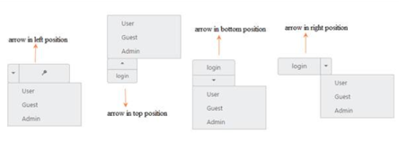

# Arrow Position

To provide a good look and feel for the Split Button, position of arrow in the Split Button is important. By using the ArrowPosition property, you can easily customize the position of arrow inside Split Button without using any complex CSS. ArrowPosition property is applicable for both Split Button and Dropdown Button. This property represents the position of arrow with menu content.

<table>
<tr>
<th>
Left</th><td>
Support for arrow in left.</td></tr>
<tr>
<th>
Right</th><td>
Support for arrow in right. </td></tr>
<tr>
<th>
Top</th><td>
Support for arrow in top. </td></tr>
<tr>
<th>
Bottom</th><td>
Support for arrow in bottom.</td></tr>
</table>

The following steps explain the details on rendering the Split Button with above mentioned arrow position options.

In an ASPX page, define the Split Button control and configure the ArrowPosition property as required.  



<ej:SplitButton ID="spltbutton11" runat="server" Text="login" Size="Large" ShowRoundedCorner="true" ContentType="ImageOnly" ArrowPosition="Left" PrefixIcon="e-icon e-login">

    <Items>

        <ej:SplitItem Text="User"></ej:SplitItem>

        <ej:SplitItem Text="Guest"></ej:SplitItem>

        <ej:SplitItem Text="Admin"></ej:SplitItem>

    </Items>

</ej:SplitButton>

<ej:SplitButton ID="spltbutton21" runat="server" Text="login" Size="Mini" ShowRoundedCorner="true" ContentType="TextOnly" ArrowPosition="Top">

    <Items>

        <ej:SplitItem Text="User"></ej:SplitItem>

        <ej:SplitItem Text="Guest"></ej:SplitItem>

        <ej:SplitItem Text="Admin"></ej:SplitItem>

    </Items>

</ej:SplitButton>

<ej:SplitButton ID="spltbutton31" runat="server" Text="login" Size="Small" ShowRoundedCorner="true" ContentType="TextOnly" ArrowPosition="Bottom">

    <Items>

        <ej:SplitItem Text="User"></ej:SplitItem>

        <ej:SplitItem Text="Guest"></ej:SplitItem>

        <ej:SplitItem Text="Admin"></ej:SplitItem>

    </Items>

</ej:SplitButton>

<ej:SplitButton ID="spltbutton41" runat="server" Text="login" Size="Medium" ShowRoundedCorner="true" ContentType="TextOnly" ArrowPosition="Right">

    <Items>

        <ej:SplitItem Text="User"></ej:SplitItem>

        <ej:SplitItem Text="Guest"></ej:SplitItem>

        <ej:SplitItem Text="Admin"></ej:SplitItem>

    </Items>

</ej:SplitButton>



The following screenshot displays the output of the above code example.

