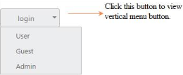

# Dropdown Button

You can change the Split Button as Dropdown Button that consists of a single button. When it is clicked, displays a drop-down list of mutually exclusive items. You can achieve this by using default functionality of the Split Button with ButtonMode as Dropdown. Initially the Items tag is mandatory.

The following steps explain how to change the Split Button as Dropdown Button.

In an ASPX page, define the Split Button control.



<ej:SplitButton ID="dropdownbtn" runat="server" Text="login" Size="Medium" ShowRoundedCorner="true" ContentType="TextOnly" ButtonMode="Dropdown">

    <Items>

        <ej:SplitItem Text="User"></ej:SplitItem>

        <ej:SplitItem Text="Guest"></ej:SplitItem>

        <ej:SplitItem Text="Admin"></ej:SplitItem>

    </Items>

</ej:SplitButton>



The following screenshot displays the output of the above code example.

 

