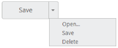

# Getting Started

## Create your first Split Button in ASP.NET

Essential ASP.NET Split Button control contains built-in features such as Click and different display options. You can create the Split Button control by using HTML helper as follows.

You can create a WEB Project and add necessary assemblies, styles and scripts to it.  Refer to [ASP-Getting Started.](https://help.syncfusion.com/aspnet/getting-started)

Create an ASPX file and add the following code example to ASPX file for ejSplitButton creation.



<ej:SplitButton ID="ButtonSizeLarge" runat="server" Text="Save" Size="Large" ShowRoundedCorner="true">

    <items>

        <ej:splititem text="Open.."></ej:splititem>

        <ej:splititem text="Save"></ej:splititem>

        <ej:splititem text="Delete"></ej:splititem>

    </items>

</ej:SplitButton>



N> Add menu items of the Split Button inside <Items> that is displayed when you click on the Split Button.

#### Output of above steps.

