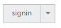

# Miscellaneous

## Text

It is necessary to display the user-defined text for the Split Button. By using the **Text property**, you can easily set text content for the Split Button. This Text property overwrites the text that is provided on input button element.

The following step explains the details about rendering the Split Button with specified text.

In an ASPX page, define the Split Button control. Set the Text property as required.  



    <ej:SplitButton ID="SplitButton_Text" runat="server" Text="signin" Size="Small">

        <Items>

            <ej:SplitItem Text="User"></ej:SplitItem>

            <ej:SplitItem Text="Guest"></ej:SplitItem>

            <ej:SplitItem Text="Admin"></ej:SplitItem>

        </Items>

    </ej:SplitButton>



Define the style for the Split Button control.



.spltspan {

	margin-left: 120px;

}



The following screenshot displays the output of the above code example.

 

## Show Rounded Corner

Specifies the corner of the Split Button in a rounded shape. By default, the edges of the Split Button are not rounded. To set rounded corner, you can enable the **ShowRoundedCorner property**.

The following step explains the details about rendering the Split Button with rounded corner.

In an ASPX page, define the Split Button control. Set the ShowRoundedCorner property to true.  



    <ej:SplitButton ID="SplitButton_RoundedCorner" runat="server" Text="login" ShowRoundedCorner="true" Size="Small">

        <Items>

            <ej:SplitItem Text="User"></ej:SplitItem>

            <ej:SplitItem Text="Guest"></ej:SplitItem>

            <ej:SplitItem Text="Admin"></ej:SplitItem>

        </Items>

    </ej:SplitButton>



Define the style for the Split Button control.



.spltspan {

	margin-left: 120px;

}



The following screenshot displays the output of the above code example.

  

