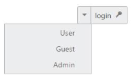

# RTL Support

In some cases, it is necessary to use right to left alignment. RTL support is provided by using **EnableRTL property**. In RTL mode, when there is more than one content (image/text, image/image) in the Split Button, then the content is aligned in right to left format. For example, when text is in left and image is in right position, after applying right to left alignment these positions are interchanged.

The following step explains the details about rendering the Button with Right to left alignment support.

In an ASPX page, define the Split Button control. Set the EnableRTL property to true.  



      <ej:SplitButton ID="SplitButton_RTL" runat="server" Text="login" Size="Small" ShowRoundedCorner="true" ContentType="TextAndImage" PrefixIcon="e-icon e-login" EnableRTL="true">

        <Items>

            <ej:SplitItem Text="User"></ej:SplitItem>

            <ej:SplitItem Text="Guest"></ej:SplitItem>

            <ej:SplitItem Text="Admin"></ej:SplitItem>

        </Items>

      </ej:SplitButton>



The following screenshot displays the output of the above code example.

 

