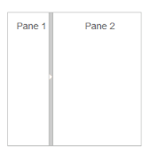
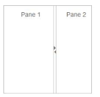
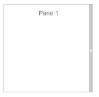
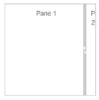
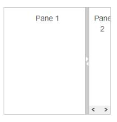
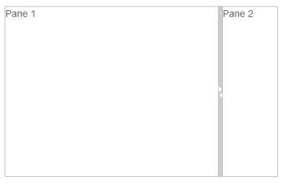

# Appearance and Styling

## Responsive

The EnableAutoResize option allows the Splitter control to adapt its rendering based on the parent container where it is actually placed. When this option is set to true, the Splitter control adjusts its height and width based on the outer container that contains it, and also the sub-elements within it adjust to its height, width and position, appropriately.

## Enable Auto Resize

In an ASPX page, define the Splitter control and add the contents correspondingly. Set the EnableAutoResize property as true.



<ej:Splitter Height="280" Width="100%" ID="outersplitter" EnableAutoResize="true" Orientation="Vertical" runat="server">

	 <ej:SplitPane PaneSize="60">

		 

			  

				<h3 class="h3">ASP.NET MVC </h3>

			  

		  

	 </ej:SplitPane>

	 <ej:SplitPane>

		<ej:Splitter ID="innersplitter" EnableAutoResize="true"  runat="server">

			 <ej:SplitPane>

			   

				  

					<h3 class="h3">Tools </h3>Essential Tools is an collection of user interface components used to create interactive ASP.NET MVC applications.

				  

			   

			 </ej:SplitPane>

			 <ej:SplitPane>

			   

				  

					<h3 class="h3">Grid </h3>

					Essential MVC Grid offers full featured a Grid control with extensive support for Grouping and the display of hierarchical data.

				  

			   

			 </ej:SplitPane>

		</ej:Splitter>

	</ej:SplitPane>

</ej:Splitter>



The following screenshot displays the output of the above code example.

The output for Splitter when EnableAutoResize is “True”.

The output for Splitter when EnableAutoResize is “false”.

 

## Animation Support

The Splitter provides animation support when you expand or collapse the pane. The animation speed can be modified by using the AnimationSpeed property that has values in milliseconds.

## Enabling Animation with Animation speed

The following steps explain the implementation of EnableAnimation option in the Splitter control.

In an ASPX page, define the Splitter control and add the contents correspondingly. Set the EnableAnimation property as true with AnimationSpeed.



<ej:Splitter ID="splitter" AnimationSpeed="300" Height="200px" Width="200px" EnableAnimation="true" runat="server">

          <ej:SplitPane>

             

                
Pane 1

            

         </ej:SplitPane>

         <ej:SplitPane>

             

                
Pane 2

            

         </ej:SplitPane>

</ej:Splitter>



The output for Splitter when EnableAnimation is “True”. Expanding or collapsing the outer pane in the Splitter produces the animation effect with the animation speed.

 

### Adjusting Splitter Size

#### Height

The height of Splitter can be modified by using the Height property. The default value for Height property is null in Splitter. You can set the Height property by pixel or percentage values.

#### Width

The width of Splitter can be modified by using the Width property. The default value for Width property is null in Splitter. You can set the Width property by pixel or percentage values.

#### Max Size

Defines the maximum resizable size of the pane when you resize the Splitter control. The default value of MaxSize is null in Splitter. You can set the MaxSize property by pixel values.

#### Min Size

Defines the minimum resizable size of the pane when you resize the Splitter control. The default value of MinSize is 10 in Splitter. You can set the MinSize property by pixel values.

#### Pane Size

Defines the pane size in the Splitter control. The default value of PaneSize is 0px in Splitter. You can set the PaneSize property by pixel or percentage values.

#### Resizable

Defines whether the pane in the Splitter is resizable or not. Setting the Resizable property as “false” disables the resize option to the pane. The default value of Resizable property is true in Splitter.

The following steps explain the implementation of Splitter properties.

In an ASPX page, define the Splitter control and add the contents correspondingly. Set the Resizable property as true.



<ej:Splitter ID="splitter" Height="200"  Width="200" CssClass="customCss" runat="server">

     <ej:SplitPane PaneSize="80" MinSize="10" MaxSize="40" Collapsible="true" Resizable="true">

            

                
Pane 1

            

     </ej:SplitPane>

     <ej:SplitPane PaneSize="80" MinSize="10" MaxSize="40" Collapsible="true" Resizable="true">

            

              
Pane 2

            

     </ej:SplitPane>

</ej:Splitter>



The output for Splitter after adding the properties.

 

 

 

 

## Theme

Splitter control’s style and appearance can be controlled based on CSS classes. In order to apply styles to the Splitter control, refer to 2 files namely: ej.widgets.core.min.css and ej.theme.min.css. When you refer to ej.widgets.all.min.css file, it is not necessary to include the files ej.widgets.core.min.css and ej.theme.min.css in your project, as ej.widgets.all.min.css is the combination of these two.

By default, there are 13 themes support available for Splitter control namely

* bootstrap-theme
* default-theme
* flat-azure-dark
* fat-lime
* flat-lime-dark
* flat-saffron
* flat-saffron-dark
* gradient-azure
* gradient-azure-dark
* gradient-lime
* gradient-lime-dark
* gradient-saffron
* gradient-saffron-dark

## CSS Class

The CSS properties can be customized by using CssClass in the Splitter control. The following steps explain the implementation of CssClass option in the Splitter control.

In an ASPX page, define the Splitter control and add the contents correspondingly. 



<ej:Splitter ID="splitter" Height="200" Width="200" CssClass="customCSS" runat="server">

    <ej:SplitPane>

         

            
Pane 1

        

    </ej:SplitPane>

    <ej:SplitPane>

        

            
Pane 2

        

    </ej:SplitPane>

</ej:Splitter>



Define CSS class for customizing the Splitter.



.customCSS {           

	border-color: #661e19;

}

//Customize Split bar

.customCSS .e-splitbar {

	background-color: #f9c89f;

}

//Customize Splitter pane

.customCSS .e-pane {

	color: #b21010;

	background-color: #f6e492;

}    



The output for Splitter after customizing the CSS class.

 

## Keyboard Navigation

With the keyboard navigation enabled in the Splitter control, it is possible to control the actions of the Splitter with the provided shortcut keys. Almost all the Splitter actions that are performed by mouse can be controlled with shortcut keys.

The various keyboard shortcuts available within the Splitter control are discussed in the following table.

<table>
<tr>
<th>
Shortcut Key</th><th>
Description</th></tr>
<tr>
<td>
Left</td><td>
Moves the Split bar left.</td></tr>
<tr>
<td>
Right</td><td>
Moves the Split bar right.</td></tr>
<tr>
<td>
Ctrl + Left</td><td>
Collapses the left pane.</td></tr>
<tr>
<td>
Ctrl + Right</td><td>
Collapses the right pane.</td></tr>
<tr>
<td>
Up</td><td>
Moves the Split bar up.</td></tr>
<tr>
<td>
Down</td><td>
Moves the Split bar down.</td></tr>
<tr>
<td>
Ctrl + Up</td><td>
Collapses the top pane.</td></tr>
<tr>
<td>
Ctrl + Down</td><td>
Collapses the bottom pane.</td></tr>
<tr>
<td>
Enter</td><td>
Resizes the pane to the current Split bar position.</td></tr>
<tr>
<td>
Esc</td><td>
Focuses out from the Split bar.</td></tr>
</table>

### Configuring Keyboard Navigation

The following steps explain to enable keyboard interaction for Splitter control.

In an ASPX page, define the Splitter control and add the contents correspondingly



<ej:Splitter ID="splitter" Height="250" Width="400" runat="server">

    <ej:SplitPane>

        

            
Pane 1 

        

    </ej:SplitPane>

    <ej:SplitPane PaneSize="80">

        

            
Pane 2 

        

    </ej:SplitPane>

</ej:Splitter>





$(document).on("keydown", function (e) {

    if (e.altKey && e.keyCode === 74) { // j- key code.

 $("#<%=outersplitter.ClientID%> .e-splitbar.e-splitbar")[0].focus();

    }

});



Run the sample and press Alt + J to focus the Splitter control. Perform provided functionality by using keyboard shortcuts.

 

