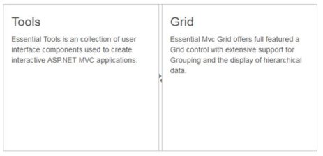

# Enable Collapsible

The Splitter provides you the option to enable or disable the pane collapse functionality. You can click the icon in Split bar to collapse or expand the corresponding pane element in Splitter. Setting the Collapsible property to “false” disables the pane collapse functionality in the Splitter control.

## Configure Collapsible

The following steps explain the implementation of the Collapsible option in Splitter.

In an ASPX page, define the Splitter control and add the contents correspondingly. Set the Collapsible property as true.



<ej:Splitter ID="splitter" Height="280" Width="600" runat="server">

       <ej:SplitPane Collapsible="true">

                 

                    

                        <h3 class="h3">Tools </h3>

                        Essential Tools is a collection of user interface components used to create interactive ASP.NET MVC applications.

                    

                

       </ej:SplitPane>

       <ej:SplitPane Collapsible="true">

                

                    

                        <h3 class="h3">Grid </h3>

                       Essential MVC Grid offers full featured a Grid control with extensive support for Grouping and the display of hierarchical data.

                   

              

            </ej:SplitPane>

</ej:Splitter>



The following screenshot displays the output of the above code example.

The output for Splitter when collapsible is set to “true” is as follows.

 

The output for Splitter when collapsible is “false”.

 

