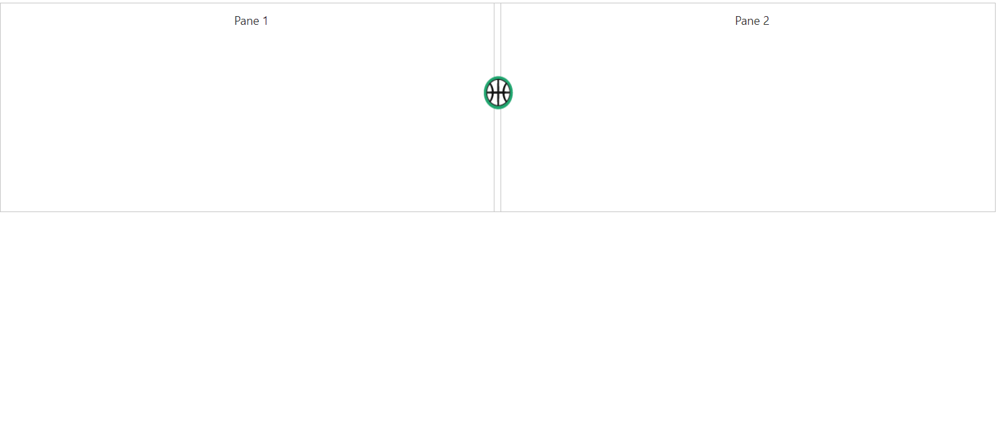

# How To?

### Change Expand/Collapse icons

By default, you are provided with collapse/expand icons in **Split bar** to collapse or expand the splitter panes. We have provided template support to replace existing expand/collapse icons.

* **expanderTemplate** Specifies HTML element string to replace template with existing expand/collapse icons. 

* **clickOnExpander** event is triggered when we click on the template icon.`



<ej:Splitter ID="innersplitter" Height="250" Width="80%" ExpanderTemplate="" runat="server" >
    <ej:SplitPane>
        

            
Pane 1

        

    </ej:SplitPane>
    <ej:SplitPane>
        

            
Pane 2

        

    </ej:SplitPane>
</ej:Splitter>





       function onClick(args) {
            if (flag) { this.collapse(0); flag = false; }
            else { this.expand(0); flag = true; }
        }





        .cont {
            padding: 10px 0 0 10px;
            text-align: center;
        }   
         .eimg {
            height:40px;
            width:35px;
			margin-left: -13px;
        }  
       .e-splitter .e-splitbar .e-splitter-h-template {
            top: 15%;
       }



The output for Splitter with **Template support**.

 

### Change the splitter pane size dynamically

Splitter pane size can be changed by updating model property of paneSize and by refreshing the control using refresh public method.  As shown in the below code, based on the selected dropdown list value, pane size of splitter is changed.





<ej:DropDownList ID="DropDownList1" runat="server" DataTextField="Text" DataValueField="Id" Value="50" ClientSideOnChange="change"></ej:DropDownList>

<ej:Splitter ID="outersplitter" Height="250" runat="server">
         <ej:SplitPane>
                   

                        
Pane 1

                   

        </ej:SplitPane>
        <ej:SplitPane>
            

                
Pane 2 

           

        </ej:SplitPane>
    </ej:Splitter>





       protected void Page_Load(object sender, EventArgs e)
        {
            List<Employee> Data = new List<Employee>();
            Data.Add(new Employee
            {
                Id = 25,
                Text = "25"
            });
            Data.Add(new Employee
            {
                Id = 50,
                Text = "50"
            });
            Data.Add(new Employee
            {
                Id = 75,
                Text = "75"
            });
            DropDownList1.DataSource = Data;
        }
        public class Employee
         {
            public int Id { get; set; }
            public string Text { get; set; }
         }



  



    



 