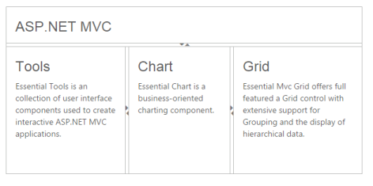

# Nested Splitter Support

The Splitter provides nested pane support that allows you to add a pane between two pane elements.

## Configure Nested Splitter

The following steps explain the implementation of the “nested splitter” option.

In an ASPX page set the corresponding 
 elements for outer and inner Splitter control.



<ej:Splitter Height="280" Width="600" ID="outersplitter"  Orientation="Vertical" runat="server">

        <ej:SplitPane PaneSize="60">

             

                

                    <h3 class="h3">ASP.NET MVC </h3>

                

            

        </ej:SplitPane>

        <ej:SplitPane>

            <ej:Splitter ID="innersplitter" Width="600" EnableAutoResize="true"  runat="server">

                <ej:SplitPane paneSize="200">

                    

                      

                        <h3 class="h3">Tools </h3>

                        Essential Tools is an collection of user interface components used to create interactive

                                    ASP.NET MVC applications.

                      

                   

                </ej:SplitPane>

                <ej:SplitPane paneSize="170">

                  

                    

                        <h3 class="h3">Chart </h3>

                        Essential Chart is a business-oriented charting component.

                    

                  

                </ej:SplitPane>

                <ej:SplitPane>

                  

                     

                        <h3 class="h3">Grid </h3>

                        Essential MVC Grid offers full featured a Grid control with extensive support for

                                    Grouping and the display of hierarchical data.

                     

                    

              </ej:SplitPane>

            </ej:Splitter>

      </ej:SplitPane>

</ej:Splitter>



The following screenshot displays the output of the above code example.

 

