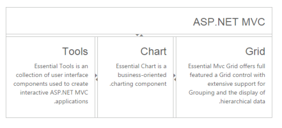

# RTL Support

The Splitter provides RTL (Right-To-Left) support. The alignment of Splitter can be changed from Left-To-Right and Right-To-Left.

## Enable RTL

The following steps explain enabling the right-to-left property for Splitter control.

In an ASPX page, define the Splitter control and add the contents correspondingly. Set the EnableRTL property as true.



<ej:Splitter Height="250" Width="600" ID="outersplitter" Orientation="Vertical" EnableRTL="true" runat="server">

        <ej:SplitPane PaneSize="60">

           

                

                    <h3 class="h3">ASP.NET MVC </h3>

                

            

        </ej:SplitPane>

        <ej:SplitPane>

            <ej:Splitter ID="innersplitter"   Width="600" runat="server">

                <ej:SplitPane paneSize="200">

                  

                    

                        <h3 class="h3">Tools </h3>

                        Essential Tools is an collection of user interface components used to create interactive

                                    ASP.NET MVC applications.

                    

                 

                </ej:SplitPane>

                <ej:SplitPane paneSize="170">

                  

                    

                        <h3 class="h3">Chart </h3>

                        Essential Chart is a business-oriented charting component.

                    

                 

                </ej:SplitPane>

                <ej:SplitPane PaneSize="60">

                  

                      

                        <h3 class="h3">Grid </h3>

                        Essential MVC Grid offers full featured a Grid control with extensive support for

                                    Grouping and the display of hierarchical data.

                      

                    

               </ej:SplitPane>

            </ej:Splitter>

      </ej:SplitPane>

</ej:Splitter>



The following screenshot displays the output of the above code example.

