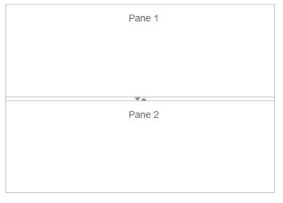
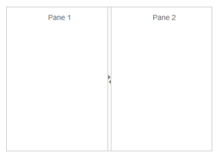

# Splitter Orientation

The Splitter supports both vertical and horizontal orientation of the pane. You can declare the orientation by using enum, Vertical or Horizontal, that has corresponding value of vertical and horizontal as a string.

## Configure Splitter Orientation

The following steps explain the implementation of Splitter orientation option.

In an ASPX page, define the Splitter control and add the contents correspondingly. Set the Orientation property as Vertical.



<ej:Splitter ID="splitter" Height="280" Width="400" Orientation="Vertical" runat="server">

           <ej:SplitPane>

             

                
Pane 1

             

           </ej:SplitPane>

           <ej:SplitPane>

             

                
Pane 2

            

          </ej:SplitPane>

</ej:Splitter>



The following screenshots display the Splitter with horizontal and vertical orientation. 

 

 

