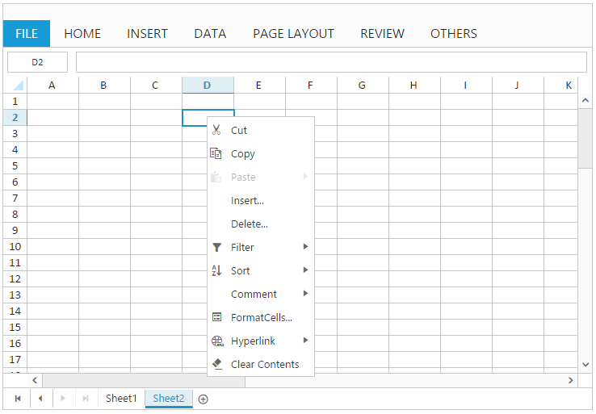
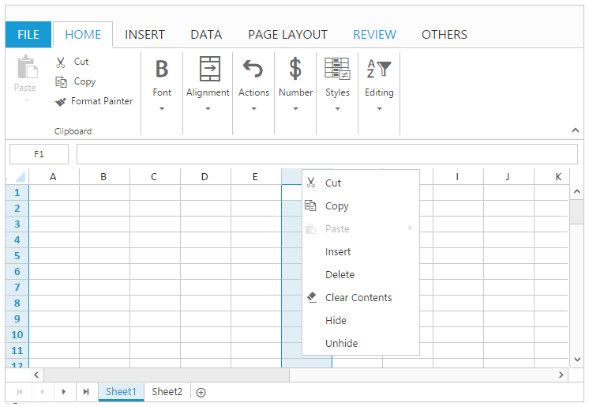
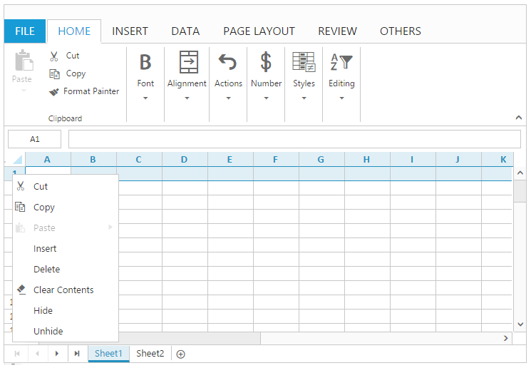
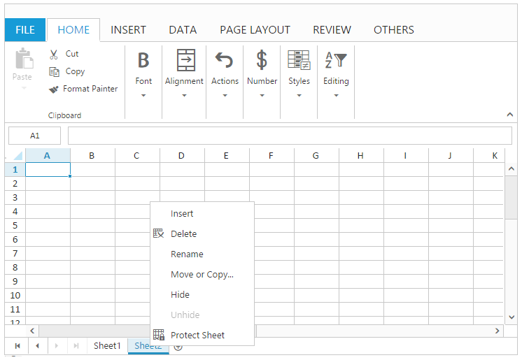

# Context Menu

Context Menu is used to improve user interaction with Spreadsheet using popup menu. This will open when right clicking on Cell/Column Header/Row Header/ Pager in Spreadsheet. You can use `EnableContextMenu` property to enable/disable context menu. 

## Default Context Menu items

Please find the below table for default context menu items and its actions.

<table>
    <colgroup><col width= "150px"/><col width = "180px"/></colgroup>
    <tr><th>Section </th><th>Context Menu items </th><th>Action </th></tr>
    <tr><td rowspan = "11">Row Cell </td><td>Cut </td><td>Cut the selected cells content to the clipboard, so that you can paste it somewhere else. </td></tr>
    <tr><td>Copy  </td><td>Copy the selected cells content to the clipboard, so that you can paste it to somewhere else. </td></tr>
    <tr><td>Paste </td><td>Paste the content from clipboard to spreadsheet. </td></tr>
    <tr><td>Insert </td><td>Insert new cells or rows or columns to worksheet. </td></tr>
    <tr><td>Delete </td><td>Delete existing cells or rows or columns from worksheet. </td></tr>
    <tr><td>Sort </td><td>Perform sorting to the selected range of cells by ascending or descending. </td></tr>
    <tr><td>Filter </td><td>Perform filtering to the selected cells based an active cell's value or active cell's color. </td></tr>
    <tr><td>Hyperlink </td><td>Create a link in the spreadsheet for quick access to webpages or worksheet reference. </td></tr>
    <tr><td>Comment </td><td>Add a note or extra information about the active cell. </td></tr>
    <tr><td>Format Cells </td><td>Apply number format to the selected cells. </td></tr>
    <tr><td>Clear Contents </td><td>Delete the contents in the selected cells. </td></tr>
    <tr><td rowspan = "8">Row Header / Column Header </td><td>Cut </td><td>Cut the selected cells content to the clipboard, so that you can paste it to somewhere else. </td></tr>
    <tr><td>Copy  </td><td>Copy the selected cells content to the clipboard, so that you can paste it to somewhere else. </td></tr>
    <tr><td>Paste </td><td>Paste the content from clipboard to spreadsheet. </td></tr>
    <tr><td>Clear Contents </td><td>Delete the contents in the selected cells. </td></tr>
    <tr><td>Insert </td><td>Insert new cells or rows or columns to worksheet. </td></tr>
    <tr><td>Delete </td><td>Delete existing cells or rows or columns from worksheet. </td></tr>
    <tr><td>Hide </td><td>Hide the selected columns / rows. </td></tr>
    <tr><td>Unhide </td><td>Unhide the selected columns / rows. </td></tr>
    <tr><td rowspan = "7">Pager </td><td>Insert </td><td>Insert new worksheet to spreadsheet. </td></tr>
    <tr><td>Delete </td><td>Delete the selected worksheet from spreadsheet. </td></tr>
    <tr><td>Move or copy </td><td>Opens move or copy dialog to move worksheet or to create duplicate worksheet. </td></tr>
    <tr><td>Rename </td><td>Rename the selected worksheet. </td></tr>
    <tr><td>Protect Sheet </td><td>Prevent unwanted changes from others by limiting their ability to edit. </td></tr>
    <tr><td>Hide  </td><td>Hide the selected worksheet. </td></tr>
    <tr><td>Unhide </td><td>Opens unhide dialog to unhide worksheet. </td></tr>
</table>

The following code example describes the above behavior.


<ej:Spreadsheet ID="FlatSpreadsheet" EnableContextMenu="true" runat="server">
</ej:Spreadsheet> 


ContextMenu at Cell
{:.caption}

ContextMenu at Column Header
{:.caption}

ContextMenu at Row Header
{:.caption}

ContextMenu at Pager
{:.caption}
