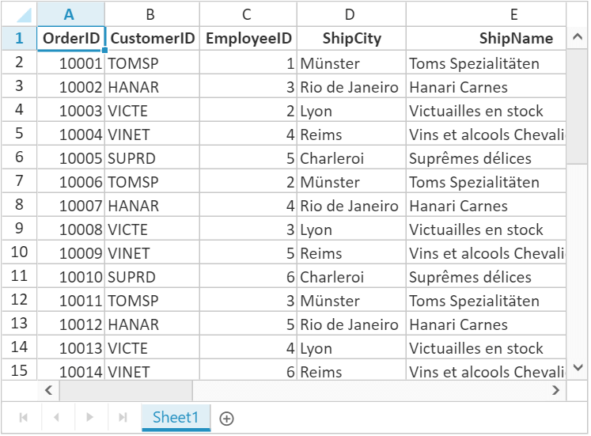
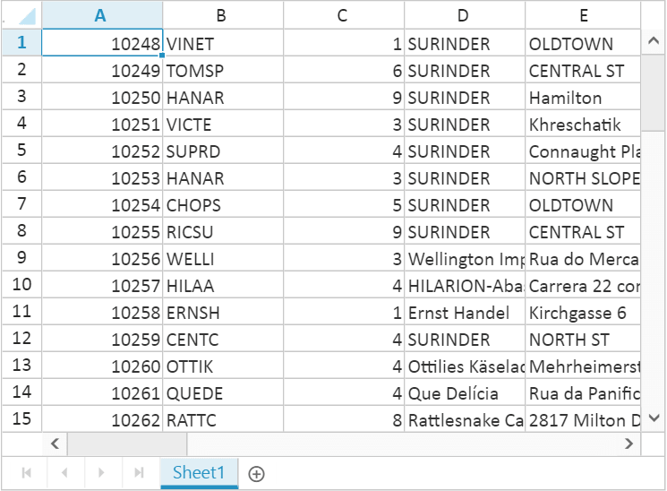
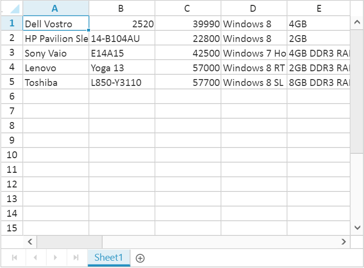
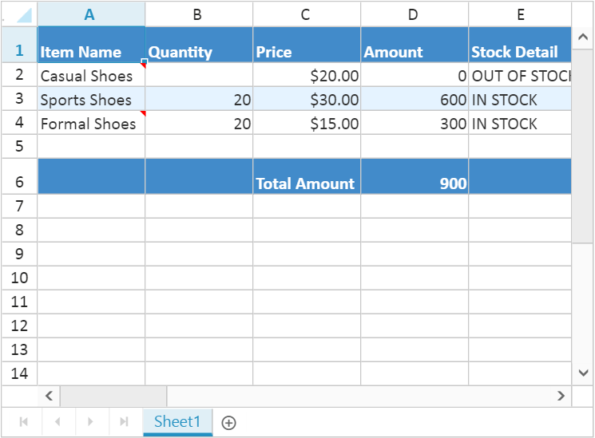
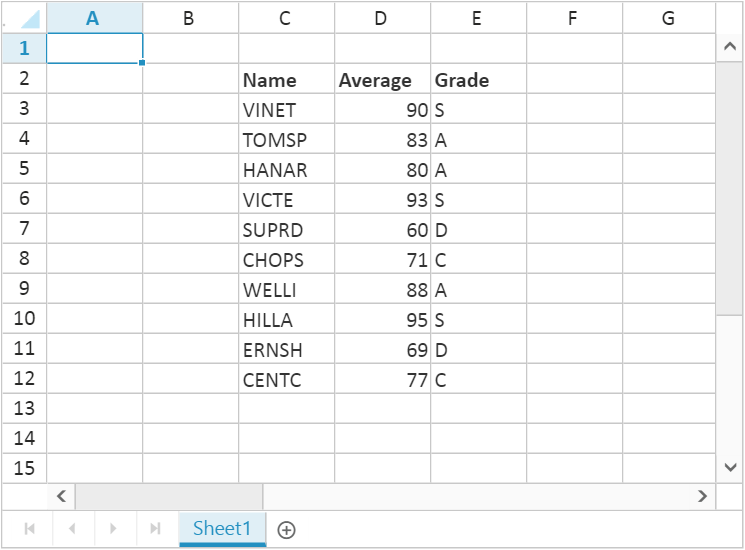
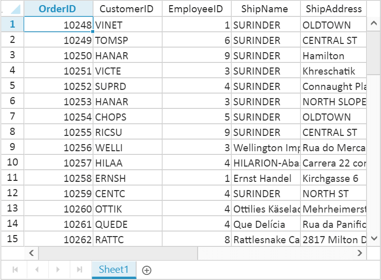

# Data Binding

Spreadsheet can be populated with external datasource using `Datasource` property. The `Datasource` property can be assigned either with the instance of `ej.DataManager` or List collection. Spreadsheet supports three different kinds of Data binding.

* Local Data
* Remote Data
* HTML Table Data

## Local Data

To bind local data to the Spreadsheet, you can assign a List to the worksheet `Datasource` property. The following code illustrates how to bind local data to the Spreadsheet,





<ej:Spreadsheet ID="FlatSpreadsheet" runat="server">
</ej:Spreadsheet>





 protected void Page_Load(object sender, EventArgs e)
        {
            if (!IsPostBack)
            {
                BindDataSource();
            }
        }

        private void BindDataSource()
        {
          int code = 10000;
            List<Orders> order = new List<Orders>();

            for (int i = 1; i <= 40; i++)
            {
                order.Add(new Orders(code + 1, "TOMSP", i + 0, "Munster", "Toms Spezialitaten", "Germany"));
                order.Add(new Orders(code + 2, "HANAR", i + 2, "Rio de Janeiro", "Hanari Carnes", "Brazil"));
                order.Add(new Orders(code + 3, "VICTE", i + 1, "Lyon", "Victuailles en stock", "France"));
                order.Add(new Orders(code + 4, "VINET", i + 3, "Reims", "Vins et alcools Chevalier", "France"));
                order.Add(new Orders(code + 5, "SUPRD", i + 4, "Charleroi", "Supremes delices", "Belgium"));
                code += 5;
            }
            this.FlatSpreadsheet.Sheets.Add(new Syncfusion.JavaScript.Models.Sheet()
            {
                Datasource = order
            });
        }

        [Serializable]
        public class Orders
        {
            public Orders()
            {
            }
            public Orders(long OrderId, string CustomerId, int EmployeeId, string ShipCity, string ShipName, string ShipCountry)
            {
                this.OrderID = OrderId;
                this.CustomerID = CustomerId;
                this.EmployeeID = EmployeeId;
                this.ShipName = ShipName;
                this.ShipCity = ShipCity;
                this.ShipCountry = ShipCountry;
            }
            public long OrderID { get; set; }
            public string CustomerID { get; set; }
            public int EmployeeID { get; set; }
            public string ShipCity { get; set; }
            public string ShipName { get; set; }
            public string ShipCountry { get; set; }
        }





The following output is displayed as a result of the above code snippets.

## Remote Data

To bind remote data to the Spreadsheet, you can assign a service data as an instance of `ej.DataManager` to the worksheet `Datasource` property. The following code illustrates how to bind remote data to the Spreadsheet,





        <ej:DataManager ID="dataManager" runat="server" URL="http://js.syncfusion.com/demos/ejServices/Wcf/Northwind.svc/Orders/"/>

<ej:Spreadsheet ID="FlatSpreadsheet" runat="server">
	   <Sheets>
           <ej:Sheet DataManagerID="dataManager" Query="ej.Query().take(50).select(['OrderID', 'CustomerID', 'EmployeeID', 'ShipName', 'ShipAddress',])" PrimaryKey="OrderID">
         </ej:Sheet>
      </Sheets>
</ej:Spreadsheet>





 protected void Page_Load(object sender, EventArgs e)
        {
            
        }
     





The following output is displayed as a result of the above code snippets.

### Offline Mode

To avoid sending post back request to server on every action, Spreadsheet allows user to create, update and delete data on client side. To enable this, set `offline` property of `ej.DataManager` as `true` to fetch all data from server on initial rendering of Spreadsheet and perform all operation on client side.

The following code illustrates offline data binding for Spreadsheet,





        <ej:DataManager ID="dataManager" Offline="true" runat="server" URL="http://js.syncfusion.com/demos/ejServices/Wcf/Northwind.svc/Orders/"/>

<ej:Spreadsheet ID="FlatSpreadsheet" runat="server">
	   <Sheets>
           <ej:Sheet DataManagerID="dataManager" Query="ej.Query().take(50).select(['OrderID', 'CustomerID', 'EmployeeID', 'ShipName', 'ShipAddress',])" PrimaryKey="OrderID">
         </ej:Sheet>
      </Sheets>
</ej:Spreadsheet>





 protected void Page_Load(object sender, EventArgs e)
        {
            
        }
     





The following output is displayed as a result of the above code snippets.

N> For further reference about `offline` property in `ej.DataManager` refer following [`link`](http://help.syncfusion.com/aspnet/datamanager/data-binding#offline-mode "link")

## HTML Table Data

An HTML Table element can also be used as the data source of Spreadsheet. To use HTML Table as data source, the table element should be passed to worksheet `Datasource` property of Spreadsheet as an instance of the `ej.DataManager`. The following code illustrates how to bind HTML Table data to the Spreadsheet,





    

        <ej:DataManager ID="dataManager" runat ="server" Table ="#Table1"/> 
    

<ej:Spreadsheet ID="FlatSpreadsheet" runat="server">
	    <Sheets>
            <ej:Sheet DataManagerID ="dataManager"></ej:Sheet>
      </Sheets>
</ej:Spreadsheet>





 protected void Page_Load(object sender, EventArgs e)
        {
            
        }
     





The following output is displayed as a result of the above code snippets.

## Ways to bind data in Spreadsheet

You can bind data to Spreadsheet in following ways,

* Cell binding
* Range binding
* Sheet binding

### Cell Binding

Spreadsheet can bind data for individual cells in a sheet. The data may contain value, style, format, comment and hyperlink. The individual cell properties are listed below,

<table>
    <tr>
        <th>
            Properties
        </th>
        <th>
            Description
        </th>
    </tr>
    <tr>
        <td>
            index
        </td>
        <td>
            To specify particular cell
        </td>
    </tr>
    <tr>
        <td>
            value
        </td>
        <td>
            To specify value. It may be string, integer, formula etc.
        </td>
    </tr>
    <tr>
        <td>
            style
        </td>
        <td>
            To specify style in the cell
        </td>
    </tr>
    <tr>
        <td>
            format
        </td>
        <td>
            To specify number format in the cell
        </td>
    </tr>
    <tr>
        <td>
            comment
        </td>
        <td>
            To specify comment in the cell
        </td>
    </tr>
    <tr>        
        <td>
            hyperlink
        </td>
        <td>
            To specify hyperlink in the cell
        </td>
    </tr>
</table>

The individual row properties are listed below,

<table>
    <tr>
        <th>
            Properties
        </th>
        <th>
            Description
        </th>
    </tr>
    <tr>
        <td>
            index
        </td>
        <td>
            To specify particular row
        </td>
    </tr>
    <tr>
        <td>
            height
        </td>
        <td>
            To specify height in the row
        </td>
    </tr>
</table>

You can specify particular row with `index` property and its height with `Height` property in the rows' property collection. The following code illustrates cell binding in Spreadsheet,





<ej:Spreadsheet ID="FlatSpreadsheet" runat="server">
	<Sheets>
            <ej:Sheet>
                    <Rows>
                        <ej:Row Height="30">
                            <Cells>
                                <ej:Cell Value="Item Name">
                                    
                                </ej:Cell>
                                <ej:Cell Value="Quantity">
                                    
                                </ej:Cell>
                                <ej:Cell Value="Price">
                                    
                                </ej:Cell>
                                <ej:Cell Value="Amount">
                                    
                                </ej:Cell>
                                <ej:Cell Value="Stock Detail">
                                    
                                </ej:Cell>
                                <ej:Cell Value="Website">
                                    
                                </ej:Cell>
                            </Cells>
                        </ej:Row>
                        <ej:Row>
                            <Cells>
                                <ej:Cell Value="Casual Shoes">
                                    <Comment Value="Casual Footwears with wide variety of colors." />
                                </ej:Cell>
                                <ej:Cell Value="10"/>
                                <ej:Cell Value="20">
                                    <Format Type="currency"/>
                                </ej:Cell>
                                <ej:Cell Value="=B2*C2"/>
                                <ej:Cell Value="OUT OF STOCK"/>
                                <ej:Cell Value="Amazon">
                                    <Hyperlink WebAddr="www.amazon.com" />
                                </ej:Cell>
                            </Cells>
                        </ej:Row>
                        <ej:Row>
                            <Cells>
                                <ej:Cell Value="Sports Shoes">
                                    <Style BackgroundColor="#E5F3FF" />
                                </ej:Cell>
                                <ej:Cell Value="20">
                                    <Style BackgroundColor="#E5F3FF" />
                                </ej:Cell>
                                <ej:Cell Value="30">
                                    <Style BackgroundColor="#E5F3FF" />
                                    <Format Type="currency" />
                                </ej:Cell>
                                <ej:Cell Value="=B3*C3">
                                    <Style BackgroundColor="#E5F3FF" />
                                    </ej:Cell>
                                <ej:Cell Value="IN STOCK">
                                    <Style BackgroundColor="#E5F3FF" />
                                    </ej:Cell>
                                <ej:Cell Value="AliExpress">
                                    <Hyperlink WebAddr="www.aliexpress.com" />
                                    <Style BackgroundColor="#E5F3FF" />
                                </ej:Cell>
                            </Cells>
                        </ej:Row>
                        <ej:Row>
                            <Cells>
                                <ej:Cell Value="Formal Shoes">
                                    <Comment Value="Formal Footwears with wide range of sizes." />
                                </ej:Cell>
                                <ej:Cell Value="20" />
                                <ej:Cell Value="15">
                                    <Format Type="currency"/>
                                </ej:Cell>
                                <ej:Cell Value="=B4*C4" />
                                <ej:Cell Value="IN STOCK" />
                                <ej:Cell Value="Amazon">
                                    <Hyperlink WebAddr="www.amazon.com" />
                                </ej:Cell>
                            </Cells>
                        </ej:Row>
                       
                        <ej:Row Height="30">
                            <Cells>
                                <ej:Cell>
                                    <Style BackgroundColor="#428bca" />
                                </ej:Cell>
                                <ej:Cell>
                                    <Style BackgroundColor="#428bca" />
                                </ej:Cell>
                                <ej:Cell Value="Total Amount" Index="2">
                                    <Style FontWeight="bold" BackgroundColor="#428bca" Color="#FFFFFF" />
                                </ej:Cell>
                                <ej:Cell Value="=Sum(D2:D4)">
                                    <Style FontWeight="bold" BackgroundColor="#428bca" Color="#FFFFFF" />
                                </ej:Cell>
                                <ej:Cell>
                                    <Style BackgroundColor="#428bca" />
                                </ej:Cell>
                                <ej:Cell>
                                    <Style BackgroundColor="#428bca" />
                                </ej:Cell>
                            </Cells>
                        </ej:Row>
                    </Rows>
                </ej:Sheet>
            </Sheets>  
</ej:Spreadsheet>





 protected void Page_Load(object sender, EventArgs e)
        {
            
        }
     





The following output is displayed as a result of the above code snippets.

### Range Binding

Spreadsheet can bind data for one or more range in a sheet using `RangeSettings`. The individual range properties are listed below,

<table>
    <tr>
        <th>
            Properties
        </th>
        <th>
            Description
        </th>
    </tr>
    <tr>
        <td>
            {{'dataSource'| markdownify }}
        </td>
        <td>
            To specify List or {{'ej.DataManager'| markdownify }}
        </td>
    </tr>
    <tr>    
        <td>
            {{'query'| markdownify }}
        </td>
        <td>
            To specify query for {{'ej.DataManager'| markdownify }}
        </td>
    </tr>
    <tr>
        <td>    
            {{'startCell'| markdownify }}
        </td>
        <td>
            To specify start cell of a range
        </td>
    </tr>
    <tr>
        <td>
            {{'primarykey'| markdownify }}
        </td>
        <td>
            To specify data source primary key
        </td>
    </tr>
    <tr>
        <td>
            {{'showHeader'| markdownify }}
        </td>
        <td>
            To show data source header
        </td>
    </tr>
    <tr>
        <td>
            {{'headerStyles'| markdownify }}
        </td>
        <td>
            To specify header styles
        </td>
    </tr>
</table>

The following code illustrates range binding in Spreadsheet





<ej:Spreadsheet ID="FlatSpreadsheet" runat="server">
	    <Sheets>
           <ej:Sheet>
            <RangeSettings>
                <ej:RangeSetting StartCell="C2" ShowHeader="true"/>
            </RangeSettings>
        </ej:Sheet>
    </Sheets>
</ej:Spreadsheet>





 protected void Page_Load(object sender, EventArgs e)
        {
            if (!IsPostBack)
            {
                BindDataSource();
            }
        }

        private void BindDataSource()
        {
          var dataSource = new OrderItemsDataContext().GetAllMarkList.ToList();
		  this.FlatSpreadsheet.Sheets[0].RangeSetting[0].Datasource = dataSource;
        }





The following output is displayed as a result of the above code snippets.

### Sheet Binding

Spreadsheet can bind data for a sheet. The individual sheet properties are listed below,

<table>
    <tr>
        <th>
            Properties
        </th>
        <th>
            Description
        </th>
    </tr>
    <tr>
        <td>
            {{'dataSource'| markdownify }}
        </td>
        <td>
            To specify List or {{'ej.DataManager'| markdownify }}
        </td>
    </tr>
    <tr>
        <td>
            {{'query'| markdownify }}
        </td>
        <td>
            To specify query for {{'ej.DataManager'| markdownify }}
        </td>
    </tr>
    <tr>
        <td>
            {{'startCell'| markdownify }}
        </td>
        <td>
            To specify start cell of a range
        </td>
    </tr>
    <tr>
        <td>
            {{'primarykey'| markdownify }}
        </td>
        <td>
            To specify data source primary key
        </td>
    </tr>
    <tr>
        <td>
            {{'showHeader'| markdownify }}
        </td>
        <td>
            To show data source header
        </td>
    </tr>
    <tr>
        <td>
            {{'headerStyles'| markdownify }}
        </td>
        <td>
            To specify header styles
        </td>
    </tr>
    <tr>
        <td>
            {{'fieldAsColumnHeader'| markdownify }}
        </td>
        <td>
            To show data source fields in column header
        </td>
    </tr>
</table>

The following code illustrates sheet binding in Spreadsheet




        <ej:DataManager ID="dataManager" runat="server" URL="http://js.syncfusion.com/demos/ejServices/Wcf/Northwind.svc/Orders/"/>

<ej:Spreadsheet ID="FlatSpreadsheet" runat="server">
	   <Sheets>
           <ej:Sheet DataManagerID="dataManager" Query="ej.Query().take(50).select(['OrderID', 'CustomerID', 'EmployeeID', 'ShipName', 'ShipAddress',])" PrimaryKey="OrderID" FieldAsColumnHeader="true">
         </ej:Sheet>
      </Sheets>
</ej:Spreadsheet>





 protected void Page_Load(object sender, EventArgs e)
        {
            
        }
     





The following output is displayed as a result of the above code snippets. 

