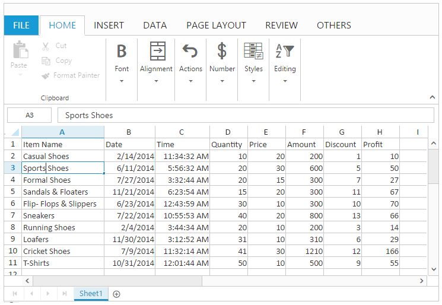
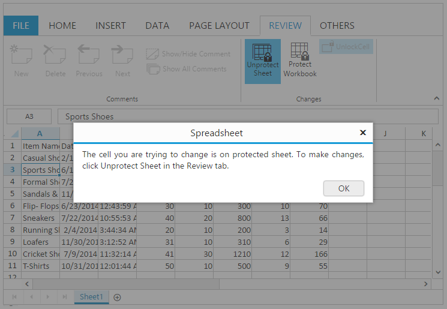

# Editing 

You can edit the contents of a cell directly in the cell. You can also do this by typing in the formula bar. When you edit the cell, Spreadsheet is operating in edit mode. In editing mode formatting options are not available. You can use `AllowEditing` property to enable/disable editing feature.

N> By default `AllowEditing` property is set to true.

## Edit cell content

You can perform this by one of the following ways,

* Double click on the cell to perform editing. This starts the edit mode and positions the cursor at the end of the cell.
* Press F2 Key to edit the active cell.
* Use Formula bar to perform editing.
* Use Backspace and Delete Key to delete the contents of a cell.
* Use "Alt + Enter" keys to perform multi line editing.
* Using [`editCell`](https://help.syncfusion.com/api/js/ejspreadsheet#methods:xledit-editcell "editCell") method.

## Save cell content

You can do this by one of the following ways,

* Perform mouse click on any other cell other than the current editing cell.
* Perform Enter/Tab key press on the cell.
* Using [`saveCell`](https://help.syncfusion.com/api/js/ejspreadsheet#methods:xledit-savecell "saveCell") method.

N> Edited cells are automatically formatted (right/left/center/Number Formatting) based on cell values.

The following code example describes the above behavior.





<ej:Spreadsheet ID="FlatSpreadsheet" runat="server">
       <ClientSideEvents LoadComplete="loadComplete" />
</ej:Spreadsheet>





 protected void Page_Load(object sender, EventArgs e)
        {
            if (!IsPostBack)
            {
                BindDataSource();
            }
        }
 
  private void BindDataSource()
        {
             var dataSource = new OrderItemsDataContext().GetAllItemDetails.ToList();
            this.FlatSpreadsheet.Sheets.Add(new Syncfusion.JavaScript.Models.Sheet()
            {
                Datasource = dataSource

            });
        }




The following output is displayed as a result of the above code example.

## Read-Only cells

You can restrict/prevent the editing in the specified range. You can use `AllowLockCell` property to enable/disable the lock cells. You can do using following ways,

* Using [`lockCells`](http://help.syncfusion.com/api/js/ejspreadsheet#methods:lockcells "lockCells") method to lock the specified range. Then you need to protect the sheet using [`protectSheet`](https://help.syncfusion.com/api/js/ejspreadsheet#methods:protectsheet "protectSheet") method to restrict the editing.
* Using "Lock Cells" option under Changes group of REVIEW tab in ribbon. Then Using "Protect Sheet" option under Changes group of REVIEW tab in ribbon to restrict editing.

The following code example describes the above behavior.





<ej:Spreadsheet ID="FlatSpreadsheet"  AllowLockCell="true" runat="server">
       <ClientSideEvents LoadComplete="loadComplete" />
</ej:Spreadsheet>





 protected void Page_Load(object sender, EventArgs e)
        {
            if (!IsPostBack)
            {
                BindDataSource();
            }
        }
 
  private void BindDataSource()
        {
             var dataSource = new OrderItemsDataContext().GetAllItemDetails.ToList();
            this.FlatSpreadsheet.Sheets.Add(new Syncfusion.JavaScript.Models.Sheet()
            {
                Datasource = dataSource

            });
        }




The following output is displayed as a result of editing in Spreadsheet which is rendered with above code example.

## Events

The following events will trigger when editing and saving the cell. 

* [`cellEdit`](http://help.syncfusion.com/api/js/ejspreadsheet#events:celledit"cellEdit") - Triggered when the cell is edited.
* [`cellSave`](http://help.syncfusion.com/api/js/ejspreadsheet#events:cellsave"cellSave") - Triggered when save the edited cell.

## Data binding

You can bind the data to Spreadsheet using data manager. You can refer [`Data Binding`](https://help.syncfusion.com/aspnet/spreadsheet/data-binding# "Data Binding") to know more about this. You can use [`saveBatchChanges`](https://help.syncfusion.com/api/js/ejspreadsheet#methods:savebatchchanges "saveBatchChanges") method to update the changes in server.  

The following code example describes the above behavior.





   <ej:DataManager ID="dataManager" runat="server"  URL= "GetAllItemDetails" Adaptor= "UrlAdaptor" BatchURL= "BatchUpdate" />

<ej:Spreadsheet ID="FlatSpreadsheet" runat="server">
   <ClientSideEvents LoadComplete="loadComplete" />
       <Sheets>
          <ej:Sheet DataManagerID="dataManager">
            </ej:Sheet>
     </Sheets>
</ej:Spreadsheet>





 protected void Page_Load(object sender, EventArgs e)
        {
            
        }
[WebMethod]
[ScriptMethod(ResponseFormat = ResponseFormat.Json)]

public static object GetAllItemDetails()
         {
            List<ItemDetail> lItems = new List<ItemDetail>();
            lItems.Add(new ItemDetail() { ItemName = "Casual Shoes", Date = "02/14/2014", Time = "11:34:32 AM", Quantity = 10, Price = 20, Amount = 200, Discount = 1, Profit = 10 });
            lItems.Add(new ItemDetail() { ItemName = "Sports Shoes", Date = "06/11/2014", Time = "05:56:32 AM", Quantity = 20, Price = 30, Amount = 600, Discount = 5, Profit = 50 });
            lItems.Add(new ItemDetail() { ItemName = "Formal Shoes", Date = "07/27/2014", Time = "03:32:44 AM", Quantity = 20, Price = 15, Amount = 300, Discount = 7, Profit = 27 });
            lItems.Add(new ItemDetail() { ItemName = "Sandals & Floaters", Date = "11/21/2014", Time = "06:23:54 AM", Quantity = 15, Price = 20, Amount = 300, Discount = 11, Profit = 67 });
            lItems.Add(new ItemDetail() { ItemName = "Flip- Flops & Slippers", Date = "06/23/2014", Time = "12:43:59 AM", Quantity = 30, Price = 10, Amount = 300, Discount = 10, Profit = 70 });
            lItems.Add(new ItemDetail() { ItemName = "Sneakers", Date = "07/22/2014", Time = "10:55:53 AM", Quantity = 40, Price = 20, Amount = 800, Discount = 13, Profit = 66 });
            lItems.Add(new ItemDetail() { ItemName = "Running Shoes", Date = "02/04/2014", Time = "03:44:34 AM", Quantity = 20, Price = 10, Amount = 200, Discount = 3, Profit = 14 });
            lItems.Add(new ItemDetail() { ItemName = "Loafers", Date = "11/30/2014", Time = "03:12:52 AM", Quantity = 31, Price = 10, Amount = 310, Discount = 6, Profit = 29 });
            lItems.Add(new ItemDetail() { ItemName = "Cricket Shoes", Date = "07/09/2014", Time = "11:32:14 AM", Quantity = 41, Price = 30, Amount = 1210, Discount = 12, Profit = 166 });
            lItems.Add(new ItemDetail() { ItemName = "T-Shirts", Date = "10/31/2014", Time = "12:01:44 AM", Quantity = 50, Price = 10, Amount = 500, Discount = 9, Profit = 55 });
            var dataSource = lItems.ToList();
            return new { result = dataSource, count = dataSource.Count };
        }

[WebMethod]
 public static void BatchUpdate( List<ItemDetail> changed,  List<ItemDetail> added,  List<ItemDetail> deleted, string action, string key)
        {
            //Save the batch changes
        }




To save and retrieve the Spreadsheet data in the database, you can refer this [`Knowledge Base`](https://www.syncfusion.com/kb/7567/how-to-save-and-retrieve-the-spreadsheet-data-in-database "Knowledge Base") link.

You can update data dynamically in the Spreadsheet by using [`updateRange`](https://help.syncfusion.com/api/js/ejspreadsheet#methods:updaterange "updateRange") method.