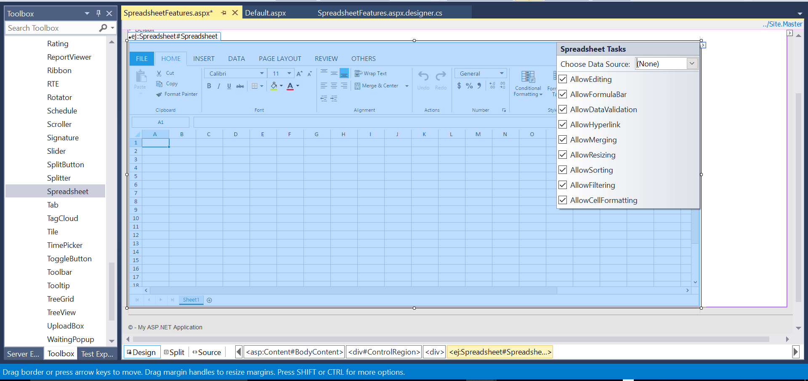
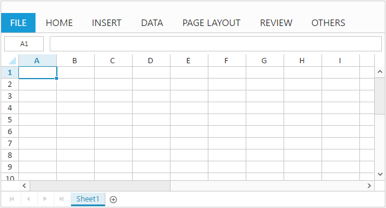
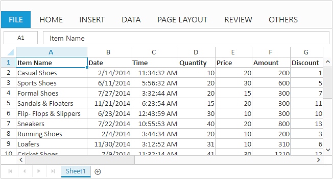
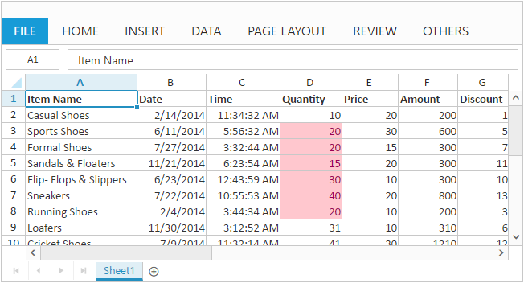

# Getting started with ASP.NET Webforms SpreadSheet

This section explains you the steps required to populate the Spreadsheet with data, format, and export it as excel file. This section covers only the minimal features that you need to know to get started with the Spreadsheet.

## Create your first SpreadSheet ASP.NET Web Forms Application

1. Create a Syncfusion ASP.NET Web Forms application.

2. Drag and drop the SpreadSheet control in the Index.aspx page from the toolbox.
 
 

The Spreadsheet is rendered based on default `Width` and `Height`. You can also customize the Spreadsheet dimension by setting the `Width` and `Height` property in `ScrollSettings`.



<ej:Spreadsheet ID="Spreadsheet" runat="server">
            <ScrollSettings Width="100%" Height="100%" IsResponsive="true" />
</ej:Spreadsheet>



Now, the Spreadsheet is rendered with default row and column count.

## Populate Spreadsheet with data

Now, this section explains how to populate JSON data to the Spreadsheet. You can set `DataSource` property in `Sheet` settings to populate JSON data in Spreadsheet.





         <ej:Spreadsheet ID="Spreadsheet"  runat="server">
            <ClientSideEvents LoadComplete="loadComplete" OpenFailure="openFailure" />
</ej:Spreadsheet>





    protected void Page_Load(object sender, EventArgs e)
        {
            BindDataSource();
        }

    private void BindDataSource()
        {
             var dataSource = GetAllItemDetails().ToList();
            this.Spreadsheet.Sheets.Add(new Syncfusion.JavaScript.Models.Sheet()
            {
                Datasource = dataSource
            });
        }

    private List<ItemDetail> GetAllItemDetails()
        {
            List<ItemDetail> Items = new List<ItemDetail>();
            Items.Add(new ItemDetail() { ItemName = "Casual Shoes", Date = "02/14/2014", Time = "11:34:32 AM", Quantity = 10, Price = 20, Amount = 200, Discount = 1, Profit = 10 });
            Items.Add(new ItemDetail() { ItemName = "Sports Shoes", Date = "06/11/2014", Time = "05:56:32 AM", Quantity = 20, Price = 30, Amount = 600, Discount = 5, Profit = 50 });
            Items.Add(new ItemDetail() { ItemName = "Formal Shoes", Date = "07/27/2014", Time = "03:32:44 AM", Quantity = 20, Price = 15, Amount = 300, Discount = 7, Profit = 27 });
            Items.Add(new ItemDetail() { ItemName = "Sandals & Floaters", Date = "11/21/2014", Time = "06:23:54 AM", Quantity = 15, Price = 20, Amount = 300, Discount = 11, Profit = 67 });
            Items.Add(new ItemDetail() { ItemName = "Flip- Flops & Slippers", Date = "06/23/2014", Time = "12:43:59 AM", Quantity = 30, Price = 10, Amount = 300, Discount = 10, Profit = 70 });
            Items.Add(new ItemDetail() { ItemName = "Sneakers", Date = "07/22/2014", Time = "10:55:53 AM", Quantity = 40, Price = 20, Amount = 800, Discount = 13, Profit = 66 });
            Items.Add(new ItemDetail() { ItemName = "Running Shoes", Date = "02/04/2014", Time = "03:44:34 AM", Quantity = 20, Price = 10, Amount = 200, Discount = 3, Profit = 14 });
            Items.Add(new ItemDetail() { ItemName = "Loafers", Date = "11/30/2014", Time = "03:12:52 AM", Quantity = 31, Price = 10, Amount = 310, Discount = 6, Profit = 29 });
            Items.Add(new ItemDetail() { ItemName = "Cricket Shoes", Date = "07/09/2014", Time = "11:32:14 AM", Quantity = 41, Price = 30, Amount = 1210, Discount = 12, Profit = 166 });
            Items.Add(new ItemDetail() { ItemName = "T-Shirts", Date = "10/31/2014", Time = "12:01:44 AM", Quantity = 50, Price = 10, Amount = 500, Discount = 9, Profit = 55 });
            return Items;
        }
        public class ItemDetail
        {
            public string ItemName { get; set; }
            public string Date { get; set; }
            public string Time { get; set; }
            public int Quantity { get; set; }
            public int Price { get; set; }
            public int Amount { get; set; }
            public int Discount { get; set; }
            public int Profit { get; set; }
        }





N> For more details about `data binding` refer following [`link`](http://help.syncfusion.com/aspnet/spreadsheet/data-binding "link")

## Apply Conditional Formatting

Conditional formatting helps you to apply formats to a cell or range with certain color based on the cells values. You can use `AllowConditionalFormats` property to enable/disable Conditional formats.

To apply conditional formats for a range use [`setCFRule`](http://help.syncfusion.com/api/js/ejspreadsheet#methods:xlcformat-setcfrule "setCFRule") method. The following code example illustrates this,



         <ej:Spreadsheet ID="Spreadsheet"  runat="server">
            <ClientSideEvents LoadComplete="loadComplete" OpenFailure="openFailure" />
</ej:Spreadsheet>
        



N> For more details about `Conditional Formatting` refer following [`link`](http://help.syncfusion.com/js/spreadsheet/data-presentation#conditional-formatting "link")

## Export Spreadsheet as Excel File

The Spreadsheet can save its data, style, format into an excel file. To enable save option in Spreadsheet set `AllowExporting` option in `ExportSettings` as `true`. Since Spreadsheet uses server side event `OnServerExcelExporting` to save documents. The following code example illustrates this,





         <ej:Spreadsheet ID="Spreadsheet" OnServerExcelExporting="Spreadsheet_ServerExcelExporting" runat="server">
            <ClientSideEvents LoadComplete="loadComplete" OpenFailure="openFailure" />
</ej:Spreadsheet>





     protected void Spreadsheet_ServerExcelExporting(object sender, Syncfusion.JavaScript.Web.SpreadsheetEventArgs e)
        {
            var args = e.Arguments;
            string password = args["password"].ToString();
            string sheetModel = args["sheetModel"].ToString();
            string sheetData = args["sheetData"].ToString();

            if (!string.IsNullOrEmpty(password))
                
                Spreadsheet.Save(sheetModel, sheetData, "sample", ExportFormat.XLSX, ExcelVersion.Excel2013, password);
            else
                Spreadsheet.Save(sheetModel, sheetData, "sample", ExportFormat.XLSX, ExcelVersion.Excel2013);
        }





Use shortcut [`Ctrl + S`](http://help.syncfusion.com/aspnet/spreadsheet/keyboard-shortcuts "Ctrl + S") to save Spreadsheet as excel file.

N> 1. For more details about `Export` refer following [`link`](http://help.syncfusion.com/aspnet/spreadsheet/open-and-save#save "link")
N> 2. For more details about `Client dependencies` refer the following [`link`](https://help.syncfusion.com/aspnet/spreadsheet/dependencies "link")
N> 3. For more details about `Server dependencies` refer the following [`link`](https://help.syncfusion.com/aspnet/spreadsheet/open-and-save#server-dependencies "link")

