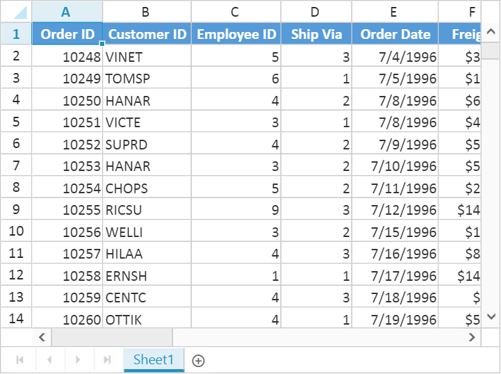

# Open and Save

The native data format for Spreadsheet is JSON. You can load and store JSON data with Spreadsheet. In Spreadsheet we have [`saveAsJSON`](http://help.syncfusion.com/api/js/ejspreadsheet#methods:saveasjson "saveAsJSON") and [`loadFromJSON`](https://help.syncfusion.com/api/js/ejspreadsheet#methods:loadfromjson "loadFromJSON") method which is used to save Spreadsheet as JSON and same JSON used to render Spreadsheet.



function SaveAsJSON() {
    var excelObj = $("#FlatSpreadsheet").data("ejSpreadsheet");
    window.excelData = excelObj.saveAsJSON();
}

function loadFromJSON() {
    var excelObj = $("#FlatSpreadsheet").data("ejSpreadsheet");
    excelObj.loadFromJSON(window.excelData);
}



When you open an excel file, it needs to be read and converted to client side Spreadsheet model. The converted client side Spreadsheet model is sent as JSON which is used to render Spreadsheet. Similarly, when you save the Spreadsheet, the client Spreadsheet model is sent to the server as JSON for processing and saved. [`Server configuration`](https://help.syncfusion.com/aspnet/spreadsheet/open-and-save#server-configuration "Server configuration") is used for this process.

## Open 

The Spreadsheet can open excel documents as like excel application with its data, style, format. To enable open option in Spreadsheet set `AllowImport` option as `true`. Since Spreadsheet uses a server side helper to open document, set `ImportMapper` in `ImportSettings` to map server action.



<ej:Spreadsheet ID="FlatSpreadsheet" AllowImport="true" runat="server">
    <ImportSettings ImportMapper="SpreadsheetHandler.ashx" />
</ej:Spreadsheet>



The below code snippets is used to read and converted excel document into client side Spreadsheet model using `Spreadsheet.Open()` in 'SpreadsheetHandler.ashx' are as follows,



 public void ProcessRequest(HttpContext context)
        {
            string password = "password", sheetIndex = "sheetIndex", dataContainer = "dataContainer", allowSheetOnDemand = "allowSheetOnDemand";
            bool isImport = true;
            var files = context.Request.Files;
            NameValueCollection form = context.Request.Form;
            ImportRequest importRequest = new ImportRequest();
            if (files.Count == 0)
                importRequest.Url = form["url"];
            else
            {
                var obj = files[0];
                if (obj.ContentType.IndexOf("image") > -1)
                {
                    importRequest.File = new HttpPostedFileWrapper(files[0]);
                    isImport = false;
                }
                else
                {
                    importRequest.FileStream = obj.InputStream;
                    importRequest.FileType = obj.FileName.Split('.')[obj.FileName.Split('.').Length - 1];
                    importRequest.File = null;
                }
            }
            if (isImport)
            {
                string[] keys = form.AllKeys;
                if (keys.Contains(password))
                    importRequest.Password = form[password];
                if (keys.Contains(allowSheetOnDemand))
                    importRequest.AllowSheetOnDemand = bool.Parse(form[allowSheetOnDemand]);
                if (keys.Contains(sheetIndex))
                    importRequest.SheetIndex = int.Parse(form[sheetIndex]);
                if (keys.Contains(dataContainer))
                    importRequest.DataContainer = form.GetValues(dataContainer);
            }
            string str = Spreadsheet.Open(importRequest);
            context.Response.Write(str);
        }

        public bool IsReusable
        {
            get
            {
                return false;
            }
        }



Following file types can be opened in Spreadsheet

* XLS
* XLSX
* CSV

[`Click`](http://asp.syncfusion.com/demos/web/spreadsheet/importexport.aspx "Click") here to view online demo sample.
You can open excel documents in following ways,

1. Initial settings
2. Methods
3. User Interface

### Initial settings

The Spreadsheet can load excel documents initially. The document can be specified either from client side or in server side.
To load excel documents initially from client side, set `ImportUrl` as excel file URL in `ImportSettings`. The code snippets for document initial load on client side are as follows,



<ej:Spreadsheet ID="FlatSpreadsheet" AllowImport="true" runat="server">
      <ImportSettings ImportUrl="http://mvc.syncfusion.com/Spreadsheet/LargeData.xlsx" ImportMapper="SpreadsheetHandler.ashx" />
</ej:Spreadsheet>



To load excel documents initially from server side, set `ImportOnLoad` as `true` and assign document stream or URL in the server. The code snippets for document initial load from server side are as follows,


<ej:Spreadsheet ID="FlatSpreadsheet" AllowImport="true" runat="server">
      <ImportSettings ImportOnLoad="true" ImportUrl="http://mvc.syncfusion.com/Spreadsheet/LargeData.xlsx" ImportMapper="SpreadsheetHandler.ashx" />
</ej:Spreadsheet>



### Methods

To open an excel document, [`import`](http://help.syncfusion.com/api/js/ejspreadsheet#methods:import "import") method should be called with import options as a parameter. The Spreadsheet can open excel document as a stream or file URL.

#### Stream
Spreadsheet can open excel document as a stream and the document stream was either from the client side or it can be specified in server side. The code snippets to open excel document as a stream from client side are as follows,



function fileOpen(args) {
    var excelObj = $("#FlatSpreadsheet").data("ejSpreadsheet"),
    stream = args.files[0]; // file stream from ejUploadbox
    excelObj["import"]({ file: stream });
}



#### File URL
Spreadsheet can open excel document from specified file URL. The file URL can be specified either from client side or in server side.
The code snippets to open excel document as URL from client side are as follows,



function fileOpen() {
    var excelObj = $("#FlatSpreadsheet").data("ejSpreadsheet");
    excelObj["import"]({Url: "http://mvc.syncfusion.com/Spreadsheet/LargeData.xlsx"});
}



> Refer `SpreadsheetHandler.ashx` under [`Open`](https://help.syncfusion.com/aspnet/spreadsheet/open-and-save#open "open") for server side processing.

### User Interface

You can dynamically open excel document by clicking the file menu in ribbon and choose Open to upload excel file.

## Save

The Spreadsheet can save its data, style, format into an excel file. To enable save option in Spreadsheet set `AllowExporting` option in `ExportSettings` as `true`. Since Spreadsheet uses server side event to save documents set `OnServerExcelExporting` option as `Spreadsheet_ServerExcelExporting`





 <ej:Spreadsheet ID="FlatSpreadsheet"
  OnServerExcelExporting="Spreadsheet_ServerExcelExporting"
  OnServerCsvExporting="Spreadsheet_ServerCsvExporting" 
  OnServerPdfExporting="Spreadsheet_ServerPdfExporting" runat="server">
  <ExportSettings AllowExporting="true" />
        </ej:Spreadsheet>





protected void Spreadsheet_ServerExcelExporting(object sender, Syncfusion.JavaScript.Web.SpreadsheetEventArgs e)
        {
            var args = e.Arguments;
            string password = args["password"].ToString();
            string sheetModel = args["sheetModel"].ToString();
            string sheetData = args["sheetData"].ToString();

            if (!string.IsNullOrEmpty(password))

                Spreadsheet.Save(sheetModel, sheetData, "sample", ExportFormat.XLSX, ExcelVersion.Excel2013, password);
            else
                Spreadsheet.Save(sheetModel, sheetData, "sample", ExportFormat.XLSX, ExcelVersion.Excel2013);
        }

        protected void Spreadsheet_ServerCsvExporting(object sender, Syncfusion.JavaScript.Web.SpreadsheetEventArgs e)
        {
            var args = e.Arguments;
            Spreadsheet.Save(args["sheetModel"].ToString(), args["sheetData"].ToString(), "sample", ExportFormat.CSV);
        }

        protected void Spreadsheet_ServerPdfExporting(object sender, Syncfusion.JavaScript.Web.SpreadsheetEventArgs e)
        {
            var args = e.Arguments;
            Spreadsheet.Save(args["sheetModel"].ToString(), args["sheetData"].ToString(), "sample", ExportFormat.PDF);
        }




You can save Spreadsheet contents with following file types

* XLS
* XLSX
* CSV
* PDF

[`Click`](http://asp.syncfusion.com/demos/web/spreadsheet/importexport.aspx "Click") here to view online demo sample.
You can save excel documents in following ways

1. Methods
2. User Interface

### Methods

To save Spreadsheet document as excel file, [`export`](http://help.syncfusion.com/api/js/ejspreadsheet#methods:xlexport-export "export") method should be called with file type as parameter. The code snippets to save Spreadsheet document are as follows,



function saveAsFile() {
    var excelObj = $("#FlatSpreadsheet").data("ejSpreadsheet");
    excelObj.XLExport["export"](ej.Spreadsheet.exportType.Excel);
}



### User Interface

You can dynamically save spreadsheet by clicking file menu in ribbon and choose SaveAs option.

## Server dependencies

Import and Export Helper functions are available in the assembly `Syncfusion.EJ.Export`, which is available in Essential Studio and Essential JavaScript builds. The full list of assemblies needed for Spreadsheet import and export are as follows.

1. Syncfusion.EJ
2. Syncfusion.EJ.Export
3. Syncfusion.Linq.Base
4. Syncfusion.Compression.Base
5. Syncfusion.DocIO.Base
6. Syncfusion.XlsIO.Base
7. Syncfusion.PDF.Base

N> 1. The above mentioned assemblies will be available in below location after Essential Studio build installation.
N> 2. C:\Program Files (x86)\Syncfusion\Essential Studio\x.x.x.x\precompiledassemblies\x.x.x.x\y.y.
N> 3. x.x.x.x defines build version of Essential Studio and y.y defines .NET Framework version.
