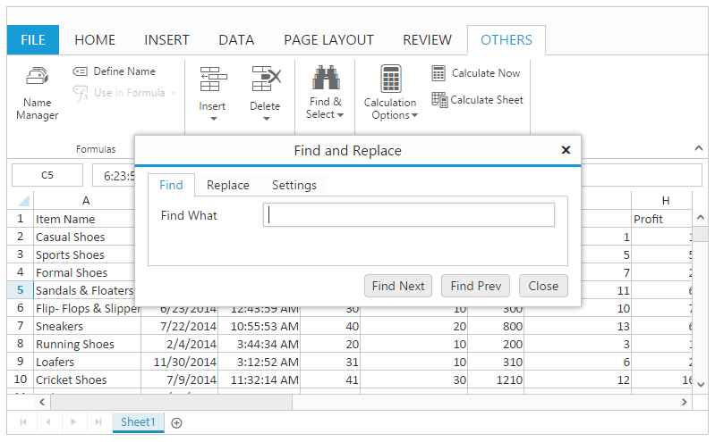
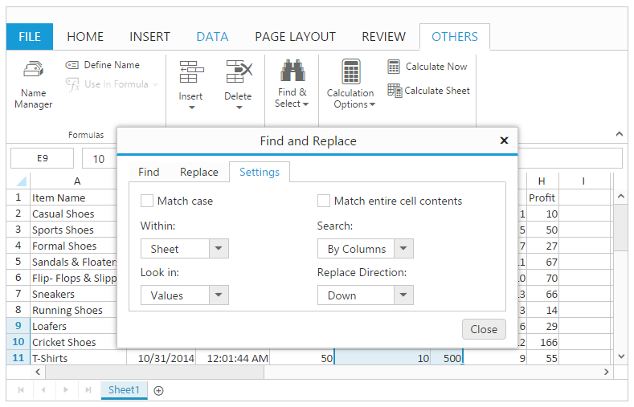
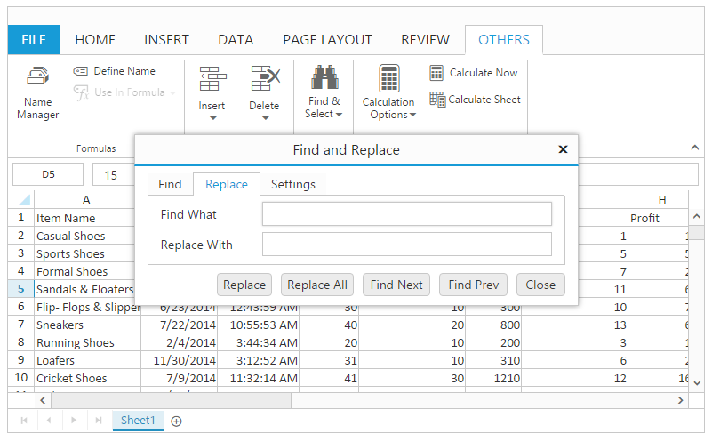
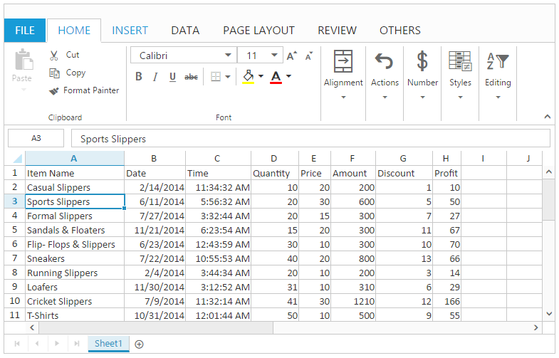
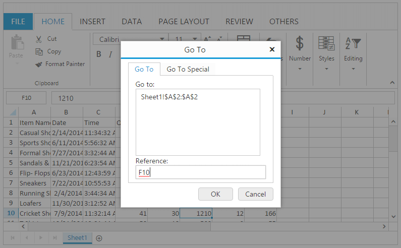
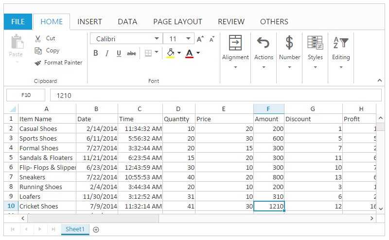
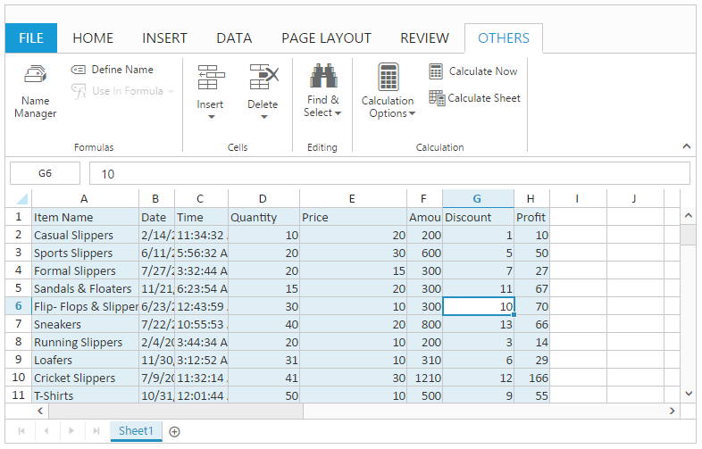

---
layout: post
title: Searching with Spreadsheet widget for Syncfusion Essential JS
description: How to enable Searching and its functionalities
platform: aspnet
control: Spreadsheet
documentation: ug
--- 

# Searching

This feature is used to search the contents in the Spreadsheet. You can use `AllowSearching` property to enable or disable this feature.

You have following options in Searching.

* Find
* Replace
* GoTo
* GoTo Special

The following code example describes the above behavior.





<ej:Spreadsheet ID="FlatSpreadsheet" AllowSearching="true"  runat="server">
</ej:Spreadsheet>





 protected void Page_Load(object sender, EventArgs e)
        {
            if (!IsPostBack)
            {
                BindDataSource();
            }
        }

        private void BindDataSource()
        {
            var dataSource = new OrderItemsDataContext().GetAllItemDetails.ToList();
            this.FlatSpreadsheet.Sheets.Add(new Syncfusion.JavaScript.Models.Sheet()
            {
                Datasource = dataSource
            });
        }





The following output is displayed as a result of the above code example which shows the find and Select button.

## Find

This is used to search the contents of a cell. You can do this by one of the following ways,

* Using "Find" option in Find and Select button of OTHERS tab in ribbon to open the Find and Replace dialog.
* Using [`findNext`](https://help.syncfusion.com/api/js/ejspreadsheet#methods:xlsearch-findnext "findNext") and [`findPrevious`](https://help.syncfusion.com/api/js/ejspreadsheet#methods:xlsearch-findprevious "findPrevious") methods to search the given value in workbook.
* Using Ctrl + F key to open the Find and Replace dialog with Find tab enabled.

The following output is displayed as a result of Find and Replace dialog with Find tab enabled.

You can customize the following settings in find option.

* Match Case - Search content should have same casing compared with the cell content.
* Match Entire Cell Content - Search content should match with entire cell content.
* Look in - You can search the contents by values, formulas and comments.
* Within - You can search the content within the sheet or workbook.
* Search - You can search the contents by rows or columns.
* Replace Direction - You can replace the contents by up or down direction.

Find and Replace dialog with Settings tab enabled.
{:.caption}

## Replace

This is used to replace the contents of a cell. You can do this by one of the following ways.

* Using "Replace" option in Find and Select button of OTHERS tab in ribbon to open the Find and Replace dialog.
* Using [`replaceAllByBook`](https://help.syncfusion.com/api/js/ejspreadsheet#methods:xlsearch-replaceallbybook "replaceAllByBook") or [`replaceAllBySheet`](https://help.syncfusion.com/api/js/ejspreadsheet#methods:xlsearch-replaceallbysheet "replaceAllBySheet") method to replace the contents.
* Using Ctrl + R key to open the Find and Replace dialog with Replace tab enabled.

Find and Replace dialog with Replace tab enabled
{:.caption}

The following code example describes the above behavior.




<ej:Spreadsheet ID="FlatSpreadsheet" runat="server">
       <ClientSideEvents LoadComplete="loadComplete" />
</ej:Spreadsheet>





 protected void Page_Load(object sender, EventArgs e)
        {
            if (!IsPostBack)
            {
                BindDataSource();
            }
        }
 
  private void BindDataSource()
        {
             var dataSource = new OrderItemsDataContext().GetAllItemDetails.ToList();
            this.FlatSpreadsheet.Sheets.Add(new Syncfusion.JavaScript.Models.Sheet()
            {
                Datasource = dataSource

            });
        }




The following output is displayed as a result of the above code example.

## Go To

This feature is used to navigate to the particular cell in the worksheet or workbook.

You can do this by one of the following ways,

* Using "Go To" option in Find and Select button of OTHERS tab in ribbon to open the Go To dialog.
* Using Ctrl + G key to open the Go To dialog.

Go To dialog
{:.caption}

The following output is displayed as a result of goto to cell "F10".

## GoTo Special

This feature is used to quickly select cells of a specified type within the worksheet. You can do this by following ways,

* Using "Go to Special" option in Find and Select button of OTHERS tab in ribbon to open the Go To dialog.

* Using "Go to Formulas" option in Find and Select button of OTHERS tab in ribbon to highlight the cells, which contains formulas.

* Using "Go to Comments" option in Find and Select button of OTHERS tab in ribbon to highlight the cells, which contains comments.

* Using "Go to Conditional Formats" option in Find and Select button of OTHERS tab in ribbon to highlight conditional format applied cells.

* Using "Go to Data Validation" option in Find and Select button of OTHERS tab in ribbon to highlight the data validation applied cells.

* Using "Go to Constants" option in Find and Select button of OTHERS tab in ribbon to highlight the cells, which contains constant values.

The following output is displayed as a result of goto constants which selects the cells containing constant values.

