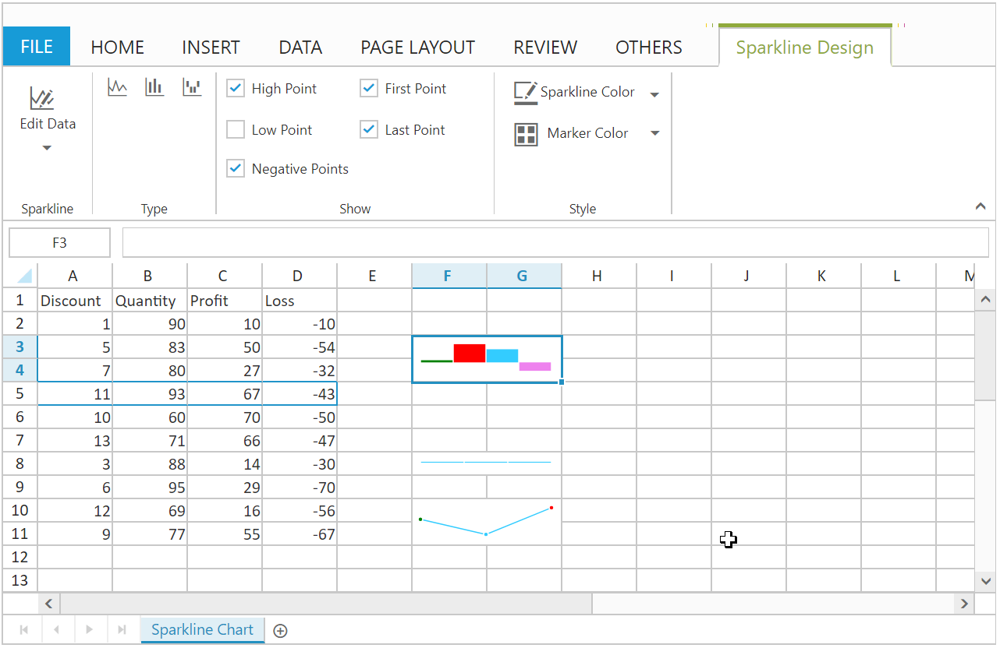

# Spreadsheet Sparkline Chart

Sparkline are easy to interpret and it conveys much more information to the user by visualizing the data in a small amount of space. Here sparkline were placed inside the cell. It creates the Sparkline based on the selected cell range’s data. You can use `AllowSparkline` property to enable/disable Sparkline.

## Types of Sparkline 

The Following Types of Sparkline are available in Spreadsheet.

*	Column
*	Line
*	Win/loss 

You can create the Sparkline by one of the following ways,

*	Using the `Sparkline Type` button to select the type of Sparkline under Sparkline groups of INSERT Tab in ribbon.
*	Using `createSparkline` method to create the Sparkline.

## Sparkline Customization

You can perform the following customizations for Sparkline. These options are available in SPARKLINE DESIGN Tab which is enabled, while clicking the Sparkline element.

<table>
    <colgroup><col width="180px" /></colgroup>
    <tr><th>Feature</th><th>API</th><th>Description</th></tr>
    <tr><td>Edit Data & Location Range</td><td>createSparkline</td><td>You can modify the data range, location range of Sparkline </td></tr>
    <tr><td>Sparkline Type</td><td>changeType</td><td>You can change the type of sparkline by using sparkline type button.</td></tr>
    <tr><td>High Point, First Point, Last Point, Low Point, Negative Point, Sparkline Color and Marker Color</td><td>changePointColor</td><td>You can high light the high point, low point, first point, last point, negative point and Marker Color of sparkline .</td></tr>
</table>

The following code example describes the above behavior,




<ej:Spreadsheet ID="FlatSpreadsheet" AllowSparkline="true" runat="server">
  <ClientSideEvents LoadComplete="loadComplete"/>
     <Sheets>
       <ej:Sheet SheetName="Sparkline Chart">
         <RangeSettings>
          <ej:RangeSetting StartCell="A1" />
        </RangeSettings>
      </ej:Sheet>
     </Sheets>
</ej:Spreadsheet>

    



protected void Page_Load(object sender, EventArgs e)
        {
            BindDataSource();
        }

private void BindDataSource()
        {
            var dataSource = SparklineDetail.GetSparklineDetails.ToList();
            this.FlatSpreadsheet.Sheets[0].RangeSetting[0].Datasource = dataSource;
        }

public class SparklineDetail
    {
        public int Discount { get; set; }
        public int Quantity { get; set; }
        public int Profit { get; set; }
        public int Loss { get; set; }
        public static IEnumerable<object> GetSparklineDetails
        {
            get
            {
                List<SparklineDetail> lItems = new List<SparklineDetail>();
                lItems.Add(new SparklineDetail() { Discount = 1, Quantity = 90, Profit = 10, Loss = -10 });
                lItems.Add(new SparklineDetail() { Discount = 5, Quantity = 83, Profit = 50, Loss = -54 });
                lItems.Add(new SparklineDetail() { Discount = 7, Quantity = 80, Profit = 27, Loss = -32 });
                lItems.Add(new SparklineDetail() { Discount = 11, Quantity = 93, Profit = 67, Loss = -43 });
                lItems.Add(new SparklineDetail() { Discount = 10, Quantity = 60, Profit = 70, Loss = -50 });
                lItems.Add(new SparklineDetail() { Discount = 13, Quantity = 71, Profit = 66, Loss = -47 });
                lItems.Add(new SparklineDetail() { Discount = 3, Quantity = 88, Profit = 14, Loss = -30 });
                lItems.Add(new SparklineDetail() { Discount = 6, Quantity = 95, Profit = 29, Loss = -70 });
                lItems.Add(new SparklineDetail() { Discount = 12, Quantity = 69, Profit = 16, Loss = -56 });
                lItems.Add(new SparklineDetail() { Discount = 9, Quantity = 77, Profit = 55, Loss = -67 });
                var itemCol =
                from item in lItems
                select new { item.Discount, item.Quantity, item.Profit, item.Loss };
                return itemCol;
            }
        }
    }




The following output is displayed as a result of the above code example.

