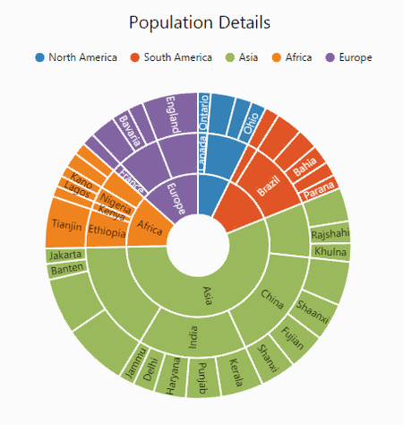
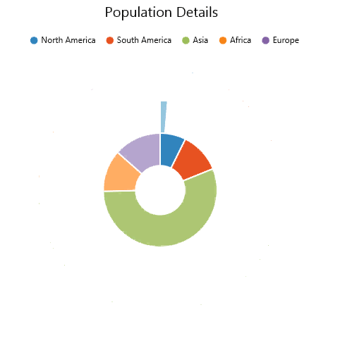

# Animation

Sunburst chart allows you to animate the chart segments. You can enable animation using **EnableAnimation** property. 



<ej:SunburstChart  ID="container" runat="server" EnableAnimation="true">                           
</ej:SunburstChart> 



## Animation Types 
Sunburst chart provide options to animate the chart segments in different ways using **AnimationType** property.
FadeIn – It gradually changes opacity of the chart segment.
Rotation – During an animation, control rotate from 0 to 360 angle.

### Fade In

The Fade In animation is enabled as follows 



<ej:SunburstChart  ID="container" runat="server" EnableAnimation="true" AnimationType="fadeIn">                           
</ej:SunburstChart> 



### Rotation

The following example shows how to enable rotation animation in ejSunburstChart



<ej:SunburstChart  ID="container" runat="server" EnableAnimation="true" AnimationType="Rotation">                           
</ej:SunburstChart> 



[Click](http://asp.syncfusion.com/demos/web/sunburstchart/animation.aspx) here to view the Animation sample of the  Sunburst Chart.
