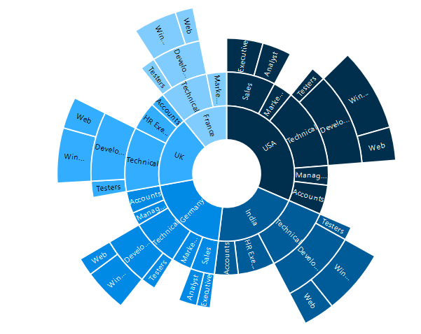
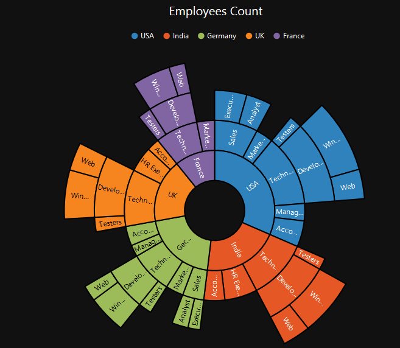

# Appearance
The appearance of the Sunburst Chart can be customized as shown below 

## Palette
The Sunburst Chart displays different segments in different colors by default. You can customize the color of each segment by providing a custom color palette of your choice by using the **Palette** property.



<ej:SunburstChart  ID="container" runat="server"  >                           
</ej:SunburstChart> 





public partial class _Default : Page
    {
        protected void Page_Load(object sender, EventArgs e)
        {
            this.container.Palette = new List<string>() { "#002e4d", "#005c99", "#008ae6", "#33adff", "#80ccff" };
        }
    }



The Sunburst Chart rendered with palette colors

 
## Built- in Themes
The Sunburst Chart supports different themes. 
*	flatlight
*	flatdark
*	gradientlight
*	gradientdark
*	azure
*	azuredark
*	lime
*	limedark
*	saffron
*	saffrondark
*	gradient-azure
*	gradient-azuredark
*	gradient-lime
*	gradient-limedark
*	gradient-saffron
*	gradient-saffrondark

You can set your desired theme by using the **Theme** property. **Flat light** is the default theme used in the Sunburst Chart.



<ej:SunburstChart  ID="container" runat="server" Theme="flatdark" >                           
</ej:SunburstChart> 



