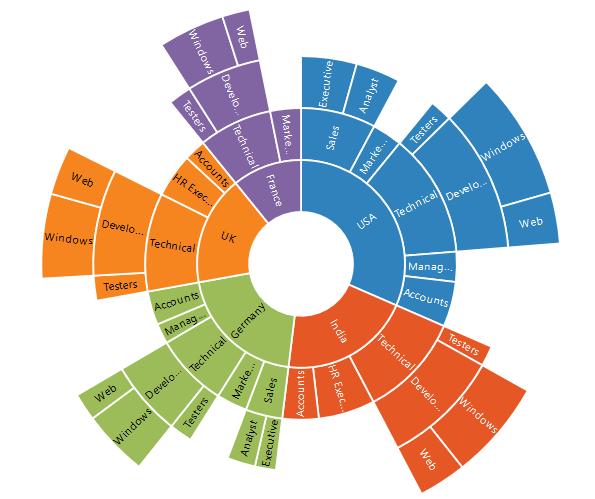
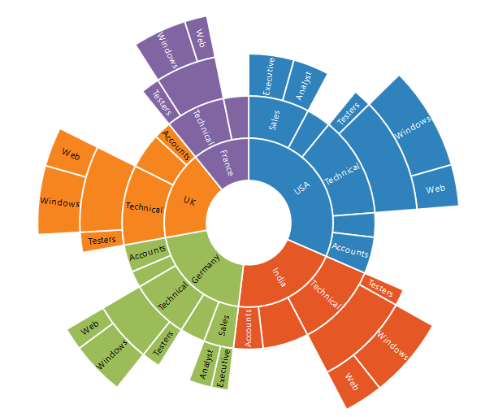
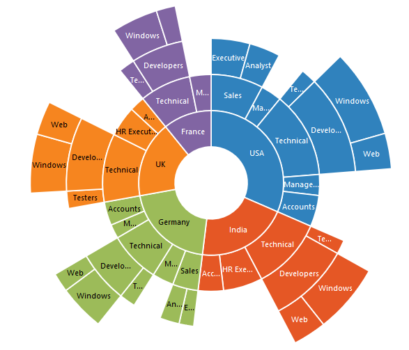
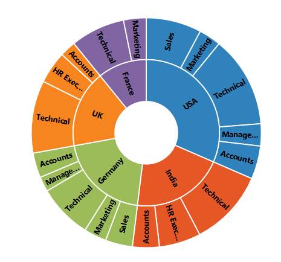

# Data Labels 

Sunburst data labels are used to display the data related to the segment. It helps to provide the information about the data points to the users.
You can enable or disable the data labels by setting the **visible** property of the DataLabelSettings to true as shown in the below code



<ej:SunburstChart  ID="container" runat="server"> 
<DataLabelSettings Visible="true"></DataLabelSettings>                             
</ej:SunburstChart> 

 

## Label Overflow mode

When you represent huge data with data labels, they may intersect each other. You can avoid this using the *SunburstLabelOverflowMode* property.

The following properties are used to avoid the overlapping.
*	Trim – To trim the large data labels.
*	Hide – To hide the overlapped data labels.
The following code shows how to set Hide and Trim mode.



<ej:SunburstChart  ID="container" runat="server"> 
<DataLabelSettings Visible="true" SunburstLabelOverflowMode="hide"></DataLabelSettings>                             
</ej:SunburstChart> 

 

 



<ej:SunburstChart  ID="container" runat="server"> 
<DataLabelSettings Visible="true" SunburstLabelOverflowMode="trim"></DataLabelSettings>                             
</ej:SunburstChart> 

 

## Label Rotation Mode
You can rotate the data label by using *SunburstLabelRotationMode* property. By default, the SunburstLabelRotationMode is set as **angle**. 

The following code shows how to set SunburstLabelRotationMode as normal and angle.



<ej:SunburstChart  ID="container" runat="server"> 
<DataLabelSettings Visible="true" SunburstLabelRotationMode="normal"></DataLabelSettings>                             
</ej:SunburstChart> 

 



<ej:SunburstChart  ID="container" runat="server"> 
<DataLabelSettings Visible="true" SunburstLabelRotationMode="angle"></DataLabelSettings>                             
</ej:SunburstChart> 



 
## Customizing the data labels
You can customize the appearance of the data point using the `Font` property.



<ej:SunburstChart  ID="container" runat="server"> 
<DataLabelSettings Visible="true" SunburstLabelRotationMode="angle">

</DataLabelSettings>                             
</ej:SunburstChart> 



