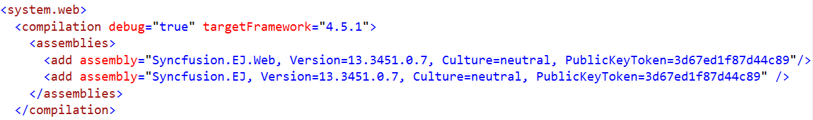

# Getting Started

This section explains you on how to create a simple SunburstChart in your application with ASP.NET and covers only the minimal features that you need to know to get started with the SunburstChart.

## Installation and Deployment

It describes you on how to configure the Syncfusion dependencies in your ASP.NET application to create a SunburstChart.

### Referencing Syncfusion Assemblies

The following assemblies need to be referenced in your application for using Essential SunburstChart ASP

1. Syncfusion.EJ.dll
2. Syncfusion.EJ.Web.dll

Follow the steps given below to deploy the application in the development server by referencing the assembly in **GAC**.

* Web.config file should be configured according to the referenced assemblies.
* To deploy your application, you have to ensure that the above referenced assemblies (in your web.config files) are present in the GAC.

And, add the Syncfusion namespace in the Web.config file.

N> If you are referring Syncfusion assemblies manually from bin folder to create ASP SunburstChart, then remove Culture, Version and PublicKeyToken attributes used in all files.

###  Adding script reference

By default, Syncfusion JavaScript source files has been included into the EJ.Web assembly as an embedded source. So we no need to refer jQuery and Syncfusion scripts externally. For debugging purpose want to refer script files externally, set false to **LoadEJResourcesFromAssembly** in Web.config file as shows in the below image and refer jQuery and Syncfusion script files.



    <!--  jquery script  -->
    

    <!-- Essential html UI widget -->
    



## Initialize Sunburst Chart

1.Add the following code in the default.aspx file to create the Chart control in View page.



<ej:SunburstChart ID="Container" runat="server" >
</ej:SunburstChart>



## Populate Data source:

Now, let’s see how to plot data source to the SunburstChart. First, let us generate a data source containing following fields in controller.



[Serializable]
 public class DefaultData
    {
        public string Category { get; set; }
        public string Country { get; set; }
        public string JobDescription { get; set; }
        public string JobGroup { get; set; }
        public string JobRole { get; set; }
        public int EmployeesCount { get; set; }

        public static List<DefaultData> GetDefaultData()
        {
            List<DefaultData> data = new List<DefaultData>();
           data.Add(new DefaultData() { Category = "Employees", Country = "USA", JobDescription = "Sales",         JobGroup ="Executive",                         EmployeesCount= 50});
           data.Add(new DefaultData() { Category = "Employees", Country = "USA", JobDescription = "Sales",         JobGroup = "Analyst",                         EmployeesCount =40 });
           data.Add(new DefaultData() { Category = "Employees", Country = "USA", JobDescription = "Marketing",                                                  EmployeesCount =40 });
           data.Add(new DefaultData() { Category = "Employees", Country = "USA", JobDescription = "Technical",     JobGroup = "Testers",                         EmployeesCount =55 });
           data.Add(new DefaultData() { Category = "Employees", Country = "USA", JobDescription = "Technical",     JobGroup = "Developers", JobRole = "Windows", EmployeesCount =175});
           data.Add(new DefaultData() { Category = "Employees", Country = "USA", JobDescription = "Technical",     JobGroup = "Developers", JobRole = "Web",     EmployeesCount =70 });
           data.Add(new DefaultData() { Category = "Employees", Country = "USA", JobDescription = "Management",                                                  EmployeesCount =40 });
           data.Add(new DefaultData() { Category = "Employees", Country = "USA", JobDescription = "Accounts",                                                    EmployeesCount =60 });

           data.Add(new DefaultData() { Category = "Employees", Country = "India",   JobDescription = "Technical",     JobGroup = "Testers",                         EmployeesCount = 43 });
           data.Add(new DefaultData() { Category = "Employees", Country = "India",   JobDescription = "Technical",     JobGroup = "Developers", JobRole = "Windows", EmployeesCount = 125});
           data.Add(new DefaultData() { Category = "Employees", Country = "India",   JobDescription = "Technical",     JobGroup = "Developers", JobRole = "Web",     EmployeesCount = 60 });
           data.Add(new DefaultData() { Category = "Employees", Country = "India",   JobDescription = "HR Executives",                                              EmployeesCount = 70 });
           data.Add(new DefaultData() { Category = "Employees", Country = "India",   JobDescription = "Accounts",                                                   EmployeesCount = 45 });

           data.Add(new DefaultData() { Category = "Employees", Country = "Germany", JobDescription = "Sales",         JobGroup = "Executive",                       EmployeesCount = 30 });
           data.Add(new DefaultData() { Category = "Employees", Country = "Germany", JobDescription = "Sales",         JobGroup = "Analyst",                         EmployeesCount = 40 });
           data.Add(new DefaultData() { Category = "Employees", Country = "Germany", JobDescription = "Marketing",                                                  EmployeesCount = 50  });
           data.Add(new DefaultData() { Category = "Employees", Country = "Germany", JobDescription = "Technical",     JobGroup = "Testers",                         EmployeesCount = 40 });
           data.Add(new DefaultData() { Category = "Employees", Country = "Germany", JobDescription = "Technical",     JobGroup = "Developers", JobRole = "Windows", EmployeesCount = 65 });
           data.Add(new DefaultData() { Category = "Employees", Country = "Germany", JobDescription = "Technical",     JobGroup = "Developers", JobRole = "Web",     EmployeesCount = 27 });
           data.Add(new DefaultData() { Category = "Employees", Country = "Germany", JobDescription = "Management",                                                 EmployeesCount = 33  });
           data.Add(new DefaultData() { Category = "Employees", Country = "Germany", JobDescription = "Accounts",                                                   EmployeesCount = 55  });

           data.Add(new DefaultData() { Category = "Employees", Country = "UK",      JobDescription = "Technical",     JobGroup = "Testers",                         EmployeesCount = 45 });
           data.Add(new DefaultData() { Category = "Employees", Country = "UK",      JobDescription = "Technical",     JobGroup = "Developers", JobRole = "Windows", EmployeesCount = 96 });
           data.Add(new DefaultData() { Category = "Employees", Country = "UK",      JobDescription = "Technical",     JobGroup = "Developers", JobRole = "Web",     EmployeesCount = 55 });
           data.Add(new DefaultData() { Category = "Employees", Country = "UK",      JobDescription = "HR Executives",                                               EmployeesCount = 60 });
           data.Add(new DefaultData() { Category = "Employees", Country = "UK",      JobDescription= "Accounts",                                                     EmployeesCount=30   });
          data.Add(new DefaultData() { Category = "Employees", Country = "France", JobDescription= "Technical",     JobGroup = "Testers",                         EmployeesCount = 40 });
           data.Add(new DefaultData() { Category = "Employees", Country = "France", JobDescription= "Technical",     JobGroup = "Developers", JobRole = "Windows", EmployeesCount = 65 });
           data.Add(new DefaultData() { Category = "Employees", Country = "France", JobDescription= "Technical",     JobGroup = "Developers", JobRole = "Web",     EmployeesCount = 27 });
           data.Add(new DefaultData() { Category = "Employees", Country = "France", JobDescription="Marketing",                                                     EmployeesCount= 50 });
           return data;
        }
    }



### Initialize Sunburst Chart with data
Now, bind the DefaultData to `DataSource` property of the Sunburst Chart. The`Levels`property determines the number of hierarchical levels. Each hierarchy level is formed based on the property specified in `GroupMemberPath` property, and each arc segment size is calculated using `ValueMemberPath`.

2. Add SunburstChart() action in SunburstChartController and add the following code.


protected void Page_Load(object sender, EventArgs e)

     {

    this.container.DataSource = DefaultData.GetDefaultList();

      }



3.Render the SunburstChart with the Datasource and Levels,the following code snippet is used



 <ej:SunburstChart  ID="container" runat="server"  ValueMemberPath="EmployeesCount" >
                <Levels>
                <ej:SunburstLevel GroupMemberPath="Country"></ej:SunburstLevel>
                <ej:SunburstLevel GroupMemberPath="JobDescription"></ej:SunburstLevel>
                <ej:SunburstLevel GroupMemberPath="JobGroup"></ej:SunburstLevel>
                <ej:SunburstLevel GroupMemberPath="JobRole"></ej:SunburstLevel>
            </Levels>
        </ej:SunburstChart>


3. The final ASPX file appears as follows



	<html xmlns="http://www.w3.org/1999/xhtml">
	<head>
	 <!--  jquery script  -->
    

    <!-- Essentialcshtml UI widget -->
    

	

	<ej:SunburstChart  ID="container" runat="server"  ValueMemberPath="EmployeesCount" >
                <Levels>
                <ej:SunburstLevel GroupMemberPath="Country"></ej:SunburstLevel>
                <ej:SunburstLevel GroupMemberPath="JobDescription"></ej:SunburstLevel>
                <ej:SunburstLevel GroupMemberPath="JobGroup"></ej:SunburstLevel>
                <ej:SunburstLevel GroupMemberPath="JobRole"></ej:SunburstLevel>
            </Levels>
        </ej:SunburstChart>
        

	</body>

	</html>



## Add Title to the Sunburst Chart

The title of the Sunburst chart is used to provide quick information to the user about the data being plotted in the Sunburst Chart. You can add it by using the `Text`property of the `Title`



<ej:SunburstChart  ID="container" runat="server">
   <Title Text="Employees Count"></Title>
</ej:SunburstChart>


## Enable Legend

You can enable or disable the legend by using the `Visible`property present inside the `Legend`



<ej:SunburstChart  ID="container" runat="server">
  <Legend Visible="true"></Legend>
</ej:SunburstChart>



## Add Data Labels

The data labels are used to improve the readability of the Sunburst chart. This can be achieved by enabling the `Visible`property in the `DataLabelSettings`



<ej:SunburstChart  ID="container" runat="server">
 <DataLabelSettings Visible="true"></DataLabelSettings>
</ej:SunburstChart>



Now the Sunburst Chart is rendered along with the specified customizations

[Click](http://asp.syncfusion.com/demos/web/sunburstchart/default.aspx) here to view the Animation sample of the  Sunburst Chart.
