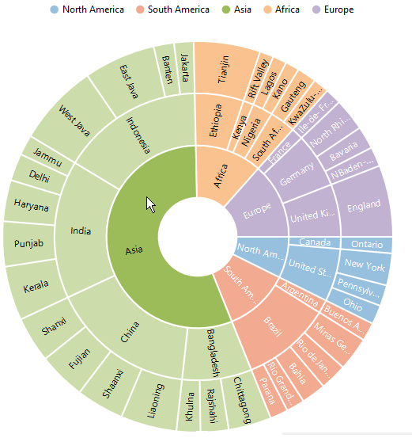
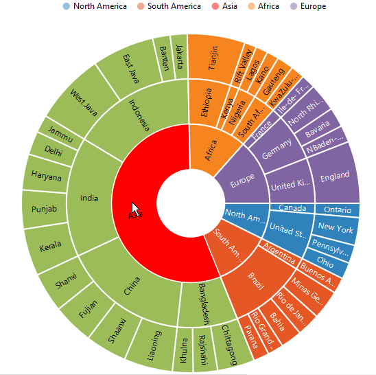
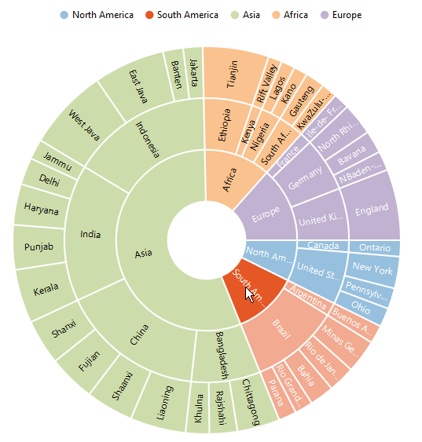

# Highlight 
SunburstChart provides highlighting support for the points on mouse hover. To enable the highlighting , set the *Enable* property to true in the **HighlightSettings**. 



<ej:SunburstChart  ID="container" runat="server"> 
<HighlightSettings Enable="true" />                            
</ej:SunburstChart> 



 
## Highlight Display mode

 You can customize the highlighted segment appearance by using color or opacity. You can choose between color or opacity using the **Type** property in the highlight Settings.

*	HighlightByColor – To display the highlighted segment appearance using color.
*	HighlightByOpacity – To display the highlighted segment appearance using opacity.



<ej:SunburstChart  ID="container" runat="server"> 
<HighlightSettings Enable="true" Type="Color" Color="Red" />                            
</ej:SunburstChart> 

 

## Highlight Mode

Sunburst chart provides multiple option to represent the highlighted categories. You can highlight the segment categories by using the **Mode** property in highlightSettings
*	Child – To highlight the child of selected parent.
*	All – To highlight the entire categories in group.
*	Parent – To highlight the parent of selected child.
*	Single - To highlight single item in the category.

### Child
The following code shows how to set the highlight type as child 



<ej:SunburstChart  ID="container" runat="server"> 
<HighlightSettings Enable="true" Mode="Child" />                            
</ej:SunburstChart> 



 
### Parent

The parent mode can be enabled by using the below code 



<ej:SunburstChart  ID="container" runat="server"> 
<HighlightSettings Enable="true" Mode="Parent" />                            
</ej:SunburstChart> 



 
### Point

To highlight the particular segment, the point mode of the highlight settings is used.



<ej:SunburstChart  ID="container" runat="server"> 
<HighlightSettings Enable="true" Mode="Point" />                            
</ej:SunburstChart> 

 

 
### All

The following code snippet is used for the all mode of highlight settings



<ej:SunburstChart  ID="container" runat="server"> 
<HighlightSettings Enable="true" Mode="All" />                            
</ej:SunburstChart> 



[Click](http://asp.syncfusion.com/demos/web/sunburstchart/selection.aspx) here to view the Highlighting sample of the  Sunburst Chart.
