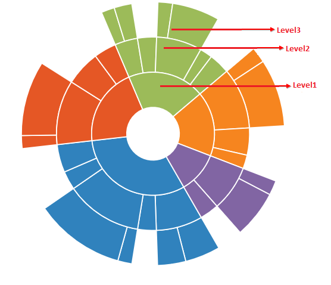

## Levels

Sunburst chart is used to display hierarchical data. You can add more than one hierarchical data by using the **Levels** property of Sunburst chart. Each level of the hierarchy is represented by circle.
The following code snippet illustrates 


<ej:SunburstChart  ID="container" runat="server" >
<Levels>
  <%--To Add Multiple levels for reprsenting the hierarchical data   --%>
</Levels>  
</ej:SunburstChart> 



## GroupMemberPath

It is the string property that is used to map the group category value in the dataSource .
You can define the levels as shown in the below code example



<ej:SunburstChart  ID="container" runat="server" >
<Levels>
                <ej:SunburstLevel GroupMemberPath="Level1"></ej:SunburstLevel>
                <ej:SunburstLevel GroupMemberPath="Level2"></ej:SunburstLevel>
                <ej:SunburstLevel GroupMemberPath="Level3"></ej:SunburstLevel>
              
            </Levels>  
</ej:SunburstChart> 
 

The following screenshot illustrates the Sunburst Chart with different levels

