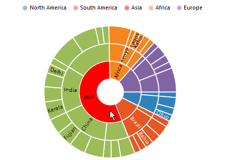
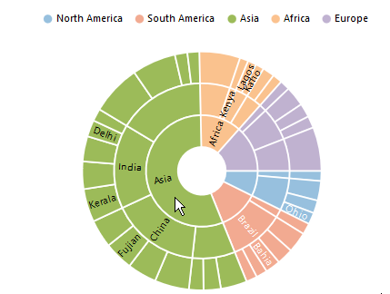
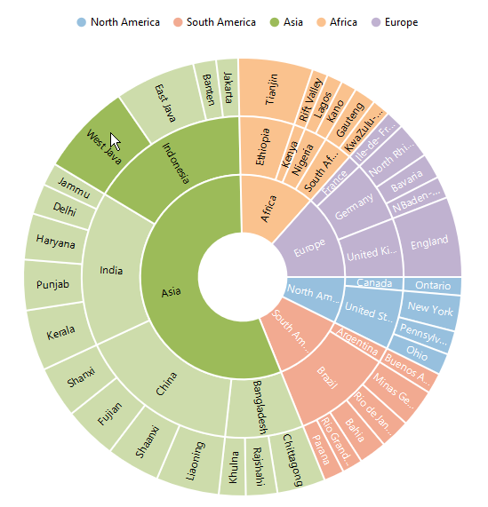

# Selection 
SunburstChart provides selection support for the points on mouse click. To enable the selection , set the *Enable* property to true in the **SelectionSettings**. 



<ej:SunburstChart  ID="container" runat="server"> 
<SelectionSettings Enable="true" />                            
</ej:SunburstChart> 



 
## Selection Display mode

 You can customize the selected  segment appearance by using color or opacity. You can choose between color or opacity using the **Type** selection Settings.

*	selectionByColor – To display the selected segment appearance using color.
*	selectionByOpacity – To display the selected segment appearance using opacity.



<ej:SunburstChart  ID="container" runat="server"> 
<SelectionSettings Enable="true" Type="Color" Color="Red" />                            
</ej:SunburstChart> 

 

## Selection Mode

Sunburst chart provides multiple option to represent the selected categories. You can select the segment categories by using the **Mode** property in selectionSettings
*	Child – To selection the child of selected parent.
*	All – To selection the entire categories in group.
*	Parent – To selection the parent of selected child.
*	Single - To selection single item in the category.

### Child
The following code shows how to set the selection type as child 



<ej:SunburstChart  ID="container" runat="server"> 
<SelectionSettings Enable="true" Mode="Child" />                            
</ej:SunburstChart> 



 
### Parent

The parent mode can be enabled by using the below code 



<ej:SunburstChart  ID="container" runat="server"> 
<SelectionSettings Enable="true" Mode="Parent" />                            
</ej:SunburstChart> 



 
### Point

To selection the particular segment, the point mode of the selection settings is used.



<ej:SunburstChart  ID="container" runat="server"> 
<SelectionSettings Enable="true" Mode="Point" />                            
</ej:SunburstChart> 

 

 
### All

The following code snippet is used for the all mode of selection settings



<ej:SunburstChart  ID="container" runat="server"> 
<SelectionSettings Enable="true" Mode="All" />                            
</ej:SunburstChart> 



[Click](http://asp.syncfusion.com/demos/web/sunburstchart/selection.aspx) here to view the Selection sample of the  Sunburst Chart.

