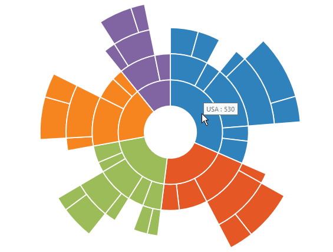
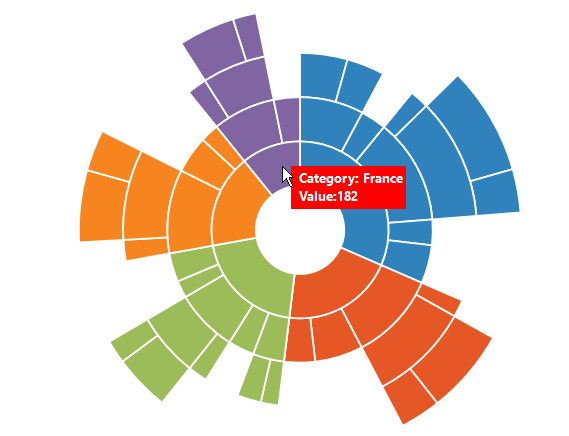

## Tooltip  

ToolTip allows you to display any information over a sunburst segment. It appears when mouse hovered over or touch any chart segment. By default, it displays the corresponding segment category name and its value



<ej:SunburstChart  ID="container" runat="server"> 
<Tooltip Visible="true" />                            
</ej:SunburstChart> 



## Tooltip Template   

HTML elements can be displayed in the tooltip by using the *Template* property of the tooltip. The template property takes the value of the id attribute of the HTML element. You can use the **#point.x#** and **#point.y#** as place holders in the HTML element to display the x and y values of the corresponding point.



        

            

                <label id="efpercentage" style="color:white">
                    &nbsp;&nbsp;Category:&nbsp;#point.x#
                    &nbsp;&nbsp;Value:#point.y#
                </label>
            

        

    

<ej:SunburstChart  ID="container" runat="server"> 
<Tooltip Visible="true" Template="Tooltip" />                            
</ej:SunburstChart> 



