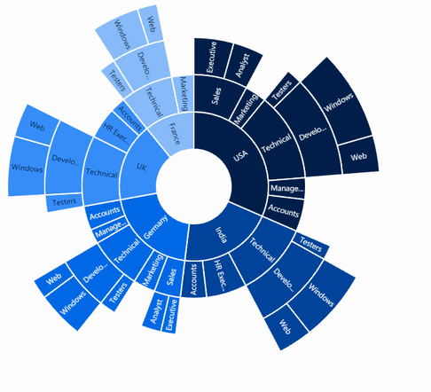
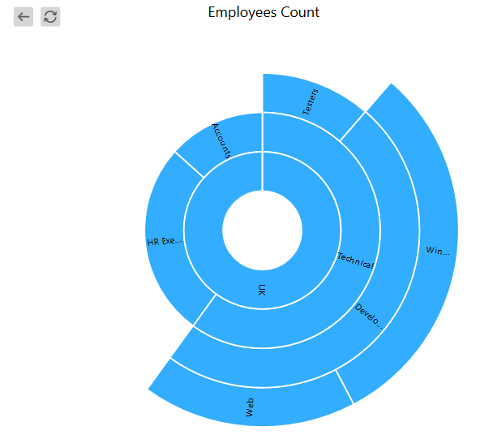

# Zooming

Sunburst chart provides zooming (drill down) experience with animation for both mouse and touch enabled devices. It allows you to virtualizing the large sets of data into minimum data view.The zooming is achieved by using the property of *zoomSettings*

The following code shows how to initialize the zooming.


<ej:SunburstChart  ID="container" runat="server"> 
<ZoomSettings Enable="true" />                            
</ej:SunburstChart> 



## Zooming toolbar
By default, zooming toolbar will be enabled while zooming the segment.It contains both back and reset option.
You can align the zooming toolbar position by using *ToolbarHorizontalAlignment* and *ToolbarVerticalAlignment* property.



<ej:SunburstChart  ID="container" runat="server"> 
<ZoomSettings Enable="true" ToolbarHorizontalAlignment="left" />                            
</ej:SunburstChart> 



[Click](http://asp.syncfusion.com/demos/web/sunburstchart/zooming.aspx) here to view the Zooming sample of the  Sunburst Chart.
