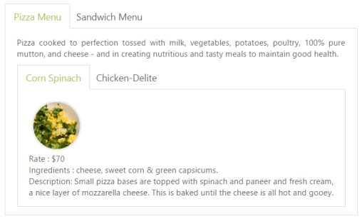

# AJAX Content Load (Load on Demand)

You can change the contents in the sub Tab element periodically and you are provided with a support to change the content without any problem. To achieve the content load, use the Load on Demand concept.

In the Load On-Demand, the external HTML file with the necessary details is referred in URL section during Tab header declaration section. Include the DataType, ContentType, and Async also in the script like the following example when rendering the control. When you click the Tab header, the AJAX automatically calls the content from the external files and displays in a Tab content section. 

## Sub Tab with AJAX Content

Each item has a variety of options and these options are also specified in the limited space. You can choose the Tab control that is used within the root Tab to specify more details.

The following code example illustrates how to create the Tab control within the root Tab element. This HTML code is appended within the previous HTML code section. To render the child Tab with its header, add this code example within the first Tab element. 

Add the following ASPX to render sub Tab with AJAX content.



<ej:Tab ID="dishtype" runat="server" Width="600px">

    <Items>

        <ej:TabItem ID="pizzatype" Text="Pizza Menu">

            <ContentSection>

                

                    Pizza cooked to perfection tossed with milk, vegetables, potatoes, poultry, 100% pure mutton, and cheese - and in creating nutritious and tasty meals to maintain good health.

                <ej:Tab ID="PizzaTab" runat="server">

                    <Items>

                        <ej:TabItem ID="PizzaMenu" Text="Corn Spinach" Url="Content/cornSpinach.html">

                        </ej:TabItem>

                        <ej:TabItem ID="PizzaMenu1" Text="Chicken-Delite" Url="Content/chickenDelite.html">

                        </ej:TabItem>

                    </Items>

                </ej:Tab>

            </ContentSection>

        </ej:TabItem>

        <ej:TabItem ID="sandwichtype" Text="Sandwich Menu">

            <ContentSection>

                

                    Sandwich cooked to perfection tossed with bread, milk, vegetables, potatoes, poultry, 100% pure mutton, and cheese - and in creating nutritious and tasty meals to maintain good health.

                <ej:Tab ID="Tab1" runat="server">

                    <Items>

                        <ej:TabItem ID="gardenveggie" Text="Garden Veggie" Url="Content/gardenVeggie.html">

                        </ej:TabItem>

                        <ej:TabItem ID="chickentikka" Text="Chicken-Tikka" Url="Content/chickenTikka.html">

                        </ej:TabItem>

                        <ej:TabItem ID="paneerTikka" Text="Paneer-Tikka" Url="Content/paneerTikka.html">

                        </ej:TabItem>

                    </Items>

                </ej:Tab>

            </ContentSection>

        </ej:TabItem>

    </Items>

</ej:Tab>



The file cornSpinach.html content is as follows. 



<!DOCTYPE html>

<html xmlns="http://www.w3.org/1999/xhtml">

<body>

    

        

        

            Rate    : $70  Ingredients : cheese, sweet corn &amp; green capsicums.

             

            Description: Small pizza bases are topped with spinach and paneer and fresh cream, a nice layer of mozzarella cheese. This is baked until the cheese is all hot and gooey.                    

    
   

</body>

</html>

 The file chickenDelite.html content is as follows.

<!DOCTYPE html>

<html xmlns="http://www.w3.org/1999/xhtml">

<body>

    

        

        

            Rate    : $100  Ingredients : cheese, chicken chunks, onions &amp; pineapple chunks.     

             Description: This is a tasty, elegant chicken dish that is easy to prepare.

        

    

</body>

</html>



At the time of AJAX call, the content is fetched from the external file.

The following screenshot illustrates the First Tab with the sub Tab control by using Load on Demand. 

 

