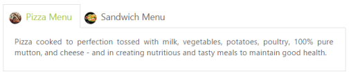
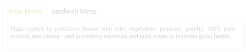
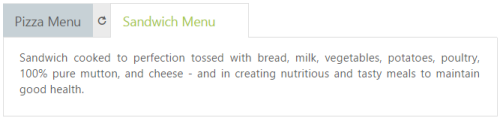
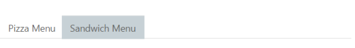
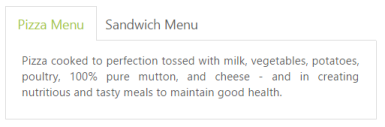
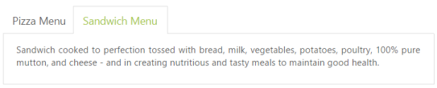

# Appearance and Styling

## Header Image Customization

To set the Tab Header image for each Tab item, you need to specify image in the ImageCssClass property during the TabItem declaration.

The following code example is used to add the Header image for the root Tab header element. 

Add the following ASPX to render Tab with Header image.



<ej:Tab ID="dishtype" runat="server" Width="600px">

    <Items>

        <ej:TabItem ID="pizzatype" ImageCssClass="dish pizzaImg" Text="Pizza Menu">

            <ContentSection>

                

                    Pizza cooked to perfection tossed with milk, vegetables, potatoes, poultry, 100% pure mutton, and cheese - and in creating nutritious and tasty meals to maintain good health.

            </ContentSection>

        </ej:TabItem>

        <ej:TabItem ID="sandwichtype" ImageCssClass="dish sandwichImg" Text="Sandwich Menu">

            <ContentSection>

                

                    Sandwich cooked to perfection tossed with bread, milk, vegetables, potatoes, poultry, 100% pure mutton, and cheese - and in creating nutritious and tasty meals to maintain good health.

            </ContentSection>

        </ej:TabItem>

    </Items>

</ej:Tab>



Add the following CSS for header image customization.



.dish {

	display: inline-block;

	vertical-align: middle;

	margin: 0px -9px 0px 9px;           

}

.pizzaImg {

	background: url("http://js.syncfusion.com/UG/Web/Content/rsz_chicken-delite.png") no-repeat;

	height: 25px;

	width: 25px;

}

.sandwichImg, .pastaImg {

	height: 25px;

	width: 25px;

}

.sandwichImg {

	background: url("http://js.syncfusion.com/UG/Web/Content/rsz_garden-fresh.png") no-repeat;

}



The following screenshot illustrates the Tab with the customized header image. 

 

## Rounded corners

By enabling the ShowRoundedCorner property, you can customize the shape of the Tab control from regular rectangular shape to rounded rectangle shape that is set to false, by default. 

The following code example is used to render the Tab control with Rounded corners.

Add the following ASPX to render Tab with Rounder corners.



<ej:Tab ID="dishtype" runat="server" ShowRoundedCorner="true" Width="600px">

    <Items>

        <ej:TabItem ID="pizzatype" Text="Pizza Menu">

            <ContentSection>

                

                    Pizza cooked to perfection tossed with milk, vegetables, potatoes, poultry, 100% pure mutton, and cheese - and in creating nutritious and tasty meals to maintain good health.

            </ContentSection>

        </ej:TabItem>

        <ej:TabItem ID="sandwichtype" Text="Sandwich Menu">

            <ContentSection>

                

                    Sandwich cooked to perfection tossed with bread, milk, vegetables, potatoes, poultry, 100% pure mutton, and cheese - and in creating nutritious and tasty meals to maintain good health.

            </ContentSection>

        </ej:TabItem>

    </Items>

</ej:Tab>



The following screenshot illustrates the Tab with Rounded corners.

 

## Enable/Disable

You can Enable or Disable the Tab control by the Enabled property. By default, the property set to true.

The following code example is used to render the Tab control with Enable/Disable.

Add the following ASPX to render the Tab with Enable/Disable.



    <ej:Tab ID="dishtype" runat="server" Enabled="false" Width="600px">

        <Items>

            <ej:TabItem Id="pizzatype" Text="Pizza Menu">

                <ContentSection>

                    
Pizza cooked to perfection tossed with milk, vegetables, potatoes, poultry, 100% pure mutton, and cheese - and in creating nutritious and tasty meals to maintain good health.

                </ContentSection>

            </ej:TabItem>

            <ej:TabItem Id="sandwichtype" Text="Sandwich Menu">

                <ContentSection>

                    
Sandwich cooked to perfection tossed with bread, milk, vegetables, potatoes, poultry, 100% pure mutton, and cheese - and in creating nutritious and tasty meals to maintain good health.

                </ContentSection>

            </ej:TabItem>

        </Items>

    </ej:Tab>



The following screenshot illustrates the Tab with disabled format.

 

## Enabling Reload Icon

Without refreshing/reloading the whole page, you can reload a particular Tab by using the Reload icon. The Reload icon appears at the right corner of the Tab by enabling the property, ShowReloadIcon to true. When you move the cursor over the Tab headers, the Reload icon is displayed. By default, the property value is set to false.   

The following code example is used to render the Tab control with Reload icon.

Add the following ASPX to render the Tab with Reload icon.



    <ej:Tab ID="dishtype" runat="server" ShowReloadIcon="true" Width="600px">

        <Items>

            <ej:TabItem Id="pizzatype" Text="Pizza Menu">

                <ContentSection>

                    
Pizza cooked to perfection tossed with milk, vegetables, potatoes, poultry, 100% pure mutton, and cheese - and in creating nutritious and tasty meals to maintain good health.

                </ContentSection>

            </ej:TabItem>

            <ej:TabItem Id="sandwichtype" Text="Sandwich Menu">

                <ContentSection>

                    
Sandwich cooked to perfection tossed with bread, milk, vegetables, potatoes, poultry, 100% pure mutton, and cheese - and in creating nutritious and tasty meals to maintain good health.

                </ContentSection>

            </ej:TabItem>

        </Items>

    </ej:Tab>



The following screenshot illustrates the Tab with reload icon.

## Collapsible Tabs

You can collapse the Tab content by setting the Collapsible property to true. When the property is set to true, click the active Tab header, and the Tab contents are hidden. By default, the property value is set to false.

The following code example is used to render the Tab control with customized Collapsible mode.

Add the following ASPX to render Tab with customized Collapsible mode.



<ej:Tab ID="dishtype" runat="server" Collapsible="true" Width="600px">

    <Items>

        <ej:TabItem ID="pizzatype" Text="Pizza Menu">

            <ContentSection>

                

                    Pizza cooked to perfection tossed with milk, vegetables, potatoes, poultry, 100% pure mutton, and cheese - and in creating nutritious and tasty meals to maintain good health.

            </ContentSection>

        </ej:TabItem>

        <ej:TabItem ID="sandwichtype" Text="Sandwich Menu">

            <ContentSection>

                

                    Sandwich cooked to perfection tossed with bread, milk, vegetables, potatoes, poultry, 100% pure mutton, and cheese - and in creating nutritious and tasty meals to maintain good health.

            </ContentSection>

        </ej:TabItem>

    </Items>

</ej:Tab>



The following screenshot illustrates the Tab with customized collapsible mode.

 

## Adjusting Tab Size

### Height Adjust Mode and Height

The height of the Tab control is customized by Height property. The Tab control’s Height depends on the HeightAdjustMode property. By using the HeightAdjustMode property, you can adjust the Height by Content, Auto, and Fill. By default, the HeightAdjustMode is set to content.

The following code example is used to render the Tab control with customized Height and Height adjust mode.

Add the following ASPX to render Tab with customized height and height adjust mode.



<ej:Tab ID="dishtype" runat="server" HeightAdjustMode="Fill" Height="300px" Width="600px">

    <Items>

        <ej:TabItem ID="pizzatype" Text="Pizza Menu">

            <ContentSection>

                

                    Pizza cooked to perfection tossed with milk, vegetables, potatoes, poultry, 100% pure mutton, and cheese - and in creating nutritious and tasty meals to maintain good health.

            </ContentSection>

        </ej:TabItem>

        <ej:TabItem ID="sandwichtype" Text="Sandwich Menu">

            <ContentSection>

                

                    Sandwich cooked to perfection tossed with bread, milk, vegetables, potatoes, poultry, 100% pure mutton, and cheese - and in creating nutritious and tasty meals to maintain good health.

            </ContentSection>

        </ej:TabItem>

    </Items>

</ej:Tab>



The following screenshot illustrates the Tab with customized height and height adjust mode.

 

### Width

The Width of the Tab control is customized by using the Width property that accepts only the pixel values.

The following code example is used to render the Tab control with customized Width.

Add the following ASPX to render the Tab with customized Width.



    <ej:Tab ID="dishtype" runat="server" Width="450px">

        <Items>

            <ej:TabItem Id="pizzatype" Text="Pizza Menu">

                <ContentSection>

                    
Pizza cooked to perfection tossed with milk, vegetables, potatoes, poultry, 100% pure mutton, and cheese - and in creating nutritious and tasty meals to maintain good health.

                </ContentSection>

            </ej:TabItem>

            <ej:TabItem Id="sandwichtype" Text="Sandwich Menu">

                <ContentSection>

                    
Sandwich cooked to perfection tossed with bread, milk, vegetables, potatoes, poultry, 100% pure mutton, and cheese - and in creating nutritious and tasty meals to maintain good health.

                </ContentSection>

            </ej:TabItem>

        </Items>

    </ej:Tab>



The following screenshot illustrates the Tab with customized Width.

 

## Theme

Tab control’s style and appearance are controlled based on the CSS classes. In order to apply styles to the Tab control, you can refer to the files, ej.widgets.core.min.css and ej.theme.min.css. When the file ej.web.all.min.css is referred, it is not necessary to include the files ej.widgets.core.min.css and ej.theme.min.css in your project, as ej.web.all.min.css is the combination of these two files. 

By default, there are 13 themes available for Tab control,

* default-theme
* bootstrap-theme
* flat-azure-dark
* fat-lime
* flat-lime-dark
* flat-saffron
* flat-saffron-dark
* gradient-azure
* gradient-azure-dark
* gradient-lime
* gradient-lime-dark
* gradient-saffron
* gradient-saffron-dark
* bootstrap-theme

## Custom styles

The style of the Tab control is customized by the CssClass property. 

The following code example is used to render the Tab control with customized style.

Add the following ASPX to render Tab with customized style.



<ej:Tab ID="dishtype" runat="server" CssClass="custom">

    <Items>

        <ej:TabItem ID="pizzatype" Text="Pizza Menu">

            <ContentSection>

                

                    Pizza cooked to perfection tossed with milk, vegetables, potatoes, poultry, 100% pure mutton, and cheese - and in creating nutritious and tasty meals to maintain good health.

            </ContentSection>

        </ej:TabItem>

        <ej:TabItem ID="sandwichtype" Text="Sandwich Menu">

            <ContentSection>

                

                    Sandwich cooked to perfection tossed with bread, milk, vegetables, potatoes, poultry, 100% pure mutton, and cheese - and in creating nutritious and tasty meals to maintain good health.

            </ContentSection>

        </ej:TabItem>

    </Items>

</ej:Tab>



Add the following styles



.custom {

	width:650px;

}



The following screenshot illustrates the Tab with customized style.

 

## Scroll of the Grid inside Tab

The tab control used for navigations can render any controls inside its content. We have adding our Grid control inside tab content section. The tab property `HeightAdjustMode` set to `None` and set tab `height`.

The following code example is used to render the Tab control with Grid control.

Add the following ASPX to render Tab with grid content.



<ej:Tab ID="Tab1" runat="server" Height="300px" HeightAdjustMode="None">
    <Items>
        <ej:TabItem ID="steelman" Text="Grid">
            <ContentSection>
                

                <ej:Grid ID="OrdersGrid" runat="server" AllowPaging="True">
                <DataManager URL="https://js.syncfusion.com/demos/ejServices/Wcf/Northwind.svc/Orders/" CrossDomain="true"></DataManager>
                <Columns>
                <ej:Column Field="OrderID" HeaderText=" OrderID" IsPrimaryKey="True" TextAlign="Right" Width="75" />
                <ej:Column Field="CustomerID" HeaderText="CustomerID" Width="90" />
                <ej:Column Field="EmployeeID" HeaderText="EmployeeID" TextAlign="Right" Width="90" />
                <ej:Column Field="Freight" HeaderText="Freight" TextAlign="Right" Width="75" />
                <ej:Column Field="ShipCity" HeaderText="Ship City" Width="80" />
                <ej:Column Field="OrderDate" HeaderText="Order Date" Format="{0:MM/dd/yyyy}" TextAlign="Right" Width="80" />
                <ej:Column Field="ShipCountry" HeaderText="Ship Country" Width="100" />
                </Columns>
                <PageSettings PageSize="9" />
                </ej:Grid>
                 

            </ContentSection>
        </ej:TabItem>
        <ej:TabItem runat="server" ID="otherItem" Text="otherItem">
            <ContentSection>
                other content item
            </ContentSection>
        </ej:TabItem>
    </Items>
</ej:Tab>

