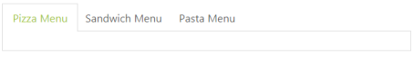
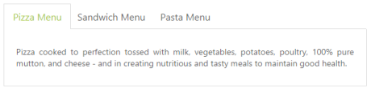

# Getting Started 

This section explains briefly how to create a Tab Control in your application with ASP.NET.

## Create your first Tab control in ASP.NET	

The ASP.NET Tab control is an interface that displays the content in multiple sections. Each TabPanel consists of HeaderText or HeaderTemplate as well as a ContentTemplate. Tab is useful for a dashboard that contains limited space. The following section guides you to customize the Tab for displaying Hotel menu items, its rating details, and ingredients.

 

### Create Tab control

You can create an ASP Project and add the necessary assembly and scripts with the help of the given [ASP-Getting Started](http://help.syncfusion.com/aspnetmvc/captcha/getting-started#create-your-first-captcha-in-aspnet-mvc) Documentation.

Add the following code example to the corresponding ASP page for Tab rendering.



<form id="form1" runat="server">

    

        <ej:Tab ID="DishType" runat="server" Width="600px">

            <Items>

                <ej:TabItem Id="PizzaType" Text="Pizza Menu">

                    <ContentSection>

                        <%-- Enter your contents here --%>

                    </ContentSection>

                </ej:TabItem>

                <ej:TabItem Id="SandwichType" Text="Sandwich Menu">

                    <ContentSection>

                        <%-- Enter your contents here --%>

                    </ContentSection>

                </ej:TabItem>

                <ej:TabItem Id="PastaType" Text="Pasta Menu">

                    <ContentSection>

                        <%-- Enter your contents here --%>

                    </ContentSection>

                </ej:TabItem>

            </Items>

        </ej:Tab>

    

</form>



Output of the above steps.

### Configure content

In this application, a detailed description is provided to each item. You can specify the contents in the Tab section within the <ContentSection > by using the following format. 



<ej:Tab ID="DishType" runat="server" Width="500px">

    <Items>

        <ej:TabItem Id="PizzaType" Text="Pizza Menu">

            <ContentSection>

                
Pizza cooked to perfection tossed with milk, vegetables, potatoes, poultry, 100% pure mutton, and cheese - and in creating nutritious and tasty meals to maintain good health.

            </ContentSection>

        </ej:TabItem>

        <!--Reuse remaining Tab contents-->  

    </Items>

</ej:Tab>



You can provide more customization to the Tab with rating control as the content to describe the item rating value.

The following screenshot is the output of the above code example:

 

### Create the rating in the Tab

The ASP.NET Rating control provides an intuitive rating experience that allows you to select the number of stars that represents the rating. The following code example explains he rating control creation. Render the rating control by using the <ej:Rating> tag. The code example is placed within the content description( <ContentSection > ) element to declare the rating control and description in the Tab section and it can be appended with the control initialization code section <ej:Tab> element by using the following format.



<ej:Tab ID="DishType" runat="server" Width="500px">

    <Items>

        <ej:TabItem Id="PizzaType" Text="Pizza Menu">

            <ContentSection>

                

                    Rating : 

                     
                                     
                     
                         <ej:Rating ID="GardenPizza" Precision="Exact" Value="4.9" runat="server"></ej:Rating>

                     
                                

                

                
Pizza cooked to perfection tossed with milk, vegetables, potatoes, poultry, 100% pure mutton, and cheese - and in creating nutritious and tasty meals to maintain good health.

            </ContentSection>

        </ej:TabItem>

        <!--Reuse remaining Tab contents-->  

    </Items>

</ej:Tab>                 



The following screenshot is the output of the above code example:

  

### Sub Tab with content 

Each item has a variety of options and these options are also specified in the limited space. So, you can choose the Tab control that is used within the root Tab to specify more details.

The following code example illustrates how to create the Tab control within the root Tab element. This HTML code is appended within the previous HTML code section. To render the child Tab with its header, add this code example within the <ej:Tab > tag by using the following format.

The sub Tab control rendering is represented in the following code example.

<!--Use the following codes with in the  above Html -->



<ej:Tab ID="DishType" runat="server" Width="500px">

    <Items>

        <ej:TabItem Id="PizzaType" Text="Pizza Menu">

            <ContentSection>

                

                    Rating : 

                    

                         <ej:Rating ID="GardenPizza" Precision="Exact" Value="4.9" runat="server"></ej:Rating>

                    

                

                
Pizza cooked to perfection tossed with milk, vegetables, potatoes, poultry, 100% pure mutton, and cheese - and in creating nutritious and tasty meals to maintain good health.

                <ej:Tab ID="PizzaTab" runat="server">

                    <Items>

                        <ej:TabItem Id="PizzaMenu" Text="Corn Spinach">

                            <ContentSection>

                                

                                

                                    Rate    : $70 

                                    Ingredients : cheese, sweet corn &amp; green capsicums. 

                                    Description: Small pizza bases are topped with spinach and paneer and fresh cream, a nice layer of mozzarella cheese. This is baked until the cheese is all hot and gooey.  

                                

                            </ContentSection>

                        </ej:TabItem>

                        <ej:TabItem Id="PizzaMenu1" Text="Chicken-Delite">

                            <ContentSection>

                                

                                

                                    Rate    : $100 

                                    Ingredients : cheese, chicken chunks, onions &amp; pineapple chunks. 

                                    Description: This is a tasty, elegant chicken dish that is easy to prepare. 

                                

                            </ContentSection>

                        </ej:TabItem>

                    </Items>

                </ej:Tab>

            </ContentSection>

        </ej:TabItem>

        <!--Reuse remaining Tab contents-->  

    </Items>

</ej:Tab>
			


The following code example positions the image and content.



.ingredients {

	height: 180px;

	margin-top: 8px;

}

img {           

	float: left;        

	margin: 10px 26px 5px 1px;

}



The following screenshot illustrates the first Tab with the sub Tab control.

 

#### Orientation Change

The following gives details on how to set the sub Tab orientation to vertical. By default, Tab control is rendered in horizontal orientation. You can change this orientation to vertical by using the HeaderPosition property. The following code section sets the Tab header orientation as left and renders the sub Tab element in the vertical orientation.



<!--Use the following codes with in the  above Html -->

<ej:Tab ID="DishType" runat="server" Width="500px">

    <Items>

        <ej:TabItem Id="PizzaType" Text="Pizza Menu">

            <ContentSection>

                

                    Rating : 

                    

                         <ej:Rating ID="gardenPizza" Precision="Exact" Value="4.9" runat="server"></ej:Rating>

                    

                

                
Pizza cooked to perfection tossed with milk, vegetables, potatoes, poultry, 100% pure mutton, and cheese - and in creating nutritious and tasty meals to maintain good health.

                <ej:Tab ID="PizzaTab" runat="server" HeaderPosition="Left" Height="221px">

                    <Items>

                        <ej:TabItem Id="PizzaMenu" Text="Corn Spinach">

                            <ContentSection>

                                

                                

                                    Rate    : $70 

                                    Ingredients : cheese, sweet corn &amp; green capsicums. 

                                    Description: Small pizza bases are topped with spinach and paneer and fresh cream, a nice layer of mozzarella cheese. This is baked until the cheese is all hot and gooey.  

                                

                            </ContentSection>

                        </ej:TabItem>

                        <ej:TabItem Id="PizzaMenu1" Text="Chicken-Delite">

                            <ContentSection>

                                

                                

                                    Rate    : $100 

                                    Ingredients : cheese, chicken chunks, onions &amp; pineapple chunks. 

                                    Description: This is a tasty, elegant chicken dish that is easy to prepare. 

                                

                            </ContentSection>

                        </ej:TabItem>

                    </Items>

                </ej:Tab>

            </ContentSection>

        </ej:TabItem>

	<!--Reuse remaining Tab contents-->  

	</Items>

</ej:Tab>



The following screenshot is the output of the above steps.

 

### Header Image Customization

In this application, the Tab header image is set for each Tab item to specify image in ImageCssClass property during the Tab header declaration time.

Use the following code example to customize the header image.



.dish {

        display: inline-block;

        vertical-align: middle;

        margin: 0px -9px 0px 9px;

    }

    .pizzaImg {

        background: url("http://js.syncfusion.com/UG/Web/Content/rsz_chicken-delite.png") no-repeat;

        height: 25px;

        width: 25px;

    }

        /*reuse the previous code*/                



The following code example is used to add the header image for the root tab header element.



<!--Use the following codes with in the  above Html --> 

<ej:TabItem Id="pizzaType" Text="Pizza Menu" ImageCssClass="dish pizzaImg">

	<ContentSection>

		<!—- reuse the previously defined first tab html content section-->

	</ContentSection>

</ej:TabItem>

 <!—- reuse the remaining tab contents -->

	</Items>

</ej:Tab>   



The following screenshot illustrates the Tab with the customized header image.

 

Configure contents to the remaining Tab items

The second and third Tab contents are declared in the same method the first Tab content declaration. These Tabs also consist of rating and sub Tab controls. Add the second Tab content with header image in the <ej:Tab > element during initialization.

<!--Use the following codes with in the  above Html -->                 



<ej:TabItem Id="SandwichType" Text="Sandwich Menu" ImageCssClass="dish sandwichImg">

    <ContentSection>

        

             Rating : 

             

                 <ej:Rating ID="RatingSandwich" Value="4.9" Precision="Exact" runat="server"></ej:Rating>

             

        

        
Sandwich cooked to perfection tossed with bread, milk, vegetables, potatoes, poultry, 100% pure mutton, and cheese - and in creating nutritious and tasty meals to maintain good health.

        <ej:Tab ID="SandwichTab" runat="server" HeaderPosition="Left" Height="221px">

            <Items>

                <ej:TabItem Id="GardenVeggie" Text="Garden Veggie">

                    <ContentSection>

                        

                        

                            Rate    : $55 

                            Ingredients : grilled chicken, corn &amp;olives. 

                            Description: To make an appetizer pizza made with crescent roll dough, baked and topped with flavored cream cheese and crispy fresh vegetables. Broccoli, carrots, and bell peppers make this a wonderfully delicious vegetarian treat 

                        

                    </ContentSection>

                </ej:TabItem>

                <ej:TabItem Id="ChickenTikka" Text="Chicken Tikka">

                    <ContentSection>

                        

                        

                            Rate    : $100 

                            Ingredients : onions, grilled chicken, chicken salami &amp; tomatoes. 

                            Description: Juicy chunks of boneless chicken roasted on open fire. This takeaway favorite is freezer-friendly and quick to reheat, giving you the chance to get ahead. 

                        

                    </ContentSection>

                </ej:TabItem>

                <ej:TabItem Id="paneerTikka" Text="Paneer Tikka">

                   <ContentSection>

                        

                        

                            Rate    : $150

                             

                            Ingredients : onions, paneer & tomatoes.

                             

                            Description: Delve into the tasty Paneer Tikka Kebabs made from marinated Paneer or cottage cubes. Relish these grilled delicacies with green mint chutney and onion rings. 

                        

                   </ContentSection>

               </ej:TabItem>

           </Items>

        </ej:Tab>

    </ContentSection>

</ej:TabItem>

<!--Reuse remaining Tab contents-->  

	</Items>

</ej:Tab>


Add the third Tab content with the header image in the <ej:Tab > element during initialization.



<ej:TabItem Id="PastaType" Text="Pasta Menu" ImageCssClass="dish pastaImg">

    <ContentSection>

        

            Rating : 

             

                 <ej:Rating ID="Rating1" Value="4.9" Precision="Exact" runat="server"></ej:Rating>

             

        

        
Pasta cooked to perfection tossed with milk, vegetables, potatoes, poultry, 100% pure mutton, and cheese - and in creating nutritious and tasty meals to maintain good health.

        <ej:Tab ID="Tab2" runat="server" HeaderPosition="Left" Height="221px">

            <Items>

                <ej:TabItem Id="kheemaPasta" Text="Kheema Pasta">

                    <ContentSection>

                        

                        

                            

                                Rate : $30 

                                Ingredients : chicken, onions, chilly, garlic &amp; tomatoes. 

                                Description: Kheema pasta dish make with veg or non-veg type.It is delicious and can be served for dinner, brunch or evening snack. 

                            

                        

                    </ContentSection>

                </ej:TabItem>

                <ej:TabItem Id="tunaPasta" Text="Tuna Pasta">

                    <ContentSection>

                        

                        

                            

                                Rate : $55 

                                Ingredients : tomato ,olive, onion &amp;garlic. 

                                Description: Canned tuna is used to make this yummy tomato sauce.

                            

                        

                    </ContentSection>

                </ej:TabItem>

                <ej:TabItem Id="channaPasta" Text="Channa Pasta">

                    <ContentSection>

                        

                        

                            

                                Rate : $30 

                                Ingredients : sauntered spinach mix, sweet corn, parsley &amp;mozzarella cheese. . 

                                Description: This is a pasta dish make with leftover Channa masala (choler). This can be made from scratch too by making the Channa masala first and then tossing in the cooked pasta.

                            

                        

                    </ContentSection>

                </ej:TabItem>

            </Items>

        </ej:Tab>

    </ContentSection>

</ej:TabItem>

<!--Reuse remaining contents-->  

	</Items>

</ej:Tab>



Apply the following styles to the Tab.



/*to reuse the previous style section code and following css*/        

.sandwichImg, .pastaImg {

	height: 25px;

	width: 25px;

}

.sandwichImg {

	background: url("http://js.syncfusion.com/UG/Web/Content/rsz_garden-fresh.png") no-repeat;                       

}

.pastaImg {

	background: url("http://js.syncfusion.com/UG/Web/Content/rsz_garden-veggie.png") no-repeat;                 

}      



The following screenshot illustrates the second Tab contents and the final hotel menu with rating, description, and ingredients of the item in the Tab interface.

  

