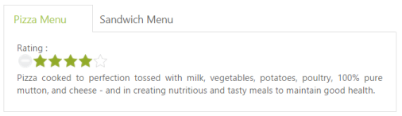

#  Integration with other controls

You can provide more customization to the Tab with rating control as content for describing the item rating value.

The Essential ASP Rating control provides an intuitive rating experience that allows you to select the number of stars that represent the rating. For more information about the rating, you can refer to the following link:

<http://help.syncfusion.com/js>

The following code example explains the rating control creation

Add the following ASPX to render Tab with other controls.



<ej:Tab ID="dishtype" runat="server" ShowReloadIcon="true" Width="600px">

    <Items>

        <ej:TabItem ID="pizzatype" Text="Pizza Menu">

            <ContentSection>

                

                    Rating :

                    

                        <ej:Rating ID="ratingpizza" Value="4" Precision="Exact" runat="server">

                        </ej:Rating>

                    

                

                

                    Pizza cooked to perfection tossed with milk, vegetables, potatoes, poultry, 100% pure mutton, and cheese - and in creating nutritious and tasty meals to maintain good health.

            </ContentSection>

        </ej:TabItem>

        <ej:TabItem ID="sandwichtype" Text="Sandwich Menu">

            <ContentSection>

                

                    Rating :

                    

                        <ej:Rating ID="ratingsandwich" Value="4" Precision="Exact" runat="server">

                        </ej:Rating>

                    

                

                

                    Sandwich cooked to perfection tossed with bread, milk, vegetables, potatoes, poultry, 100% pure mutton, and cheese - and in creating nutritious and tasty meals to maintain good health.

            </ContentSection>

        </ej:TabItem>

    </Items>

</ej:Tab>



To render the rating control in the first Tab element, refer to the styles mentioned in the following code example. 

Add the following styles to render the Tab.



.dishRating {

	position: absolute;

	margin: -31px 0px 0px 80px;

}   



The following screenshot illustrates the Tab content with rating control. 

 

