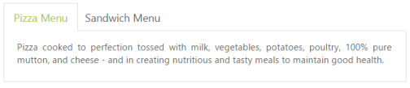

# Keyboard Navigation

Tab control provides keyboard interaction support. By using this functionality, you can interact with the control with the keyboard. This is achieved by setting the AllowKeyboardNavigation to true. By default, this property value is set to true.

The following table illustrates the accessible keys and their usage

<table>
<tr>
<th>
Keys</th><th>
Behavior</th></tr>
<tr>
<td>
Up</td><td>
Selected previous item.</td></tr>
<tr>
<td>
Right</td><td>
Selected previous item.</td></tr>
<tr>
<td>
Down</td><td>
Selected next item.</td></tr>
<tr>
<td>
Left</td><td>
Selected next item.</td></tr>
<tr>
<td>
Home</td><td>
Selected first item.</td></tr>
<tr>
<td>
End</td><td>
Selected last item.</td></tr>
</table>
The following code example is used to render the Tab element in the RTL format. 

Add the following ASPX to render the Tab with keyboard navigation.




<ej:Tab ID="dishtype" runat="server" Width="600px" AllowKeyboardNavigation="true">

    <Items>

        <ej:TabItem ID="pizzatype" Text="Pizza Menu">

            <ContentSection>

                

                    Pizza cooked to perfection tossed with milk, vegetables, potatoes, poultry, 100% pure mutton, and cheese - and in creating nutritious and tasty meals to maintain good health.

            </ContentSection>

        </ej:TabItem>

        <ej:TabItem ID="sandwichtype" Text="Sandwich Menu">

            <ContentSection>

                

                    Sandwich cooked to perfection tossed with bread, milk, vegetables, potatoes, poultry, 100% pure mutton, and cheese - and in creating nutritious and tasty meals to maintain good health.

            </ContentSection>

        </ej:TabItem>

    </Items>

</ej:Tab>





$(function () {

        //Control focus key

        $(document).on("keydown", function (e) {

            if (e.altKey && e.keyCode === 74) {

                // j- key code.

$("#<%=dishtype.ClientID%> ul a").focus();

            }

        });

    });




The following screenshot illustrates the Tab with keyboard navigation.

 