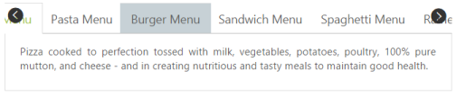

# Scroll Support

The Tab control provides scrolling support to display a large number of Tabs with scroll buttons to get rid of extending the page size. The enabled Scroll buttons can be used to traverse through the elements.

By default, Tab header is rendered without scroll button. You can add the scroll button by setting the EnableTabScroll property to true. When you move the cursor over the Tab header, the scroll button is displayed.   

You can use the following code example to render the Tab control with scroll button.

Add the following ASPX code to create a simple Tab with scroll button.



<ej:Tab ID="dishtype" runat="server" EnableTabScroll="true" Width="600px">

    <Items>

        <ej:TabItem ID="pizzatype" Text="Pizza Menu">

            <ContentSection>

                

                    Pizza cooked to perfection tossed with milk, vegetables, potatoes, poultry, 100% pure mutton, and cheese - and in creating nutritious and tasty meals to maintain good health.

            </ContentSection>

        </ej:TabItem>

        <ej:TabItem ID="pastatype" Text="Pasta Menu">

            <ContentSection>

                

                    Pasta cooked to perfection tossed with milk, vegetables, potatoes, poultry, 100% pure mutton, and cheese - and in creating nutritious and tasty meals to maintain good health.

            </ContentSection>

        </ej:TabItem>

        <ej:TabItem ID="burgertype" Text="Burger Menu">

            <ContentSection>

                

                    Burger cooked to perfection tossed with vegetables, potatoes, poultry, 100% pure mutton, and cheese - and in creating nutritious and tasty meals to maintain good health.

            </ContentSection>

        </ej:TabItem>

        <ej:TabItem ID="sandwichtype" Text="Sandwich Menu">

            <ContentSection>

                

                    Sandwich cooked to perfection tossed with bread, milk, vegetables, potatoes, poultry, 100% pure mutton, and cheese - and in creating nutritious and tasty meals to maintain good health.

            </ContentSection>

        </ej:TabItem>

        <ej:TabItem ID="spaghetti" Text="Spaghetti Menu">

            <ContentSection>

                

                    Spaghetti cooked to perfection tossed with vegetables, potatoes, poultry, 100% pure mutton, and cheese - and in creating nutritious and tasty meals to maintain good health.

            </ContentSection>

        </ej:TabItem>

        <ej:TabItem ID="ramen" Text="Ramen Menu">

            <ContentSection>

                

                    Ramen cooked to perfection tossed with vegetables, potatoes, poultry, 100% pure mutton, and cheese - and in creating nutritious and tasty meals to maintain good health.

            </ContentSection>

        </ej:TabItem>

    </Items>

</ej:Tab>



The following screenshot illustrates the Tab control with scroll button. 

 

