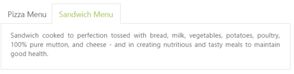

# State Maintenance

When the page is refreshed or reloaded, the Tab state is changed, that is, the focus is moved to the start Tab. You can maintain the state of the Tab by using the EnablePersistence property. When this property is set to true, it retains the state. 

The following code example is used to render the Tab control with state maintenance. 

Add the following ASPX for Tab state maintenance.



<ej:Tab ID="dishtype" runat="server" EnablePersistence="true" Width="600px">

    <Items>

        <ej:TabItem ID="pizzatype" Text="Pizza Menu">

            <ContentSection>

                

                    Pizza cooked to perfection tossed with milk, vegetables, potatoes, poultry, 100% pure mutton, and cheese - and in creating nutritious and tasty meals to maintain good health.

            </ContentSection>

        </ej:TabItem>

        <ej:TabItem ID="sandwichtype" Text="Sandwich Menu">

            <ContentSection>

                

                    Sandwich cooked to perfection tossed with bread, milk, vegetables, potatoes, poultry, 100% pure mutton, and cheese - and in creating nutritious and tasty meals to maintain good health.

            </ContentSection>

        </ej:TabItem>

    </Items>

</ej:Tab>



The following screenshots illustrate the Tab with State maintenance before and after page refresh.

 

 

